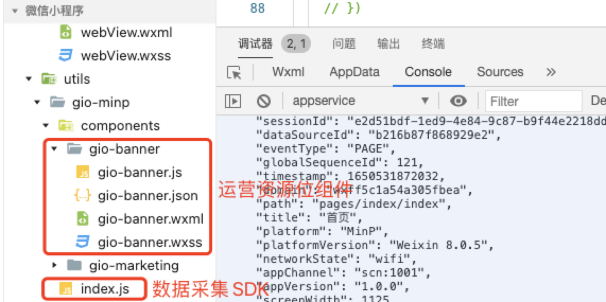
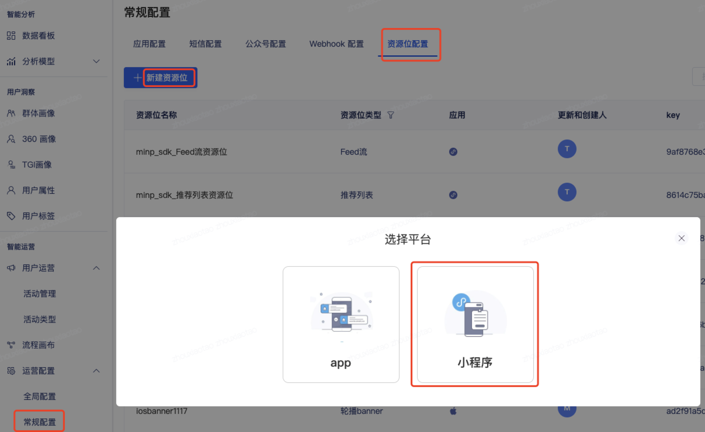
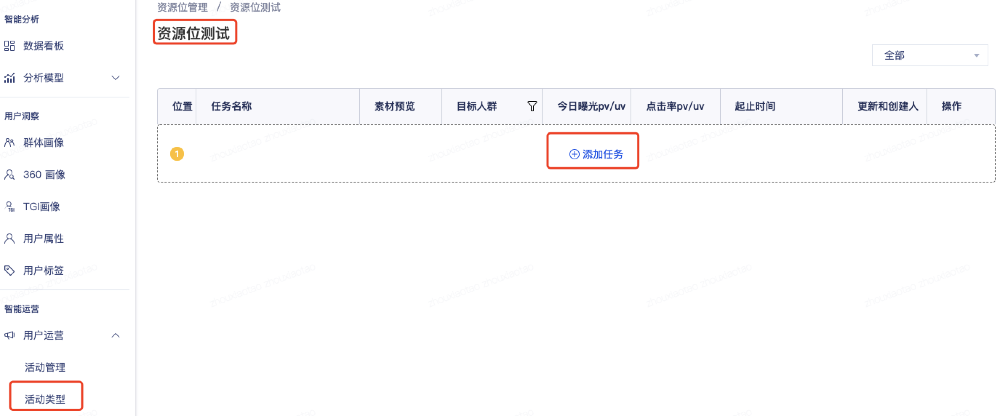

# 资源位SDK（支付宝小程序）

## 集成小程序资源位SDK[](#yi-ji-cheng-xiao-cheng-xu-banner-sdk-zui-di-ban-ben-0-5)




### 首先支付宝小程序 数据采集SDK的集成。下载链接[](#1-shou-xian-zhi-fu-bao-xiao-cheng-xu-shu-ju-cai-ji-sdk-de-ji-cheng-xia-zai-lian-jie)

参考[支付宝小程序 SDK 集成](https://growingio.github.io/growingio-sdk-docs/docs/miniprogram/3.3/integration/alipay) 资源位依赖于数据采集SDK，index.js 是数据采集SDK，如果你之前集成过老版本，替换则是升级数据采集SDK，然后引入资源位组件。

资源位[SDK下载地址](https://assets.giocdn.com/sdk/cdp/3.0/gio-alip.zip)(gio-banner为资源位SDK)


### 配置gtouchHost, 请求资源位地址，一般与您环境的host一致[](#2-pei-zhi-gtouchhost-qing-qiu-banner-di-zhi-yi-ban-yu-nin-huan-jing-de-host-yi-zhi)

```js
gdp('init', 'your GrowingIO accountId', 'your dataSourceID', 'your AppId', {
    version: '小程序版本',
    host: 'api.growingio.com',
    gtouchHost:'popupwindow.test.com',
    ...其他配置项
});
```


### 数据中设置url_scheme与APPID 一致，不一致会导致获取不到资源位[](#3-shu-ju-zhong-she-zhi-urlscheme-yu-appid-yi-zhi-bu-yi-zhi-hui-dao-zhi-huo-qu-bu-dao-banner)


### 登陆支付宝小程序后台，进入配置[](#4-deng-lu-zhi-fu-bao-xiao-cheng-xu-hou-tai-jin-ru-pei-zhi)

打开小程序详情/设置/开发设置

配置httpRequest接口请求域名白名单：https://XXX.com (你设置gtouchHost的地址)


### 开发者工具要开启component2编译[](#5-kai-fa-zhe-gong-ju-yao-kai-qi-component-2-bian-yi)


## 平台创建支付宝小程序SDK消息[](#er-ping-tai-chuang-jian-zhi-fu-bao-xiao-cheng-xu-sdk-xiao-xi)

进入  **用户运营**，**常规配置**，**资源位配置**，点击左上角的**新建**按钮，然后选择**小程序**，即可进入微信小程序的资源位配置页面






根据您的需要，选择对应的**资源位类型**、**资源位名称**、**对应的应用**、**选择分群**、**图片素材**、**跳转链接**、**上线时间**、**停止时间**后，**保存**即可。

## 使用支付宝小程序SDK组件[](#san-shi-yong-wei-xin-xiao-cheng-xu-sdk-zu-jian)

> 这里以**原生小程序应用**与**Taro应用**为例，其余支付宝小程序框架可参考对应框架对于小程序原生组件的使用方式。如果是第一次集成小程序SDK，建议下载最新GIOSDK全量替换。


### 原生小程序应用[](#31-yuan-sheng-xiao-cheng-xu-ying-yong)

1. 在**app.json**文件中的**usingComponents**属性中，添加**gio-banner**组件

```js
"usingComponents":  {

 "gio-banner":  "utils/components/gio-banner/gio-banner"

},
```

2. 在**每一个page**页面的axml文件里，引入gio-banner组件（原则上只需要在需要资源位的页面引入组件）

```xml
// 例：pages/index/index.wxml

<gio-banner />

<View>Welcome to GrowingIO</View>
```
