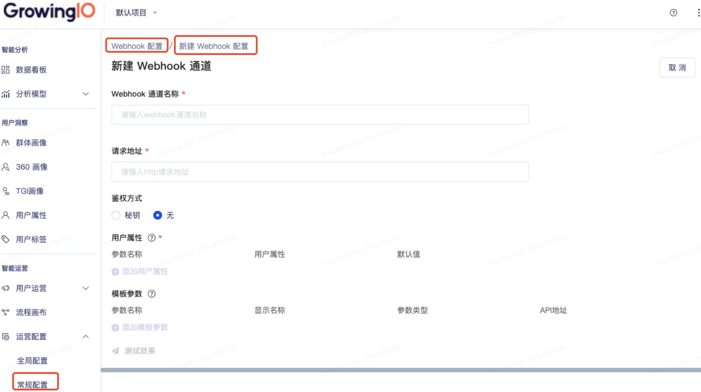

# Webhook 技术对接文档

## 简介[](#简介)

客户可以使用webhook将分群信息(用户属性)发送到自己的内部系统，比如电商自有的发券系统，Push系统等，也可以将信息发送到自己的后台， 比如当用户发生了某些行为后若干次数后，客户可以在后台增加某个用户的会员积分等。应用场景是非常灵活的。


### Webhook 请求[](#Webhook-请求)

Webhook请求是一个POST请求，会发送到某个客户提供的URL上，可以添加额外的参数，例


#### Response Code[](#Response-Code)

GIO 会遵循HTTP状态码，200代表post成功，其余的都是错误信息。


#### Request Header[](#Request-Header)

Content-Type:application/json

X-gio-signature:xxx


### Request Body[](#request-body)

| **类型** | **Key 配置处** | **值配置** | **值获取方式** | **说明** |
| --- | --- | --- | --- | --- |
| 用户属性 | 产品配置页面<br></br>侧边栏：Webhook配置 | 不需要配置 | 从对应的用户属性中获取 | ​   |
| 自定义参数 | 产品配置页面<br></br>侧边栏：Webhook配置 | 运营活动名称 | 从 触点返回值中获取 | ​   |

**字段**

| **名称** | 类型  | 备注  |
| --- | --- | --- |
| name | 字符串 | webhook 对应的名称 |
| templateParam | 对象  | 模板参数对象 |
| userAttr | 对象  | 用户属性对象 |
| timestamp | 字符串 | 发送时间戳 |

具体例子：

在后台配置 webhook 通道



后台配置 Webhook 通道

配置若干模板参数：


Webhook 模板参数配置

配置若干用户属性：


Webhook 用户属性配置

具体请求体如下:

```json
{
    "name": "webhook名称",
    "templateParam": { // 运营同学填写的模板参数值
        "campaignType": "双十一",
        "campaignDate": "2020-04-29",
        "discount": "20%",
        "content": "快来下单吧！"
    },
    "userAttr": [ //每个用户的属性值查出结果后和填充完的文本一起发送
        {
            "hobby": "game1",
            "birthday": "1992-02-01"
        },
        {
            "hobby": "game2",
            "birthday": "1990-02-01"
        }
    ],
    "timestamp": "15xxxx" //时间戳
}
```

如果查询不到用户属性，userAttr字段为空数组:

```json
{
    "name": "webhook名称",
    "templateParam": { // 运营同学填写的模板参数值
        "campaignType": "双十一",
        "campaignDate": "2020-04-29",
        "discount": "20%",
        "content": "快来下单吧！"
    },
    "userAttr": [ //查询不到位空数组
    ],
    "timestamp": "15xxxx" //时间戳
}
```

**webhook配置和测试webhook**

Request Body

和正式发送没有区别：

```json
{

 "name": "webhook名称",

 "templateParam": { // 运营同学填写的模板参数值

 "campaignType": "双十一",

 "campaignDate": "2020-04-29",

 "discount": "20%",

 "content": "快来下单吧！"

 },

 "userAttr": [ //每个用户的属性值查出结果后和填充完的文本一起发送

 {

 "hobby": "game1",

 "birthday": "1992-02-01"

 },

 {

 "hobby": "game2",

 "birthday": "1990-02-01"

 }

 ],

 "timestamp": "15xxxx" //时间戳

}
```

同样的如果不查询用户属性:

```json
{

 "name": "webhook名称",

 "templateParam": { // 运营同学填写的模板参数值

 "campaignType": "双十一",

 "campaignDate": "2020-04-29",

 "discount": "20%",

 "content": "快来下单吧！"

 },

 "userAttr": [ //查询不到位空数组

​

 ],

 "timestamp": "15xxxx" //时间戳

}
```

#### Request 验证[](#Request-验证)

一些场景下，客户需要验证 Webhook 请求是来自GIO而不是第三方伪造，可为 Webhook 配置一个 Secret Key，该 Secret Key 在GIO运营服务端和 客户的服务器上共享。

对于配置了Secret Key的可以生成消息签名来验证消息的合法性和完整性，未配置的默认用空字符串作为Secret Key。

```java
/**

 \* java生成签名示例

 */

import com.fasterxml.jackson.databind.ObjectMapper;

import org.apache.commons.codec.digest.HmacUtils;

​

String sign(Map&lt;String, String&gt; payload, String secret) {

 ObjectMapper mapper = new ObjectMapper();

 String str = mapper.writeValueAsString(payload);

 return new HmacUtils(HmacAlgorithms.HMAC\_SHA\_256, secret).hmacHex(str);

}
```

生成的签名放置在http响应头X-gio-signature中，例如:

X-gio-signature:1e089260ba1bfde37f88eca8e665d8b1fb690ae763979d25dd10a831dedd52a8

可参考秘钥计算的代码：[https://github.com/growingio/growing-webhook-demo](https://github.com/growingio/growing-webhook-demo)


## Webhook 配置[](#Webhook-配置)

#### 模版参数支持类型[](#模版参数支持类型)


