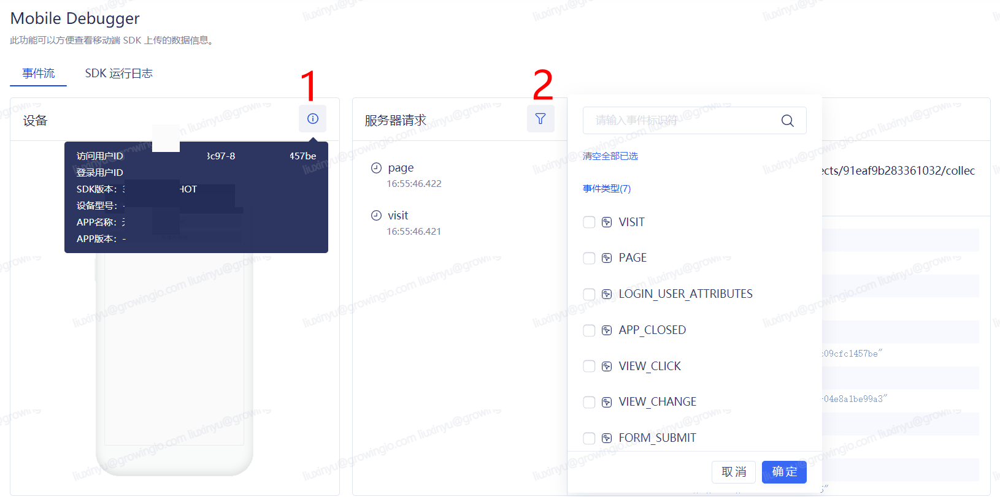

# Mobile Debugger

> 该工具要求iOS和Android SDK版本在3.1.0及以上
>
> 小米手机由于安全限制，该功能要求GrowingIO平台是https协议访问

## 启动Mobile Debugger 

**第一步、进入Mobile Debugger启动页**

登录GrowingIO平台，在**客户数据平台-数据校验**  选择**Mobile Debugger**进入Mobile Debugger启动页。

**第二步、扫码唤起App**

1. 选择项目中需要进行测试的应用，并保证手机中已经安装该APP，且该APP已经集成GrowingIO 3.1.0及以上的SDK。
2. 使用手机浏览器扫描入口的二维码唤起Debug的APP，需要注意微信中扫码无法唤起APP。

## 使用 Mobile Debugger 测试数据 

在唤起Debug的APP后，该APP采集的行为数据以及当前页面截图就会出现在网页上，测试同学可以根据数据看数据的采集以及发送情况，对数据进行测试。

**通过“事件流”页签查看请求数据**

<<<<<<< HEAD
如下图，可以查看上报某个物品属性的请求数据

=======
如下图，可以查看上报事件属性的请求数据

1. 图片中序号1：可查看当前连接的用户及设备等基本信息
2. 图片中序号2：筛选器中展示的是系统中已定义的事件标识符列表，如果筛选后无数据，说明本次连接未上报数据

\*\*\*\*
>>>>>>> 14.3.0-beta

**通过“SDK运行日志”查看SDK运行中的信息/警告/错误三种日志**

如下图，可以点击日志发生的时间查看相应的日志

<<<<<<< HEAD

=======

1. 图片中序号1：可点击暂停按钮，停止同步SDK产生的日志，便于查看当前遇到的问题；再次点击继续按钮，则同步所有产生的SDK日志，并展示最新的一条日志数据
2. 图片中序号2：点击清屏按钮，清除当前所有产生的日志
>>>>>>> 14.3.0-beta

