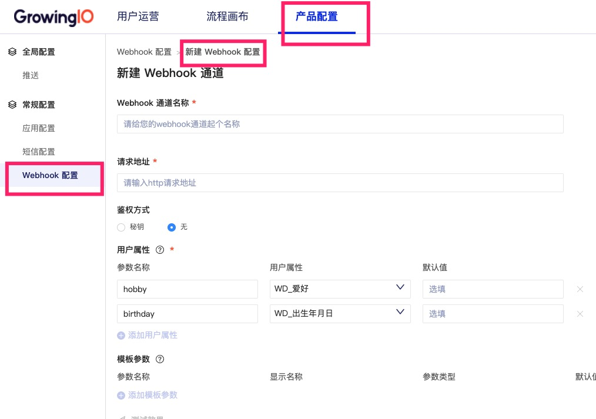

# Webhook 技术对接文档

### 简介 <a id="&#x7B80;&#x4ECB;"></a>

客户可以使用webhook将分群信息\(用户属性\)发送到自己的内部系统，比如电商自有的发券系统，Push系统等，也可以将信息发送到自己的后台， 比如当用户发生了某些行为后若干次数后，客户可以在后台增加某个用户的会员积分等。应用场景是非常灵活的。

### Webhook 请求 <a id="Webhook-&#x8BF7;&#x6C42;"></a>

Webhook请求是一个POST请求，会发送到某个客户提供的URL上，可以添加额外的参数，例


#### Response Code <a id="Response-Code"></a>

GIO 会遵循HTTP状态码，200代表post成功，其余的都是错误信息。

#### Request Header <a id="Request-Header"></a>

Content-Type:application/json

X-gio-signature:xxx

### Request Body

<table>
  <thead>
    <tr>
      <th style="text-align:left"><b>&#x7C7B;&#x578B;</b>
      </th>
      <th style="text-align:left"><b>Key &#x914D;&#x7F6E;&#x5904;</b>
      </th>
      <th style="text-align:left"><b>&#x503C;&#x914D;&#x7F6E;</b>
      </th>
      <th style="text-align:left"><b>&#x503C;&#x83B7;&#x53D6;&#x65B9;&#x5F0F;</b>
      </th>
      <th style="text-align:left"><b>&#x8BF4;&#x660E;</b>
      </th>
    </tr>
  </thead>
  <tbody>
    <tr>
      <td style="text-align:left">&#x7528;&#x6237;&#x5C5E;&#x6027;</td>
      <td style="text-align:left">
        <p>&#x4EA7;&#x54C1;&#x914D;&#x7F6E;&#x9875;&#x9762;</p>
        <p>&#x4FA7;&#x8FB9;&#x680F;&#xFF1A;Webhook&#x914D;&#x7F6E;</p>
      </td>
      <td style="text-align:left">&#x4E0D;&#x9700;&#x8981;&#x914D;&#x7F6E;</td>
      <td style="text-align:left">&#x4ECE;&#x5BF9;&#x5E94;&#x7684;&#x7528;&#x6237;&#x5C5E;&#x6027;&#x4E2D;&#x83B7;&#x53D6;</td>
      <td
      style="text-align:left"></td>
    </tr>
    <tr>
      <td style="text-align:left">&#x81EA;&#x5B9A;&#x4E49;&#x53C2;&#x6570;</td>
      <td style="text-align:left">
        <p>&#x4EA7;&#x54C1;&#x914D;&#x7F6E;&#x9875;&#x9762;</p>
        <p>&#x4FA7;&#x8FB9;&#x680F;&#xFF1A;Webhook&#x914D;&#x7F6E;</p>
      </td>
      <td style="text-align:left">&#x8FD0;&#x8425;&#x6D3B;&#x52A8;&#x540D;&#x79F0;</td>
      <td style="text-align:left">&#x4ECE; &#x89E6;&#x70B9;&#x8FD4;&#x56DE;&#x503C;&#x4E2D;&#x83B7;&#x53D6;</td>
      <td
      style="text-align:left"></td>
    </tr>
  </tbody>
</table>

**字段**

| **名称** | 类型 | 备注 |
| :--- | :--- | :--- |
| name | 字符串 | webhook 对应的名称 |
| templateParam | 对象 | 模板参数对象 |
| userAttr | 对象 | 用户属性对象 |
| timestamp | 字符串 | 发送时间戳 |

具体例子：

在后台配置 webhook 通道



配置若干模板参数：


配置若干用户属性：


具体请求体如下:

```text
{
  "name": "webhook名称",
  "templateParam": { // 运营同学填写的模板参数值
    "campaignType": "双十一",
    "campaignDate": "2020-04-29",
    "discount": "20%",
    "content": "快来下单吧！"
  },
  "userAttr": [ //每个用户的属性值查出结果后和填充完的文本一起发送
    {
      "hobby": "game1",
      "birthday": "1992-02-01"
    },
    {
       "hobby": "game2",
       "birthday": "1990-02-01"
    }
  ],
  "timestamp": "15xxxx" //时间戳
}
```

如果不查询用户属性，userAttr字段为空数组:

```text
{
  "name": "webhook名称",
  "templateParam": { // 运营同学填写的模板参数值
    "campaignType": "双十一",
    "campaignDate": "2020-04-29",
    "discount": "20%",
    "content": "快来下单吧！"
  },
  "userAttr": [ //查询不到位空数组

  ],
  "timestamp": "15xxxx" //时间戳
}
```

**webhook配置和测试webhook**

Request Body

和正式发送没有区别：

```text
{
  "name": "webhook名称",
  "templateParam": { // 运营同学填写的模板参数值
    "campaignType": "双十一",
    "campaignDate": "2020-04-29",
    "discount": "20%",
    "content": "快来下单吧！"
  },
  "userAttr": [ //每个用户的属性值查出结果后和填充完的文本一起发送
    {
      "hobby": "game1",
      "birthday": "1992-02-01"
    },
    {
       "hobby": "game2",
       "birthday": "1990-02-01"
    }
  ],
  "timestamp": "15xxxx" //时间戳
}
```

同样的如果不查询用户属性:

```text
{
  "name": "webhook名称",
  "templateParam": { // 运营同学填写的模板参数值
    "campaignType": "双十一",
    "campaignDate": "2020-04-29",
    "discount": "20%",
    "content": "快来下单吧！"
  },
  "userAttr": [ //查询不到位空数组

  ],
  "timestamp": "15xxxx" //时间戳
}
```

#### Request 验证 <a id="Request-&#x9A8C;&#x8BC1;"></a>

一些场景下，客户需要验证 Webhook 请求是来自GIO而不是第三方伪造，可为 Webhook 配置一个 Secret Key，该 Secret Key 在GIO运营服务端和 客户的服务器上共享。

对于配置了Secret Key的可以生成消息签名来验证消息的合法性和完整性，未配置的默认用空字符串作为Secret Key。

```text
/**
 * java生成签名示例
 */
import com.google.gson.Gson;
import org.apache.commons.codec.digest.HmacUtils;

String sign(Map<String, String> payload, String secret) {
    String str = new Gson().toJson(payload);
    return new HmacUtils(HmacAlgorithms.HMAC_SHA_256, secret).hmacHex(new Gson().toJson(str));
}
```

生成的签名放置在http响应头X-gio-signature中，例如:

X-gio-signature:1e089260ba1bfde37f88eca8e665d8b1fb690ae763979d25dd10a831dedd52a8

### Webhook 配置 <a id="Webhook-&#x914D;&#x7F6E;"></a>

#### 模版参数支持类型 <a id="&#x6A21;&#x7248;&#x53C2;&#x6570;&#x652F;&#x6301;&#x7C7B;&#x578B;"></a>


