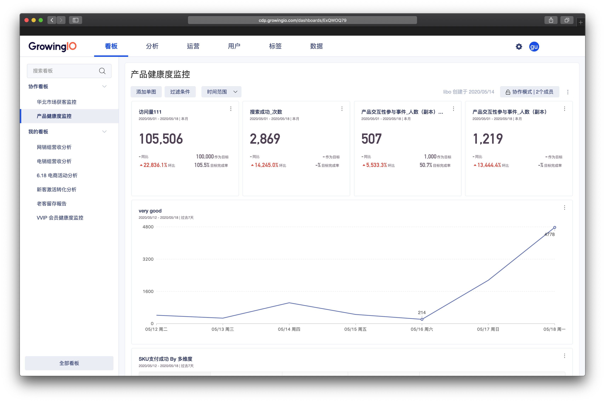
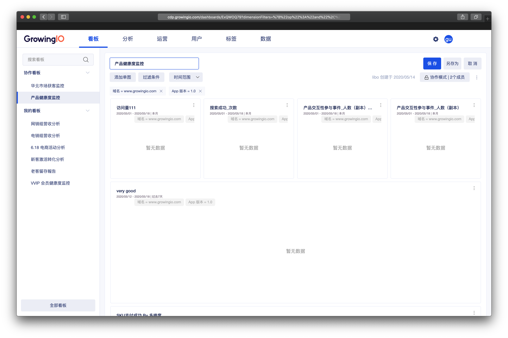
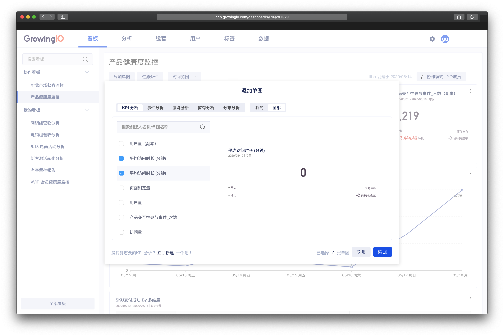
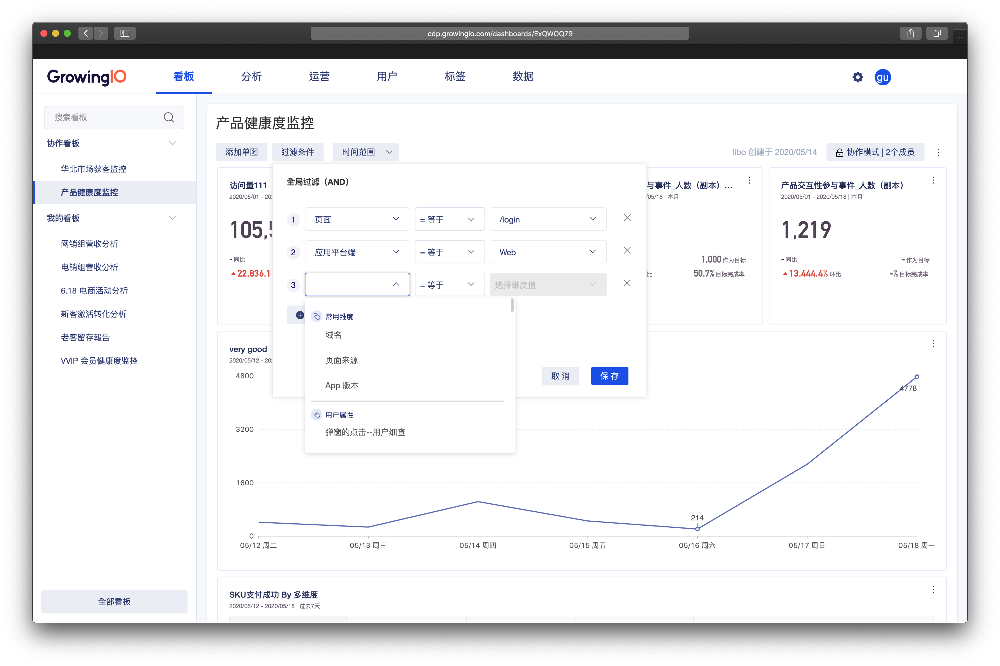
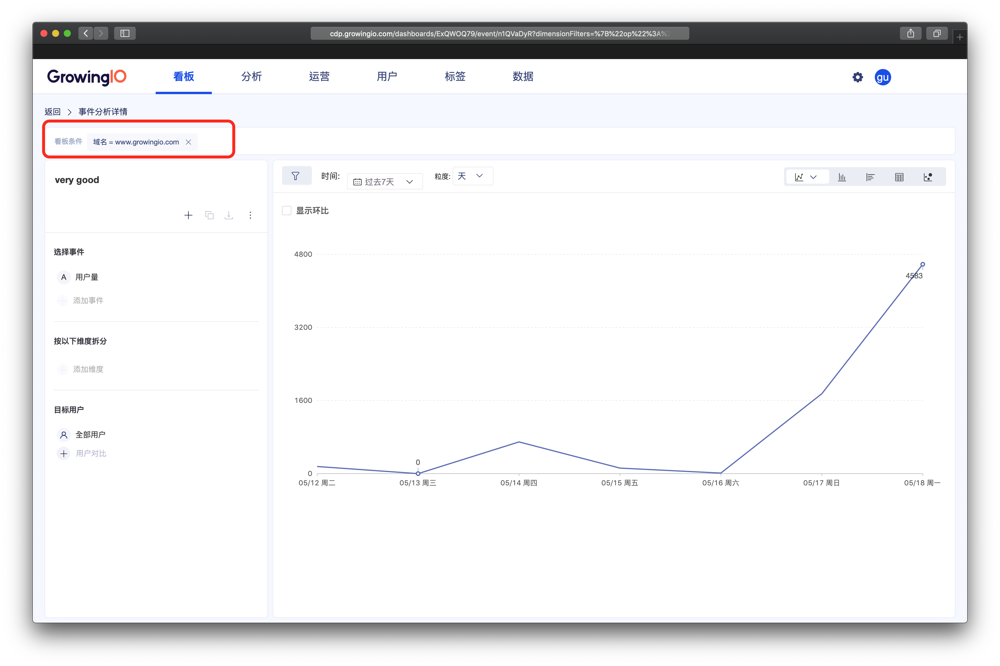
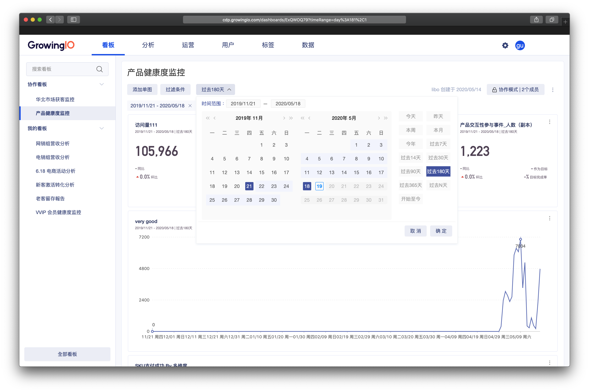
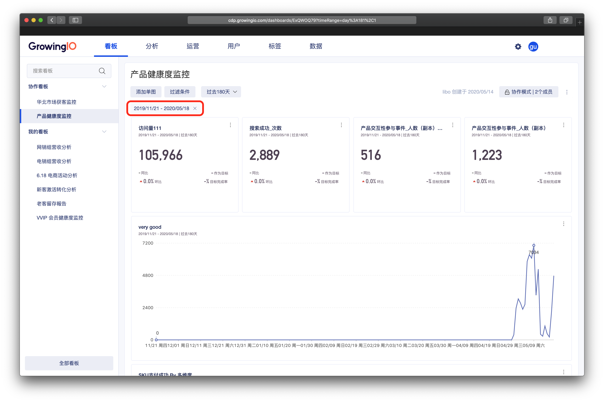
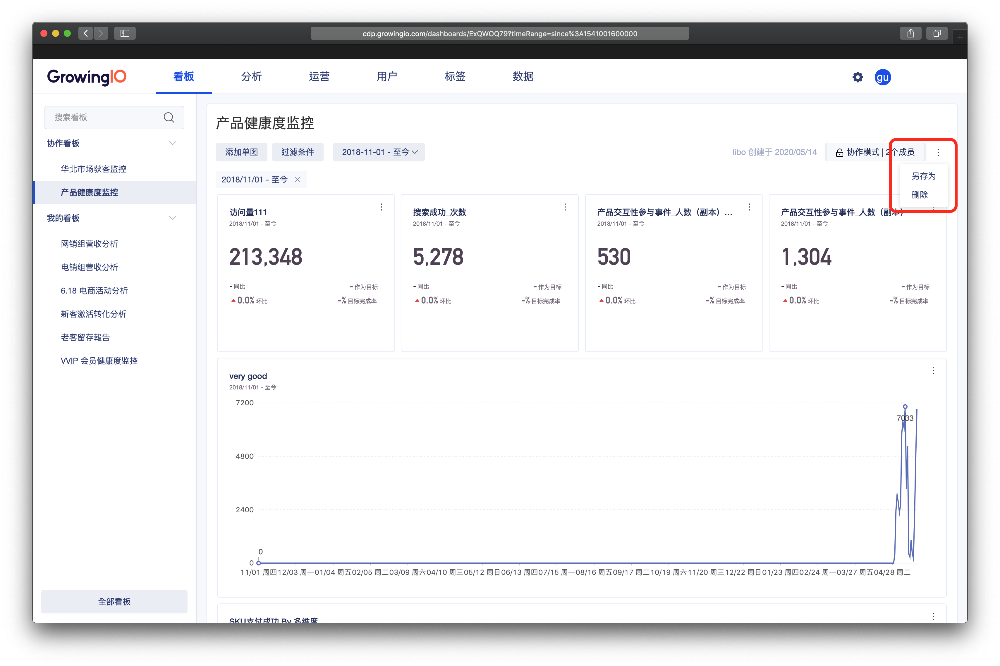
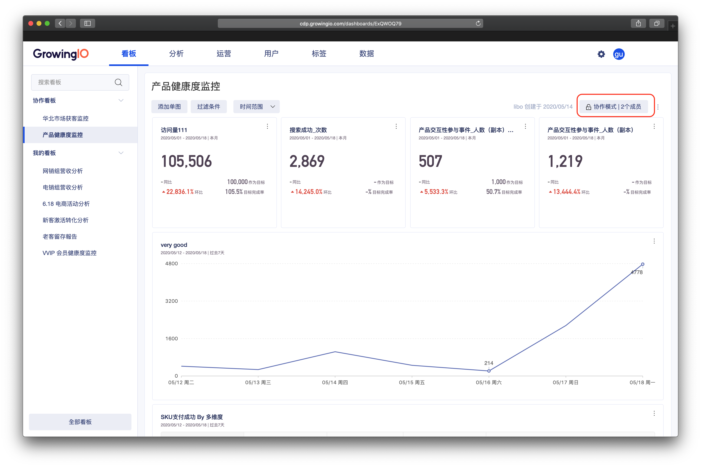

# 看板

## 简介

看板是GrowingIO  系统中，最重要的数據消費场景之一，是分析图表的集合，多个分析图表可以有效的组合成业务看板进行监控分析。

### 界面介紹

看板模塊分為兩大区域，看板侧栏与看板数据消费区。

### 看板侧栏 

看板侧栏包含以下几个部分 

* 协作看板 ： 为他人与我共享的看板 ， 看板的拥有者可在 共享设置中进行设置 。
* 我的看板 :   为我自己创建的看板，看板的拥有者属于我 。
* 全部看板： 点击全部看板，可进入看板管理模块 ，对看板进行更有效率的管理工作。

### 看板数据消费区

看板消费区包含 以下几个部分   

* 操作区 ： 添加单图、过滤条件、筛选时间范围 、设置协作模式 、另存看板、删除看板。

* 数据展示区： 不同数据图表。


为了保障企业数据安全性，每位成员的协作看板分类中 ，只会展示 与该成员共享的看板。  
  
举例： 系统中 一共有 20 个看板， 与小花鞋做的看板为 2个，小花创建的看板为 5 个 ，  因此 小花能看见的看板为 7 个。 

共享設置可見 ： [看板共享設置鏈接](https://app.gitbook.com/@growingio/s/cdp/~/drafts/-M7f1KTwEG20PbWnheJR/v/v20200600/product-manual/charts/kan-ban-gong-xiang-she-zhi)


## 看板的操作說明 

對於看板的操作  分別有以下：

| 操作 | 作用 |
| :--- | :--- |
| 修改看板名称 | 修改看板名称 |
| 添加单图 | 在看板中添加新的数据图表 |
| 移除单图 | 将分析图表由看板中移除 |
| 过滤条件 | 对看板设置一个全局过滤，该过滤条件会影响所有分析图表 |
| 筛选时间范围 | 对看板设置一个时间过滤，该过滤条件会影响所有分析图表 |
| 另存看板 | 将当前的看板复制一个并且另存 |
| 删除看板 | 删除当前的看板 |
| 單圖拖拽 | 调整当前的分析图表的布局 |
| 设置共享模式 | 设置看板协作的成员 |

### 修改看板名称

操作流程：点击看板名称&gt; 进入编辑模式 &gt;  输入看板名称 &gt; 点击保存


权限控制：需要该成员具有看板权限，且同时是该看板的编辑者。


### 添加单图

透过添加单图，我们可以在看板中添加新的数据图表，将需要共同分析的图表放在一起，构建数据看板，方便大家进行 报告、监测、分析 。

操作流程：点击 添加单图 **&gt;** 勾选要添加至此看板的分析图表 &gt; 点击添加。 


 权限控制：添加单图时，需要该成员具有看板权限，且同时是该看板的编辑者。

举例：

1.若阿花 是 产品健康度看板的阅读者，则阿花无法对看板进行 添加单图操作。

2.若阿花 是 产品健康度看板的编辑者，但管理员并没有给阿花看板的权限，则阿花无法对看板进行 添加单图操作。


### 移除单图


权限控制：移除单图时，需要该成员具有看板权限，且同时是该看板的编辑者。


### 

### 过滤条件

我们可以通过 设置过滤条件，决定数据看板中所有分析图表的数据展示范围 。  
如：当我们只想看 应用平台为 IOS 的方问量时，可通过设置 维度＝IOS  ，进行筛选过滤。

操作流程： 点击过滤条件 &gt; 选择过滤范围 &gt; 点击保存 。

从看板中进入分析图表详情，该分析图标会继承看板的过滤条件， 点击 X 可以移除过滤条件。


最多支持添加 5 个过滤条件。

过滤维度支持 ：用户属性、用户来源、地域信息、设备信息。



权限控制：保存看板过滤条件时，需要该成员具有看板权限，且同时是该看板的编辑者。


### 

### 筛选时间范围

我们可以通过 时间范围的选择，决定所有分析图表展示的时间区间。  
如：当我们想看 过去半年的访问量时，可将时间范围后则为过去180 天。

操作流程：点击时间范围 &gt;  选择时间范围区间 &gt; 点击确定。

GIO 提供强大且方便的时间选择控件，可以帮助你快速查看不同时间段的数据。

### 另存看板

操作流程：点击看版右侧  &gt; 选择另存看板 &gt;  输入新看版名称。 


权限控制： 另存看板时，需要该成员具有看板权限


### 

### 删除看板

操作流程：点击看版右侧  &gt; 选择刪除 &gt;  確定刪除。 

### 设置共享模式

可设置看板共享的成员 ，共享方式分为 阅读者、编辑者两种，您可以通过灵活的设置，与同事进行数据的协作，使数据在企业内部进行流动，更好的发挥数据的价值。


共享設置可見 ： [看板共享設置鏈接](https://app.gitbook.com/@growingio/s/cdp/~/drafts/-M7f1KTwEG20PbWnheJR/v/v20200600/product-manual/charts/kan-ban-gong-xiang-she-zhi)


## 常见问题

### 1. **为什么我 hover 到图表上时没有出现角标？**

因为您没有修改当前看板的权限。同样地，修改名称，添加和移除图表都收到编辑权限的控制。

### 2.  **从看板中移除某个图表时该图表会被删除么？**

不会。移除某个图表只会影响当前的看板，您还可以把移除的图表重新添加到该看板中。被移除的图表在各分析模块的单图列表中可以找到。

### 3. 為何我無法操作看板，提示我沒有權限？

添加单图、编辑看板名称、移除单图、删除看板、共享设置、保存过滤条件时，需要该成员具有看板权限，且同时是该看板的编辑者。

另存看板

