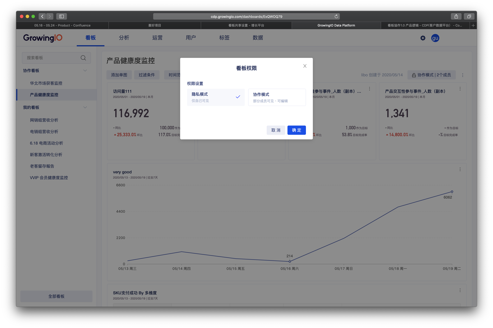
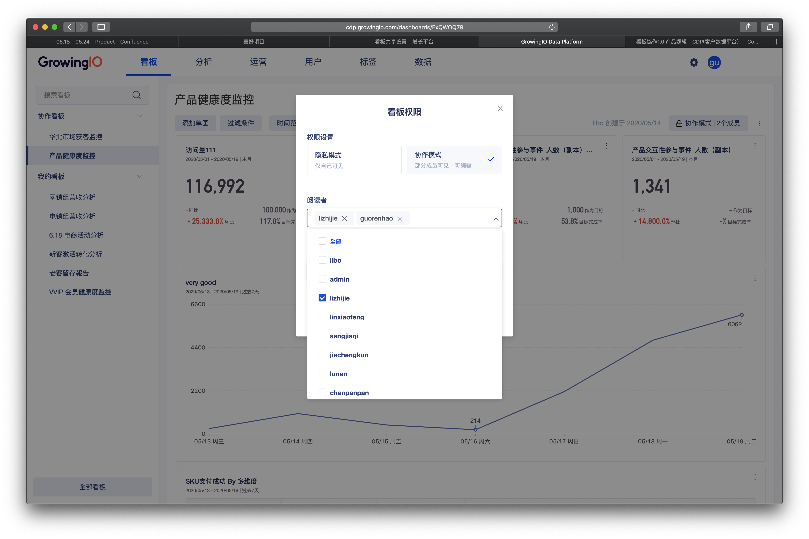
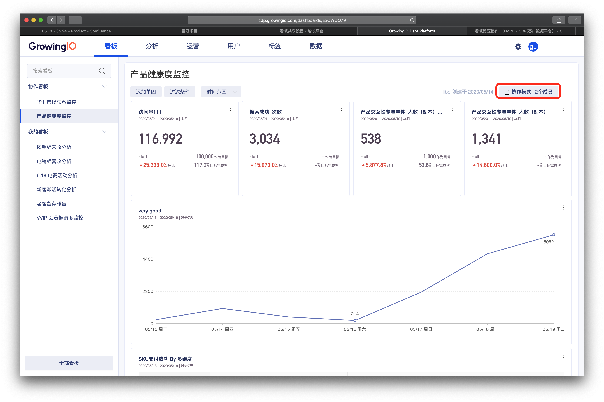
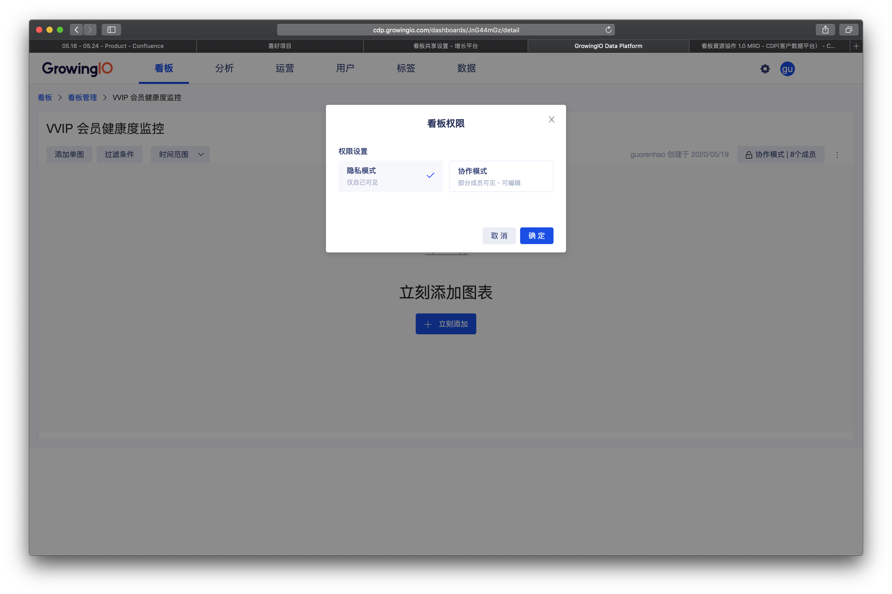
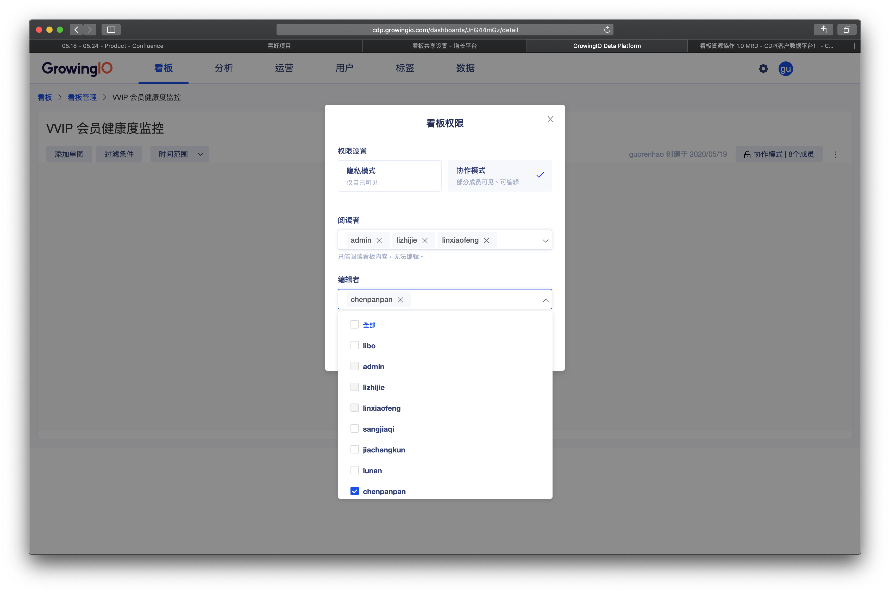
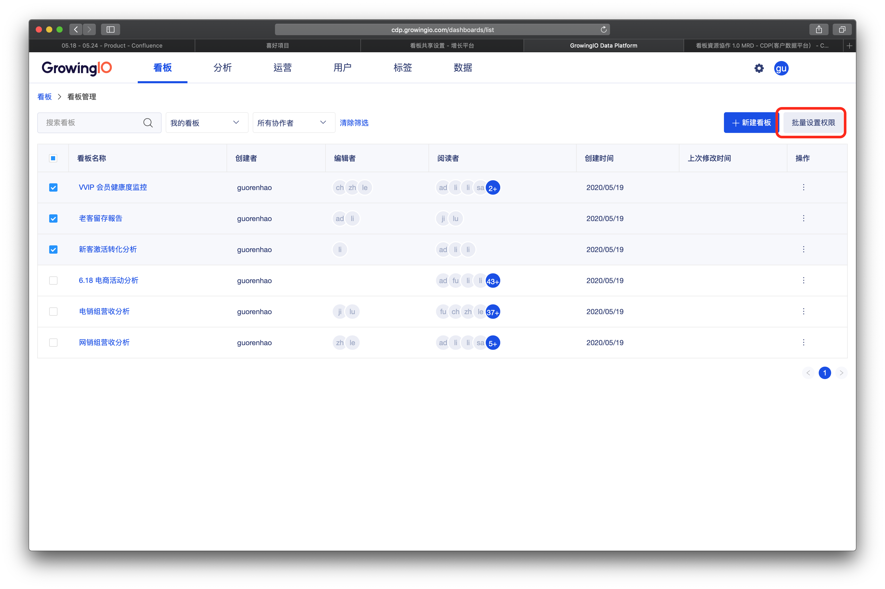
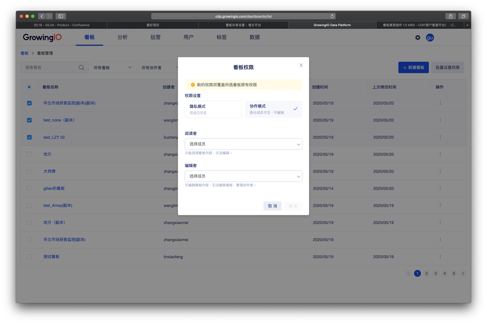

# 看板共享设置

## 简介

共享设置 可以设置不同的看板，与不同的成员分享 。  
使成员只看到他关注且有权限查看的数据看版 ，既保证数据协作也保证数据的安全性 。 

## 使用场景

当系统分别有50位同事 ，每位同事来自于不同的部门或团队，如市场部 5人、运营部10人、研发部8人、数据分析部3人时、销售部24人。

为了让不同成员 仅能看到**他需要且有权限看到的数据看板**，我们可以将不同的看板共享给不同的成员。 


建议： 编辑者的权限只开放给少数需要制作看版的分析人员  ，其余大多数仅需查看的成员为阅读者。



权限控制：需要该成员具有看板权限，且同时是该看板的拥有者。

超级管理员、管理员具有所有看板的资源权限。


## 看板共享模式说明

共享模式分为两种： 隐私模式 、共享模式 。 

**隐私模式** ：隐私状态下，该看板仅对看板拥有者自己可见 。

**共享模式**： 可設置该看板的协作成员，并赋予 “阅读者”与“编辑者”的权限。

| 选项 | 作用 |
| :--- | :--- |
| 阅读者 | 只能阅读看板内容，无法编辑。 |
| 编辑者 | 可编辑看板内容，无法删除看板、管理协作者。 |

## 操作说明

### 设置看板的共享模式

1.点击设置共享模式 

2. 选择共享模式为 **隐私模式** 或 **共享模式。**

3.设置共享 编辑者、阅读者是哪些成员 。

### 批量共享設置

1. 勾选需要设置的看板

2. 点击批量设置

3.设置共享 编辑者、阅读者是哪些成员 。


新的设置将覆盖所选看板的原有共享设置。


