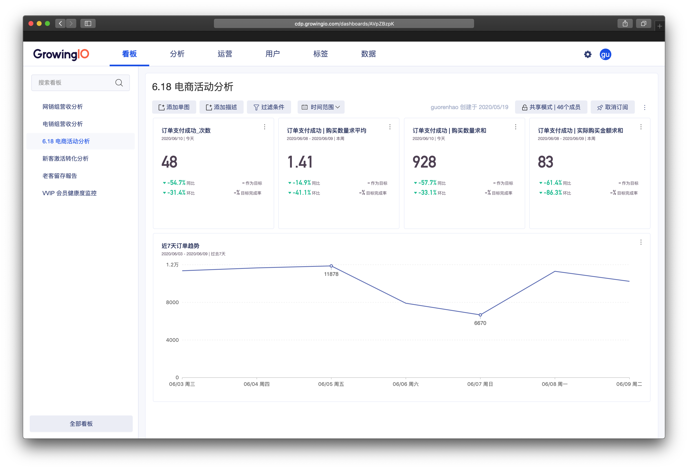
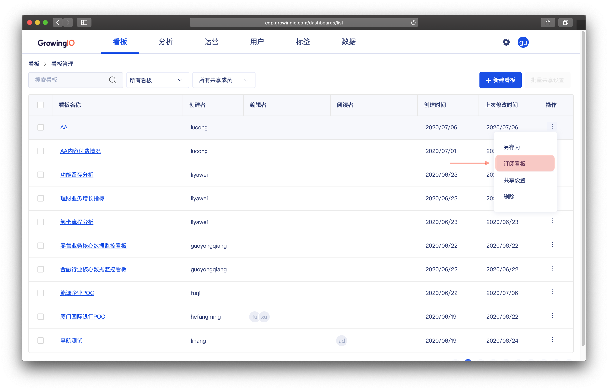

# 看板订阅

## 功能介紹

一个系统中 ，通常由于多人共同协作，会有上百个看板 。  
然而，高效的数据消费方案，应该保持用户关注  _**需要他关注的**_ 与 _**他想关注的**_ ****看板。  
因此，我们可以通过看板订阅，保证自己看板的整洁与专注。

## 可订阅的看板范围  ：

一位成员可订阅的看板 ， 包含 **自己创建的** 与 **与我共享的** 。    
‌  
举例 ： 系统中一共有 100 个看板 ， **小明自己创建**的 15 个 ，**与小明共享**的是 20 个 ， 那小明可以订阅的看板为 35 个 。   另外 65 个由于小明没有权限所以无法订阅。


自己创建的看板 ，创建成功后，采用默认订阅 。

您不需要再找到看板进行订阅操作。



他人与你共享的看板，共享設置保存後后， 被共享的成員將会默认订阅 。 

該看板会默认出现在，共享成员的侧边栏。成员不需要在找到看板进行订阅操作。


## 看板订阅操作 ：

### 订阅看板：

1.在看板管理中 找到需要订阅的看板 ，点击订阅看板 。

2. 在看板詳情中，点击订阅看板

### 取消订阅看板：

在侧栏中点击Ｘ ，确定取消看板订阅。


取消看板订阅后，当前看板将不在侧边栏展示， 您可以在看板管理中重新订阅看板到侧边栏。


