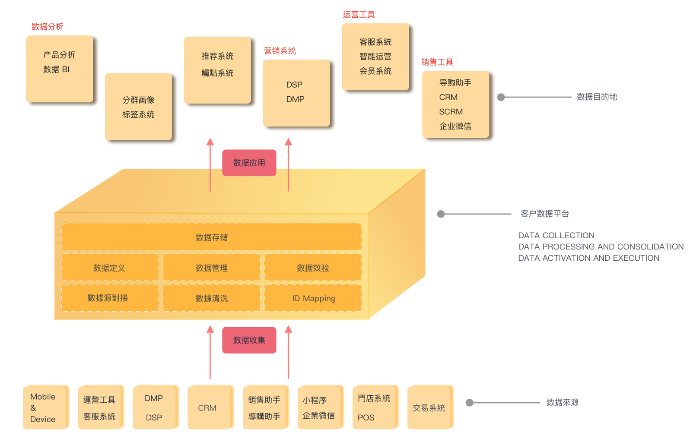

# 客户数据平台

## 什么是客户数据平台？ 

客户数据平台 （Customer Data Platform） 在GrowingIO 中被定义为一个数据中心 \(Data center\) 。‌  
所有 数据采集 、数据源接入，都会先汇集到客户数据平台，进行统一个数据融合与存储 。

为企业提供一个  _**统一的、持久的、可共享**_  的客户数据库。  解决全渠道、多触点、多业务系统、线上线下的复杂业务中所面临的数据孤岛问题 。

  

