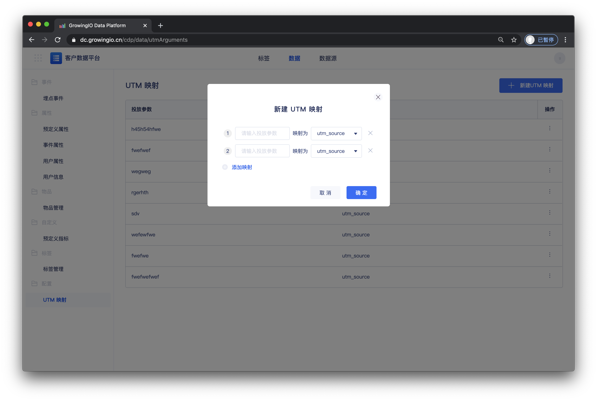

# UTM映射

## 简介

在复杂的广告投放场景中，可能会遇到以下场景：

不同渠道投放时，需要设置不同标识值的投放参数，例如A渠道必须使用ChannelID=A， B渠道必须使用ResourceID =B ;

不同部门在分别渠道投放时，设置的投放参数不一样，例如 A部门的运营活动投放时，渠道参数设置成了 utm\_source = A; 而B部门的运营活动投放时，渠道参数设置成了 utm\_channel = B;

广告参数一般是固定参数值的，例如常见的utm\_source, utm\_campaign, utm\_medium, utm\_content, utm\_term。 在面对如上场景时， 就存在一些情况，由于跨部门、跨渠道、跨场景等情况，渠道参数非常难统一，造成经常混用UTM几个不同的参数来统计同一来源角度的情况。使来源分析的可用性和可解读性大大降低。

为了解决这个问题，GrowingIO上线了UTM映射功能，使项目中，同一角度上，多个不同的参数值，可以统一到一个统计维度上，保证来源分析的可用性和可解读性。

例如，针对上面的描述的场景，ChannelID, ResourceID, utm\_source, utm\_channel 几个参数值，都代表一个分析角度，即获客来源，则都可以映射为utm\_source, 在分析中统一使用 **广告来源** 维度进行数据维度对比。


注意事项

* 映射创建后，才开始统计做映射的渠道参数
* 删除映射后，没有使用UTM 5个参数的投放数据将不再进行统计
* 严格匹配映射参数，大小写敏感，需要确保填写的映射参数和投放一致
* 不能使用相同的标识表示不同的UTM参数，即A部门使用ChannelID = A，B部门使用ResourceID = A
* 当投放链接中多个标识映射同一个UTM参数时，按顺序取最后一个参数进行映射


## 操作步骤

1. 在客户数据平台 &gt; 数据 &gt;  UTM 配置 ，打开项目配置界面。
2. 单击**新建UTM映射**来创建映射关系。

