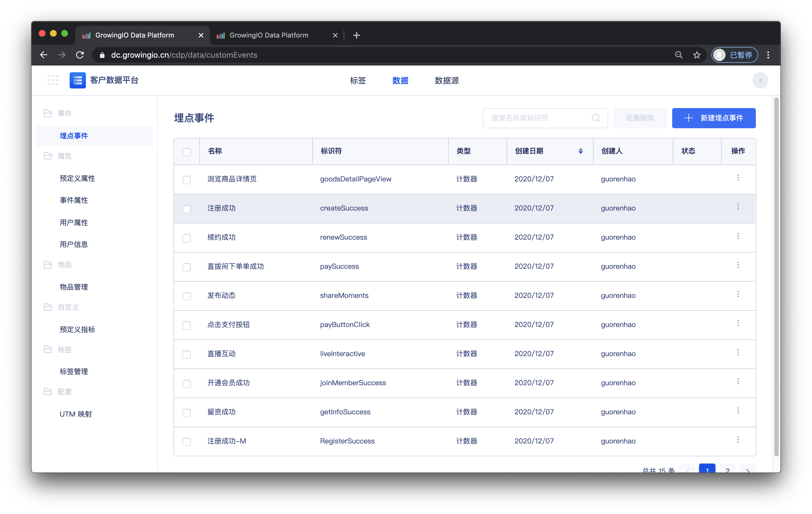
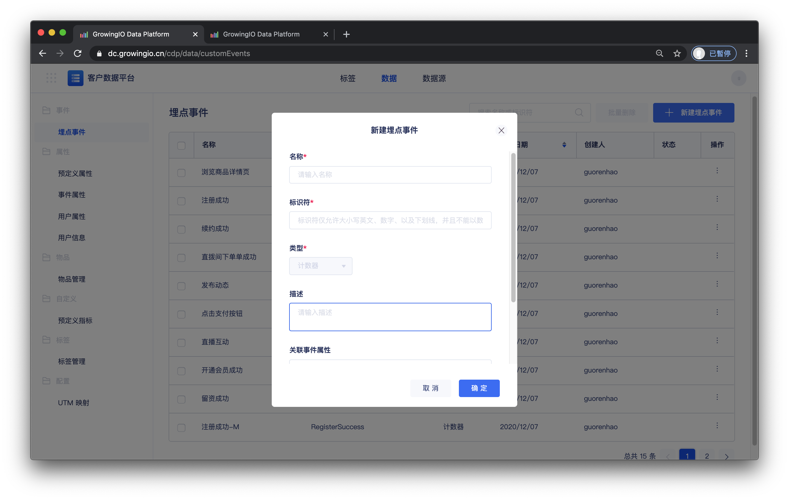

# 埋点事件

## 简介

在开始代码部署前，需要先在事件管理中将事件及事件属性、物品属性配置到GrowingIO平台。

## 创建事件

一、在顶部导航栏选择 “**数据 &gt; 事件 &gt; 埋点事件**" ，进入事件管理页面。

二、单击右上角 **添加事件**、进入**新建事件**页面。

| 参数 | 说明 |
| :--- | :--- |
| 名称 | GrowingIO平台上事件的名称。 |
| 标识符 | 此变量在代码中的标识，仅允许大小写英文、数字、下划线，并且不能以数字开头。 |
| 类型 | 默认类型为计数器，不可更改。 |
| 描述 | 事件的描述，可填写事件的触发时机和应用场景。 |
| 关联事件属性 | 选择当前埋点事件关联的事件属性。 |
| 关联物品属性 | 选择当前埋点事件关联的物品。 |

三、填写完成后单击**确定**，完成一个事件的创建。


在完成了配置，以及正确的代码实施后。我们即可开始在GrowingIO使用事件。


## 事件管理页面

在事件管理页面可以查看事件的名称、标识符、类型、创建日期、创建人、状态。

您也可以对事件进行以下操作：

**搜索：**您可以在页面中列表上方的搜索框按事件名称和标识符来搜索事件。

**QuickView：**单击任一事件，您可以在右侧弹出的事件详情中，查看事件的基本信息。

**编辑：**在QuickView界面单击事件的参数进行修改，修改后单击保存。

**删除：**单击单条事件右侧的  选择删除，可删除不需要的事件。

**批量操作**：在列表中使用复选框选择多个事件，可以进行批量删除。

