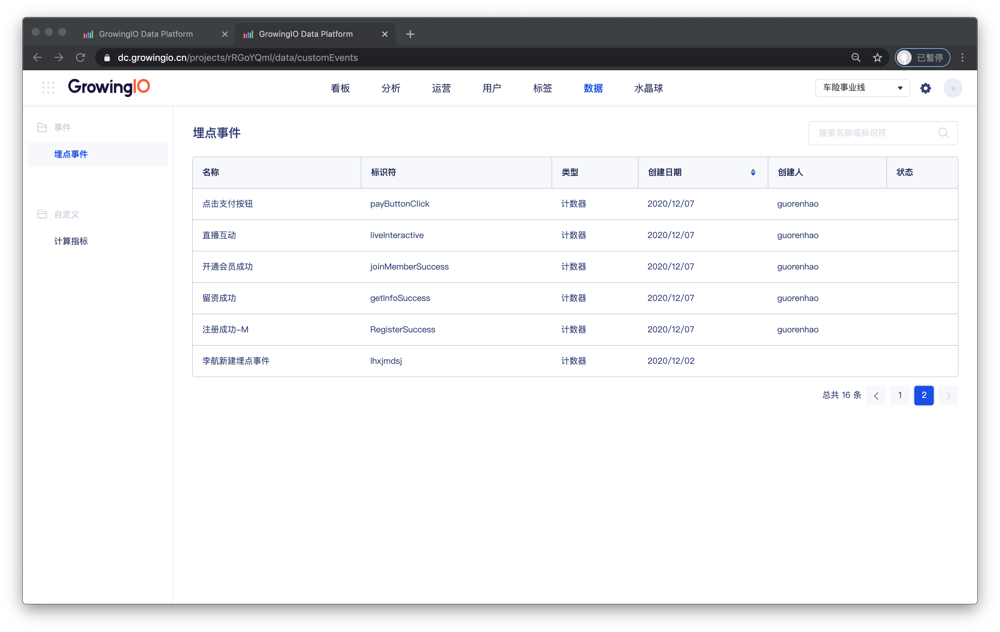

# 埋点事件


项目中展示的 埋点事件 ，为在项_**目数据授权**_中由企业超级管理员所授权。 


## 功能介绍

可由项目中的数据 &gt;  埋点事件中 ，查看该项目的可用埋点事件。 

## 事件管理页面

在事件管理页面可以查看事件的名称、标识符、类型、创建日期、创建人、状态。

您也可以对事件进行以下操作：

**搜索：**您可以在页面中列表上方的搜索框按事件名称和标识符来搜索事件。

**QuickView：**单击任一事件，您可以在右侧弹出的事件详情中，查看事件的基本信息。

