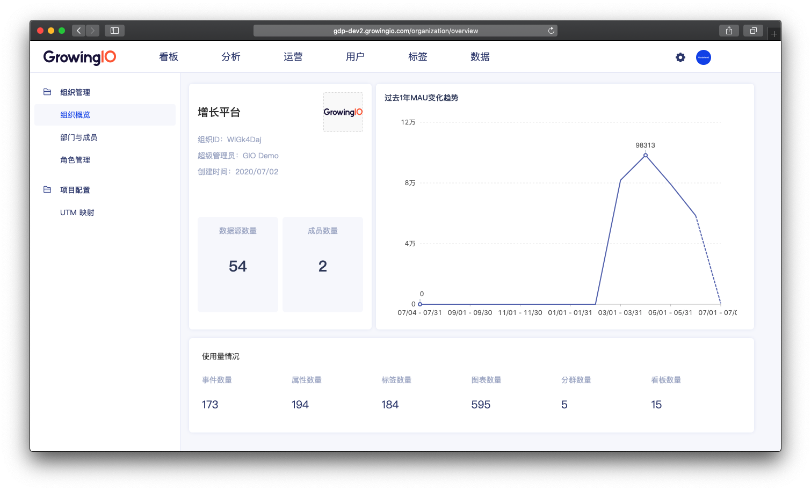
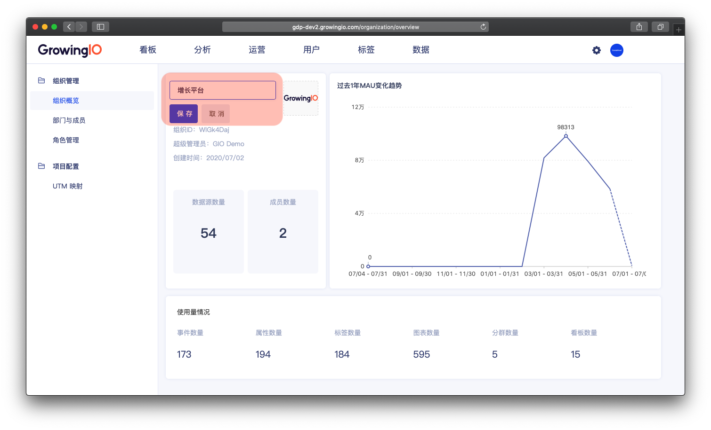
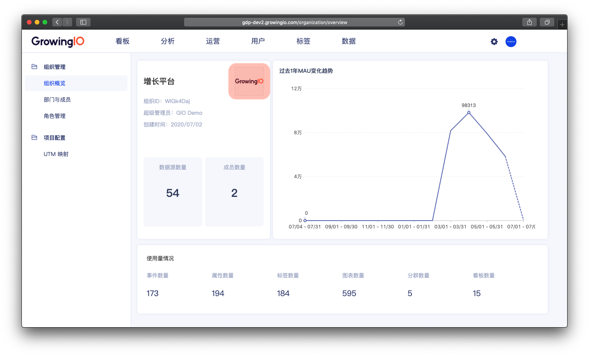

# 组织概览

## 功能介紹

组织概览包括组织基本信息、基础数据和成员创建情况总览。

## 界面介绍

* 组织信息：组织名称、组织ID、创建时间、数据源数量、成员数量；
* 基础数据：过去1年MAU变化趋势；
* 使用状况：事件数量、属性数量、标签数量、图表数量、分群数量、看板数量。

## 组织概览的操作說明 

| 操作 | 作用说明 |
| :--- | :--- |
| 编辑企业名称 | 可以修改调整企业名称 |
| 上传企业 logo | 可以修改 logo 为企业logo |


仅负责人拥有以上权限。


### 

### 编辑企业名称

点击**企业名称**，进入企业名称修改模式。你可按需修改企业名称，点击**确认**即可保存。


仅负责人可以操作編辑企业名称


### 

### 上传企业 logo

点击**企业 Logo** ，即可**修改企业 Logo** ，在弹窗中选择图片以替换现有 Logo 图。


仅负责人可以操作上传企业 logo


### 

