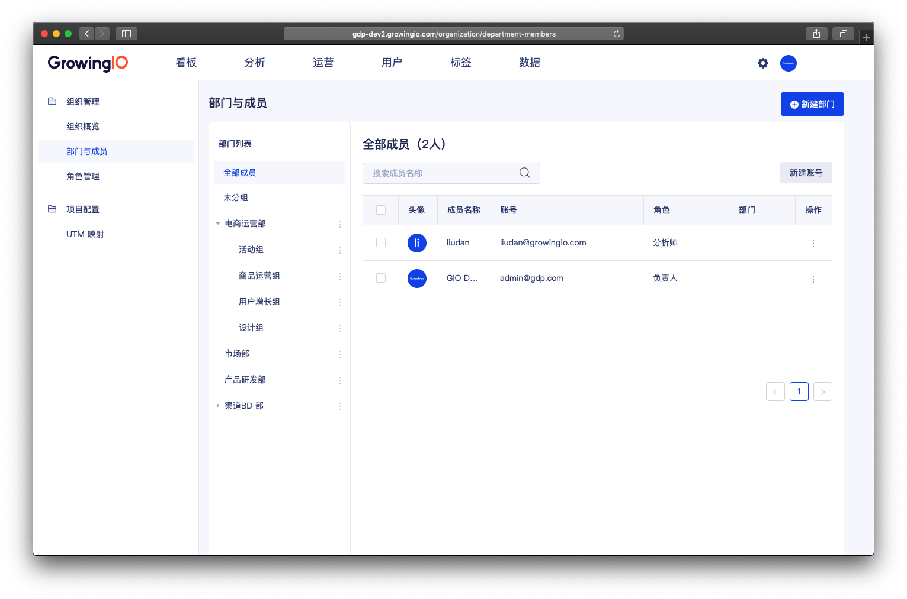
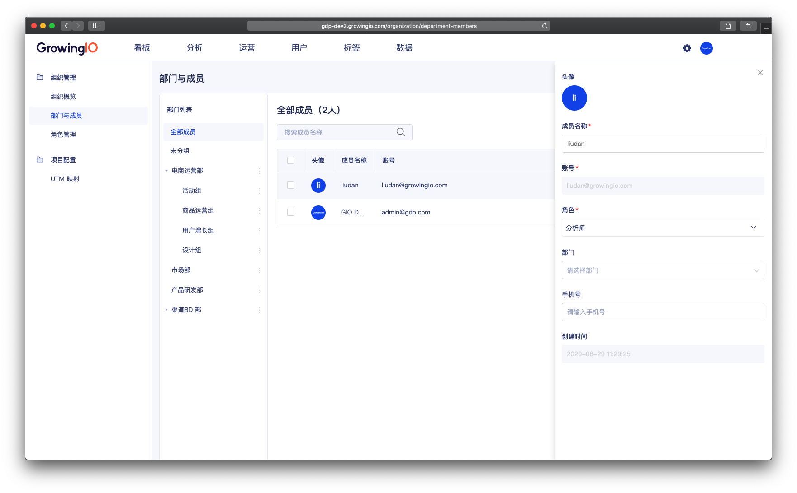
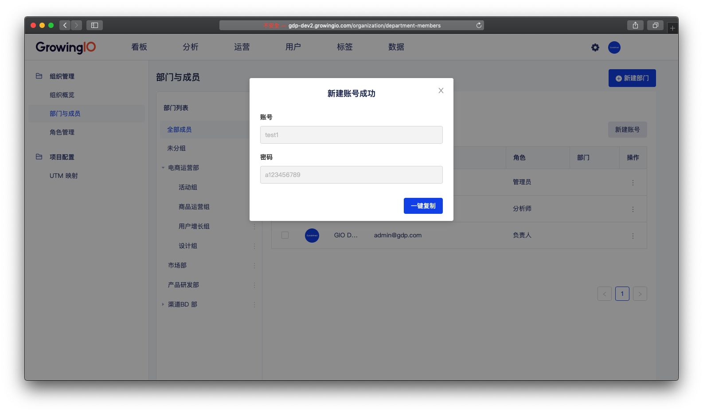
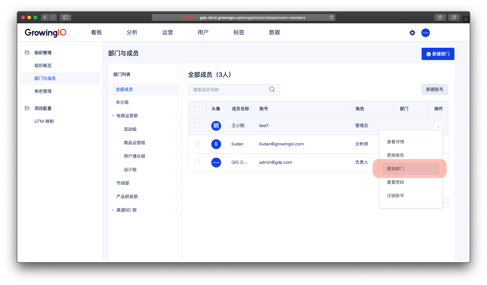
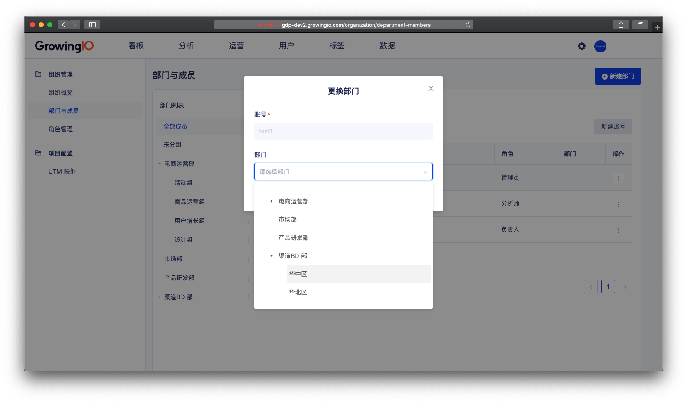
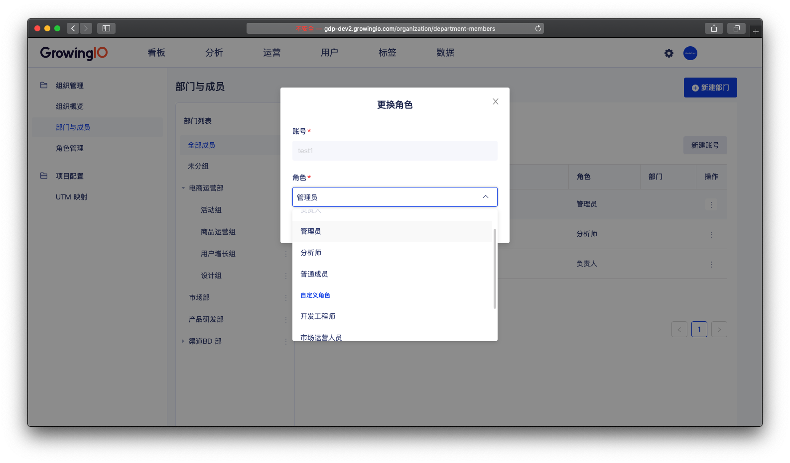
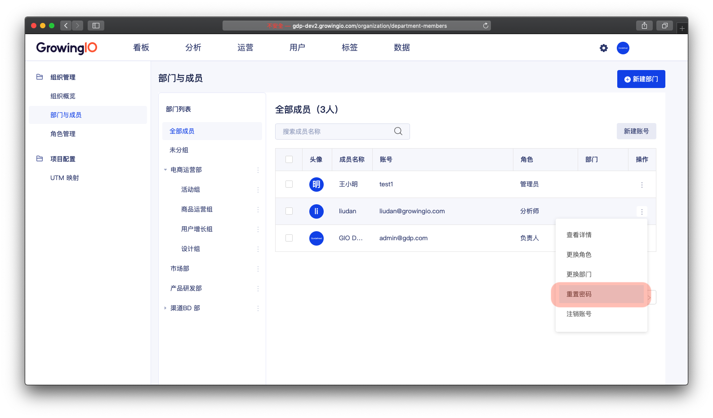
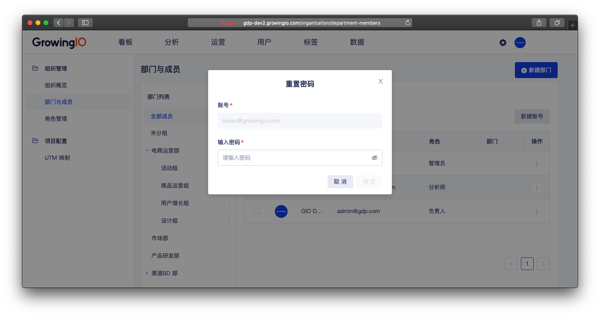
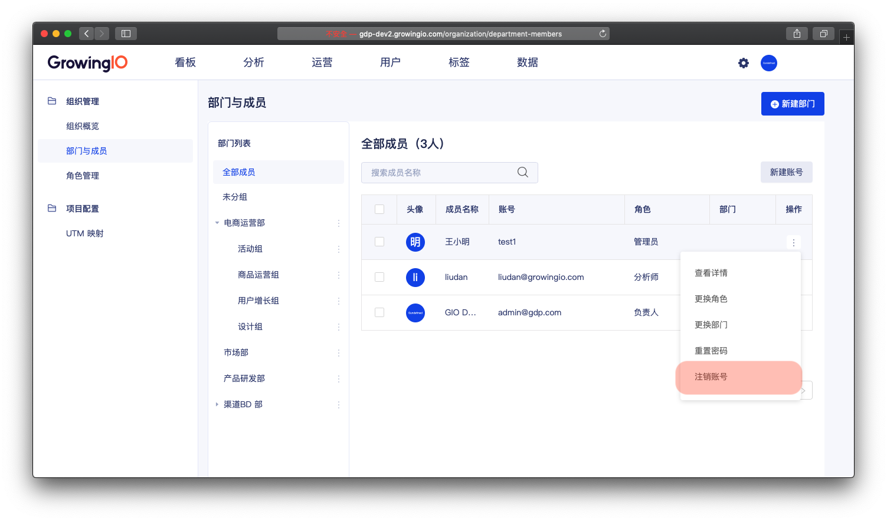

# 成员管理

## 功能介紹

成员是指 ： 可访问在GrowingIO 系统的使用者。

在成员管理中，可以帮助系统的管理员完成管理系统成员的工作 ，如 成员信息、新建帐号、赋予成员角色、註销成员等。

## 界面介绍

成员分别会展示在不同的部门之下 ，同时在全部成员下，可以查看所有的成员 。 

## 成员的操作說明 

| 操作 | 作用 |
| :--- | :--- |
| 查看/编辑成员信息 | 可以查看/编辑成员的详细信息 。 |
| 新建帐号 | 为使用者创建系统帐号 。 |
| 更換部門 | 依据组织架构，调整成员所属的部门。 |
| 更換角色 | 赋予成员功能的使用权限。 |
| 重置密码 | 未忘记密码的成员，重置密码。 |
| 注销帐号 | 删除离职、不需要的帐号 。 |


仅负责人和管理员拥有成员管理的权限 ，可进行成员管理。


### 

### 查看成员详情

操作流程： 点击成员名称 &gt;  打开成员详情。

### 新建帐号

操作流程：点击新建帐号 &gt;  填写帐号信息 &gt;  选择角色 &gt;  创建成功 &gt; 一键复制帐号密码 。

创建帐号成功后，点击一键复制 ，可将帐号密码 ，直接复制并发送给成员 。 


请提醒成员登入后，尽快跟换密码，以确保个人帐号安全 。



权限控制： 仅负责人、管理员 可新建帐号 。   


### 

### 更換部門

负责人、管理员可以依据组织架构，调整成员所属的部门。

操作流程：点击 更换部门 &gt;  选择部门 &gt;  点击确定  。


权限控制： 仅负责人、管理员可进行更换部门操作 。


### 

### 更換角色

角色作为功能权限组 ，  通过更换角色可以将成员赋予不同的角色，给予不同的功能权限 。 

角色功能权限 可查看 [角色管理 ](https://app.gitbook.com/@growingio/s/op/~/drafts/-MAzaH1u7s8T5QjeWsMF/v/v20200700/product-manual/sysmanage/orgmanage/jiao-se-guan-li)

操作流程：点击 更换角色 &gt;  选择角色 &gt;  点击确定。


权限控制： 仅负责人、管理员 可进行更换角色操作 。


### 重置密码

当成员忘记帐号密码时，管理员可以将密码进行重置，为成员帐号设置为新密码。

操作流程：点击 更换角色 &gt;  选择角色 &gt;  点击确定 &gt; 复制帐号密码。


权限控制： 仅负责人、管理员 可进行更换角色操作 。


### 注销帐号

可以通过注销成员 ，  删除离职、不需要的帐号 。

操作流程：点击 注销帐号 &gt; 弹窗提示 &gt; 点击确认 。


权限控制： 仅负责人、管理员 可进行更换角色操作 。



管理员无法注销负责人。


