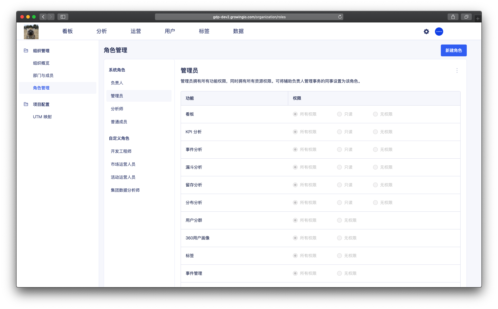
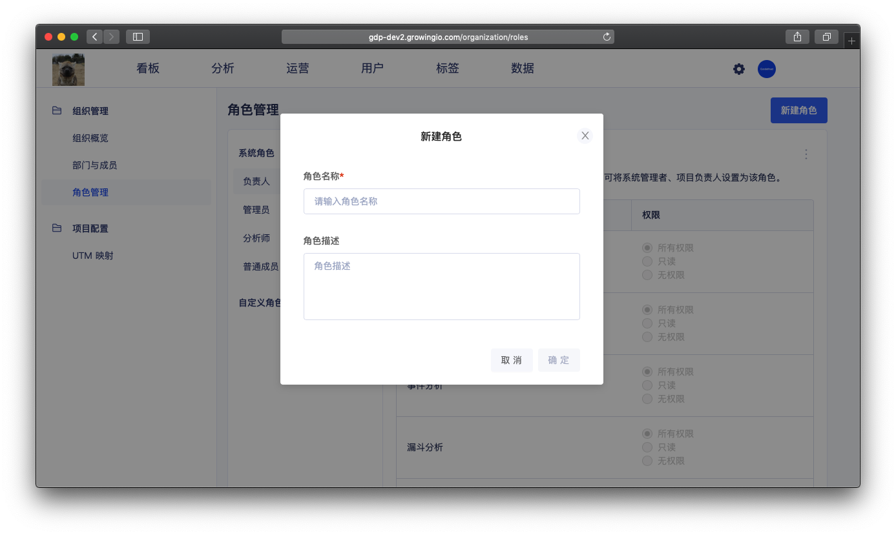
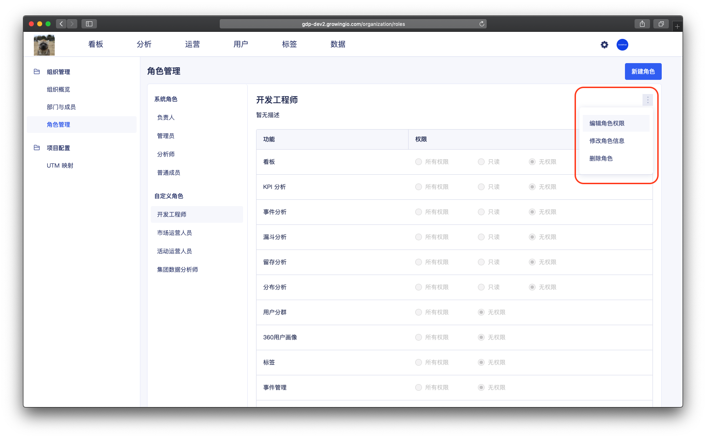

# 角色管理

## 功能介紹

一个角色，就相当于一个功能权限包。角色将决定成员在该项目中的功能权限，即该成员可否使用某项功能。

管理员给每个成员创建帐号时，都需要选择角色。GrowingIO 在项目中有预置的 **系统角色**，也支持 **自定义角色。**


**一个成员 ，只对应一个角色。**


## 界面介绍

## **系统角色**

GrowingIO 在项目中，帮助用户预置了 4 个系统角色：_**負責人、管理员、分析師、普通成员**_。系統角色不支持编辑角色信息、修改角色权限、删除角色等操作。

**负责人**

* 负责人是唯一的。 
* 负责人拥有最高权限的角色。一般来说是管理人員，管理成员们在项目中可以做什么，不能做什么。
* 负责人拥有该项目中所有的功能权限（**包括修改組織名称、移交負責人**）和 所有资源权限。

**管理员**

* 管理员可以輔助负责人做管理项目的角色。
* 管理员拥有所有功能权限（但不包括更换项目名称、更换超级管理员）。

**分析師**

* 分析師是主要生产者，具有功能创建、编辑、查看权限，可将团队内主要负责生产数据看版、数据分析的同事设置为分析師角色。

* 分析師不具有项目中的**管理相关**的权限（成员管理、角色管理、部門管理），无法对其他成员进行管理操作。

**普通成员 \(阅读者\)** 

* 普通成员是项目中的主要**消費者，**具有看板查看权限，可将团队内看数据看板的同事设置为普通成员。

## **自定义角色**

**新建角色：**单击**新建角色**按钮，勾选权限范围，并输入角色名称后进行保存。

**查看角色：**在左侧的角色列表单击选中角色，可查看此角色的功能权限范围。

**編輯角色：**在左侧的角色列表单击选中角色，选择右上角编辑按钮，可修改角色名称、角色功能权限。

**刪除角色：**在左侧的角色列表单击选中角色**，**选择右上角刪除角色按鈕**。**  


1.系统默认角色 不可删除、编辑

2.当角色关联成员时，无法删除角色，请先将成员更换角色后再删除该角色。


## 角色管理的操作說明 

| 操作 | 作用 |
| :--- | :--- |
| 新建自定义角色 | 根据不同的需求场景，可以自定义角色，来满足不同功能权限的配置。 |
| 编辑角色权限 | 配置角色拥有不同的功能。 |
| 编辑角色信息 | 修改角色名称、描述。 |
| 删除角色 | 删除不需要的角色。 |


仅负责人和管理员拥有角色管理的权限


### 

### 新建自定义角色

根据不同的需求场景，可以自定义角色，来满足不同功能权限的配置。

操作流程：点击 右上角新建角色 &gt;  填写角色信息 &gt; 点击确定 。 


新建完成后，会附于新角色初始化的权限配置 ， 可点击 编辑角色权限进行调整。



权限控制： 仅负责人和管理员拥有 新建角色权限。


### 编辑角色权限

配置角色拥有不同的功能。

操作流程： 点击 编辑角色权限 &gt; ****进入权限编辑状态 &gt; 点击保存。 

功能权限的设置 ：可对一个功能项，选择 所有权限/ 只读 / 无权限 。

* 所有权限： 可查看、新建、编辑、删除。

* 只读： 仅可查看。

* 无权限

### 删除角色

操作流程： 点击 删除角色按钮 &gt; 点击确定。


删除角色时，须先将角色关连的成员，修改为其他角色。


