# 魔豆-beta\(仅内部\)

## **魔豆简介**

魔豆是一个自动化预测模型建模工具，可以帮助业务和分析人员高效地创建预测模型。高效主要体现在两个方面：

构建模型所需时间短，从手工模型通常花费几周甚至几个月时间缩短到自动化构建的几个小时。

模型精度高，系统从原始数据中自动提取并构建丰富的特征，并采用业界成熟的预测算法，以AUC为衡量指标的模型评价可以媲美资深模型师甚至更好。

目前魔豆支持二分类预测模型，即把预测的样本人群分为2个：1为正样本，符合某个分群规则的，0为负样本。二分类模型可应用于对关键转化的预测，如：购买预测、流失预测、点击预测、活动参与预测等。

## **准备标签**

标签是预测的对象，比如“7天内购买过产品的用户”。标签的创建是在客户数据平台的数据模块中用分层标签完成。在创建标签时，只需要构建正样本，且分层名称需为1。负样本默认将由系统从非正样本中进行抽取。

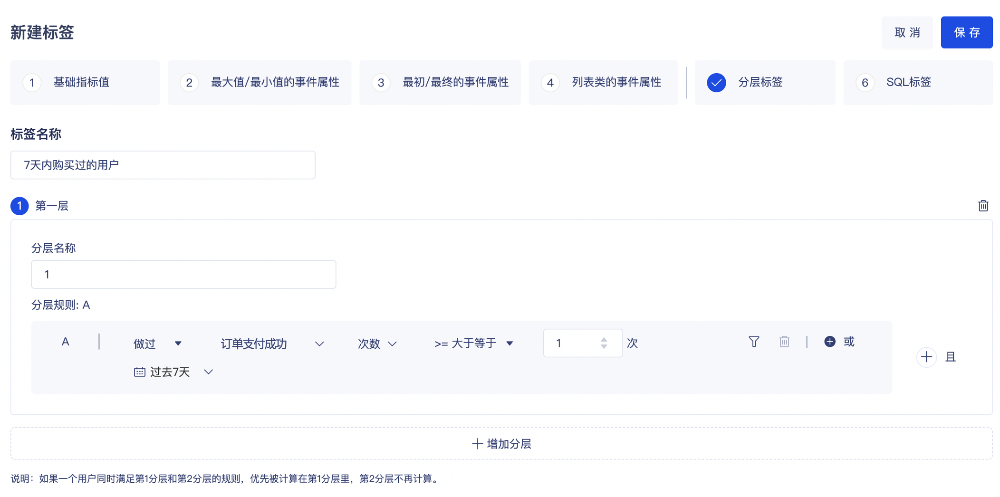

在一些特定的进阶场景中，如果默认负样本定义无法满足业务需求，则可通过分层标签同时定义正样本和负样本。例如构建新客户第二次购买预测模型，定义正样本为：”在30天内购买大于或等于2次的新用户”、并命名分层为“1”，同时定义负样本为：“在30天内购买等于1次的新用户”，并命名分层为“0”。

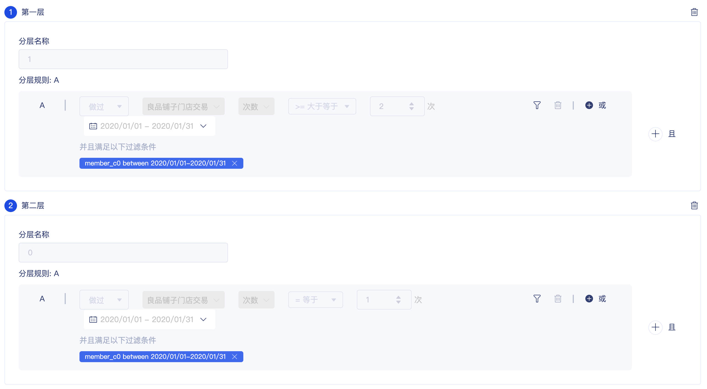

## **创建项目**

标签创建好了，就可以在魔豆中创建相应的项目来进行预测建模了。在创建项目时，选择刚才创建的标签作为【预测标签】，并给定项目的名称、描述、训练数据时间跨度等，点击开始即开始模型的训练。针对建模有经验的用户，可选择开启高级选项，进行建模的特征和算法的选择。

【训练数据时间跨度】表示用多长时间的数据来训练模型，你可以根据业务经验选择足够长且具有代表性的时间跨度。

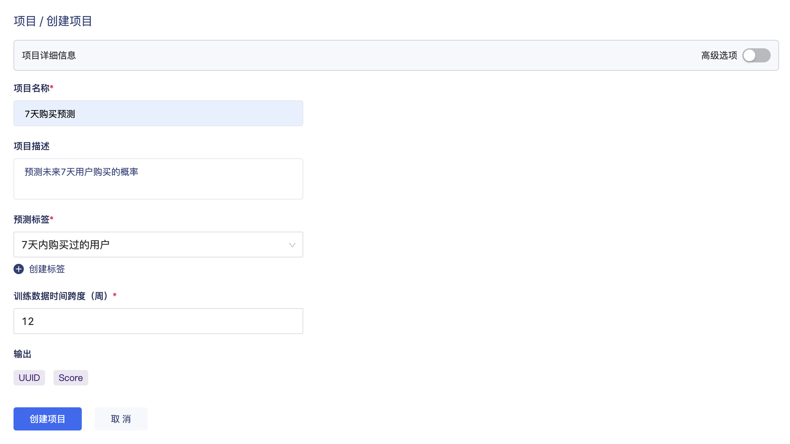

例如，希望对未来7天购买的可能性进行预测，选择【预测标签】为“7天内购买过的用户”（即文档中步骤2中创建的标签），【训练时间跨度】依据业务经验设置为12周。

以上述项目配置为例，下面说明下模型的时间跨度：

模型预测的是在未来指定时间段内达成目标的概率。具体来讲，在模型训练阶段，从现在往前7天（即预测标签中定义的时间跨度）为【目标时间跨度】，在该时间段内是否达成目标作为正负样本的判定标准。而从现在往前7天前的12周（-91天至-7天，即选择的“训练数据时间跨度”）为【特征时间跨度】，该时间段内的特征将用于模型训练。

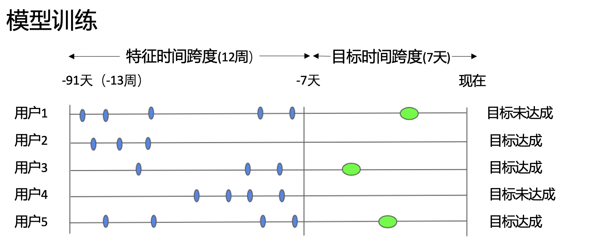

模型训练完成并部署后，在模型打分阶段，从现在往后7天（即预测标签中定义的时间跨度）为【预测时间跨度】，模型针对该时间段内用户达成目标的概率打分。而从现在往前的12周（-84天至今，即选择的“训练数据时间跨度”）为【特征时间跨度】，该时间段内的特征将用于模型打分。

## **选择特征**

在高级选项开启的情况下，系统将会预先依据信息值（Information Value）筛选一些对模型有贡献的特征。用户可以根据业务实际需要在此基础之上进行选择所需的特征进入模型。完成特征选择后点击【继续】。

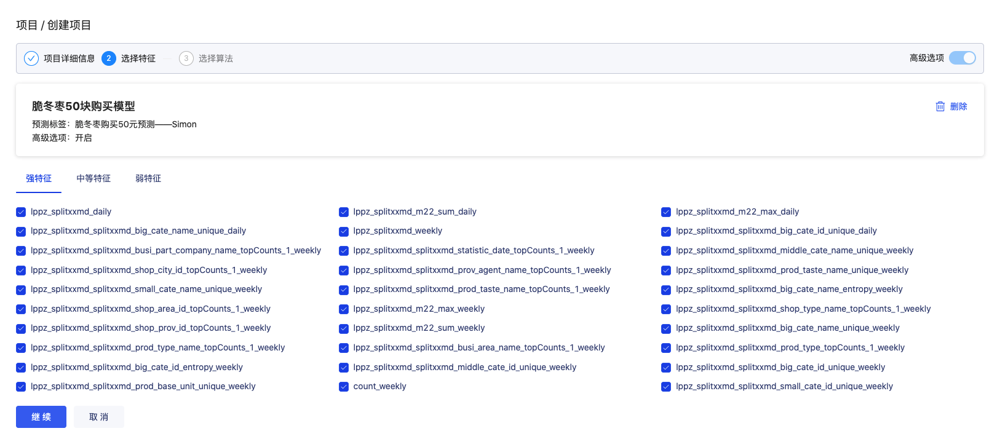

## **选择算法**

在高级选项开启的情况下，用户可以选择一个或多个算法同时进行模型训练。勾选模型后点击【训练模型】进行训练。

注：基础模式默认用Gradient Boosted Tree算法训练模型，依据我们的经验该算法针对二分类模型的效果通常优于另外几个提供的算法。

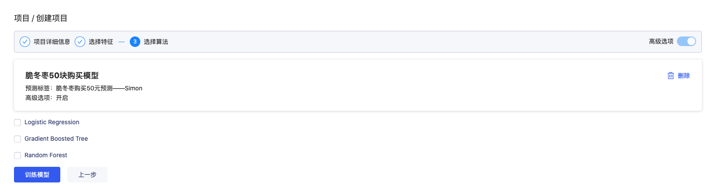

## **部署模型**

当模型训练完成后，用户可以选择需要的算法进行部署。如果有多个算法模型结果，一般选择AUC值最大的即可。点击界面上的【选择】按钮进行部署。

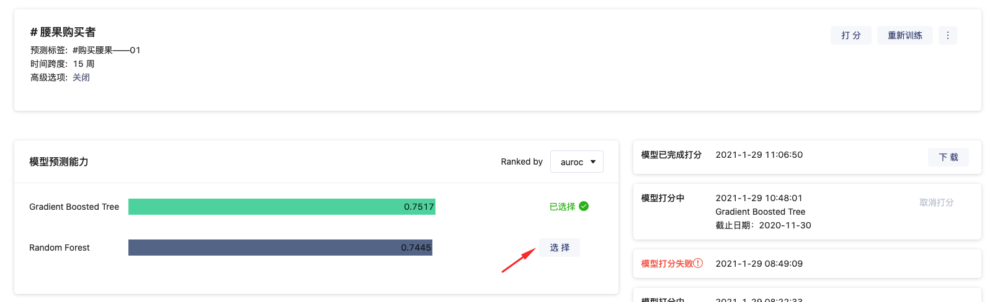

注：AUROC（简称AUC）是指ROC曲线下的面积，是衡量分类模型表现的一个常用指标。AUC值在0.5-1之间，AUC值越接近0.5、预测力越差（接近随机效果），越值越接近1、预测力越强。具体来讲：

* AUC = 1，是完美分类器
* AUC = \[0.85, 0.95\], 效果很好
* AUC = \[0.7, 0.85\], 效果一般
* AUC = \[0.5, 0.7\],效果较低
* AUC = 0.5，跟随机猜测一样（例：扔硬币），模型没有预测价值

## **算法打分**

算法打分是对所有满足条件的用户（即用户定义的【训练时间跨度】内有特征数据产生的用户）进行预测计算的过程。魔豆提供两种打分的方式：

**一次性打分**

即刻对所有满足条件的用户进行预测计算。可以指定截止日期，默认是今日，用来表示进行预测计算时最晚的用户数据时间点。

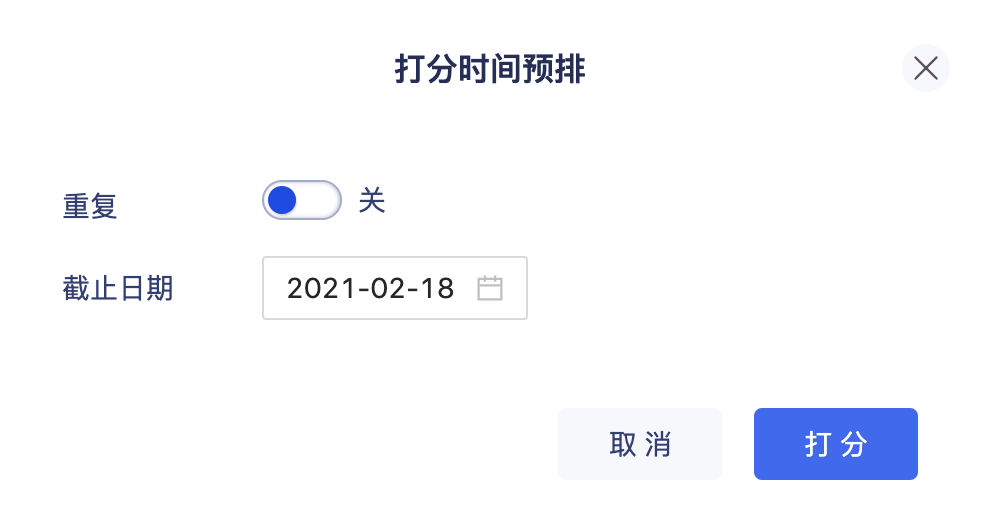

**重复打分**

可以根据业务需要按每日、每周、每月来进行预测计算，并指定具体的打分时间，对所有满足条件的用户进行打分。

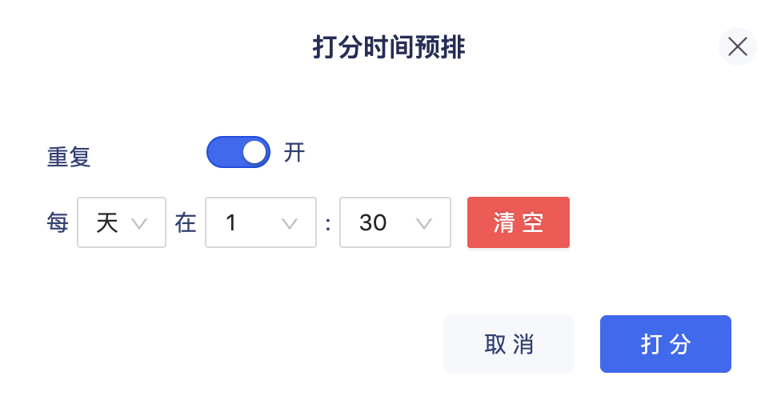

打分完成后，模型详情界面右侧会提示“模型已完成打分”，点击【下载】可获取csv格式的打分。

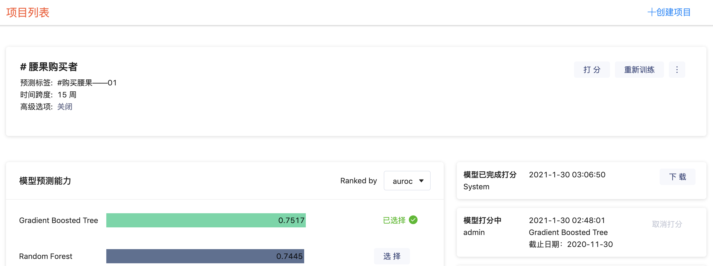

另外，模型打分结果会作为标签回存到客户数据平台，可在客户数据平台的标签列表中看到4组标签：

* score：对满足条件用户打分的值，存储值为用户的分数
* quntile：把打分从低到高排序后均分到5组（0到4组，组号越大表示打分越高），存储值为用户的组号
* decile：把打分从低到高排序后均分到10组（0到9组，组号越大表示打分越高），存储值为用户的组号
* percentile：把打分从低到高排序后均分到100组（0到99组，组号越大表示打分越高），存储值为用户的组号

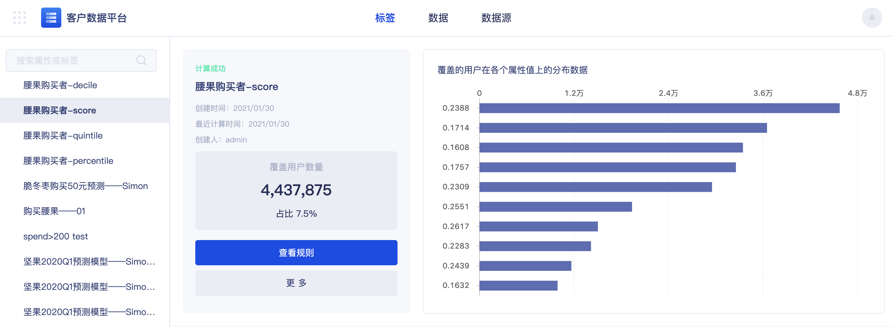

## **重新训练**

模型的预测能力可能会随着时间的流逝而慢慢下降。魔豆提供了重新训练模型的能力。

## **重新选择特征和模型**

当开启高级选项后，用户可以在模型训练完成后，重新选择特征和模型进行新的模型训练。

## **模型应用**

现阶段推荐两种方式应用模型输出结果：

**方式一：通过GrowingIO的智能运营，直接触达符合模型预测条件的用户**

首先，创建需要触达的用户分群。例如，想要选择高购买概率的用户来做触达，则可根据业务理解灵活定义，如：标签为score&gt;0.7（代表购买概率&gt;0.7）或quintile=4（代表购买概率前20%的用户）。

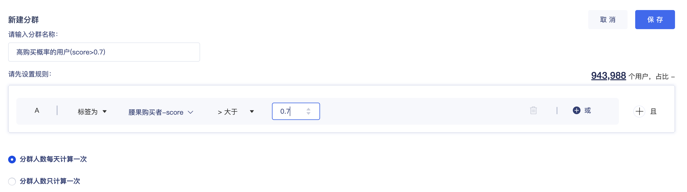

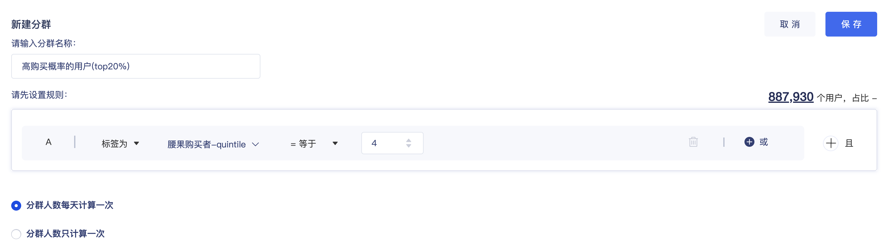

然后，在智能运营中，选择对应的分群配置触达规则。例如：对每日打分的高购买概率的用户在中午12点推送Push。

运营策略上线后，可在智能运营监测效果。

注：在模型初次应用时，建议先进行AB测试验证模型的效果。针对高概率、低概率人群，采用有触达、无触达两种方式进行对比，评估模型的提升效果。

**方式二：通过GrowingIO输出预测结果，利用客户自己的触达渠道进行运营**

你可以通过GrowingIO的标签到处API获取模型的预测结果，详见帮助文档：https://growingio.gitbook.io/op/v/v2020.13.0/developer-manual/api-reference/cdp/guide （注：这个帮助文档还未发布，预计随着13.X CDP发版上线）

如果你需要定时获取最新的预测结果（如按天/周更新），请确保设置的定时请求时间在模型打分完成后。

