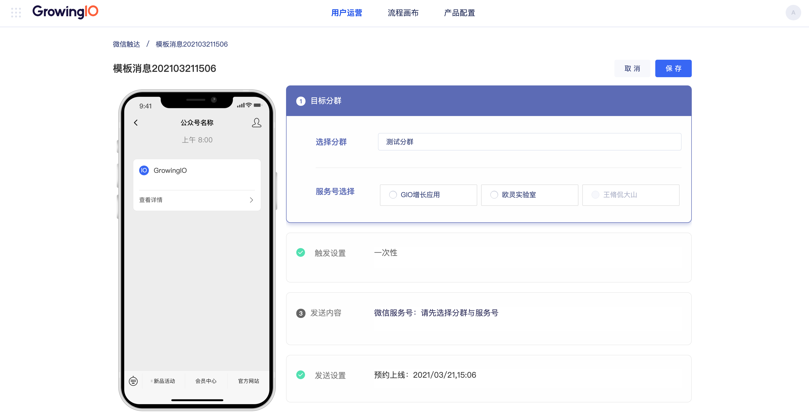

# 服务号模板消息

## 1. 服务号授权

### 1.1 服务号授权

首先，进入“产品配置-公众号配置“页面，进行公众号授权。页面上有详细的操作说明，请按步骤进行操作，需要注意两点：

1. 进行二维码扫码时，需要用服务号管理员的微信账号进行扫码
2. 进行授权时，为保证后续系统服务正常，“用户管理权限“、“群发与通知权限“、“账号管理权限“三个权限是必授权项，否则模板消息功能不可用

当授权成功后，可见服务号管理列表（如下图）

在服务号管理列表页

1. 可新增授权的服务号，可授权的服务号没有数量限制
2. 可更新授权成功状态的服务号的授权权限，为了后续更多的微信触点的对接做准备
3. 可见每个服务号可用的功能（主要是由于授权权限不足时，导致的功能不可用）

##  2. 服务号模板消息创建

### 2.1 进入服务号模板消息创建页面

进入”用户运营-活动类型-微信触达“页面，点击“新建消息“，即进入到模板消息创建页面

### 2.2 服务号模板消息配置

#### 2.2.1 模板消息任务命名

进入模板消息配置页面，可在左上角红框处进行模板消息任务的命名和修改，单击后即可编辑

#### 2.2.2 选择需要推送模板消息的客群

点击目标分群，单击选择对应的目标客群

客群选择完毕后，继续选择服务号，本次模板消息会推送至指定的服务号上，只可单选。所有在产品配置中授权的服务号，都会出现在服务号选择的待选项中。但授权权限不足导致模板消息功能不可用的服务号，会处于disable不可选中的状态

#### 2.2.3 选择模板消息的触发条件

模板消息支持四种触发条件

1. 一次性：在指定的时间，仅推送一次
2. 循环发送：在指定的时间范围内，按照设定的频率，在指定的时间点进行多次推送
3. 完成事件A触发：当圈定的用户，完成指定的事件A，给用户实时推送消息
4. 完成事件A未完成事件B：当圈定的用户，完成指定事件A后，在设定的时间范围内没有顺利完成B，给用户推送消息

#### 2.2.4 模板消息内容配置

先选择这次要发送的消息模板，消息模板为您在微信公众平台后台为服务号选择的模板，GIO会进行实时读取。关于微信服务号可选的模板可详见微信官方说明


微信官方说明：

模板消息仅用于公众号向用户发送重要的服务通知，只能用于符合其要求的服务场景中，如信用卡刷卡通知，商品购买成功通知等。不支持广告等营销类消息以及其它所有可能对用户造成骚扰的消息。关于使用规则，请注意：

1. 需要选择公众账号服务所处的2个行业，每月可更改1次所选行业
2. 在所选择行业的模板库中选用已有的模板进行调用
3. 每个账号可以同时使用25个模板

更多信息可点击下方链接了解详情[https://developers.weixin.qq.com/doc/offiaccount/Message\_Management/Template\_Message\_Interface.html\#5](https://developers.weixin.qq.com/doc/offiaccount/Message_Management/Template_Message_Interface.html#5)


选择模板后，根据模板要求进行内容配置即可。文案支持插入“事件属性/用户属性/用户标签“，可插入顾客姓名、会员等级、本次购买商品的名称等信息，灵活实现各种业务场景。

打开方式支持h5、小程序，配置好相关跳转链接后，用户收到模板消息后点击即可跳转至指定活动或者落地页面

####  2.2.5 设置执行时间

最后一步，设置好执行时间，点击上线即可

