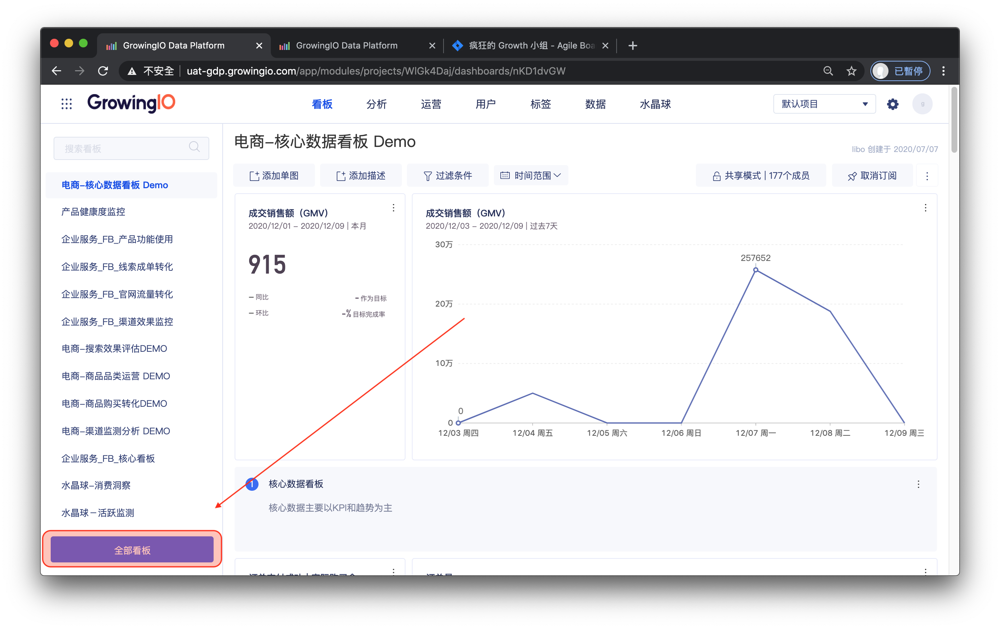
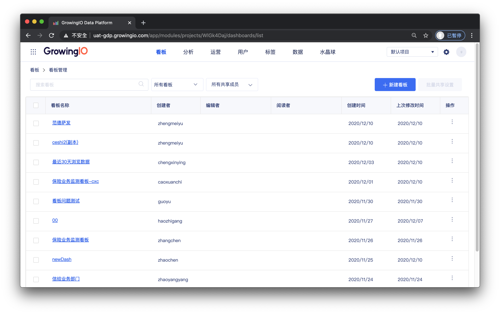
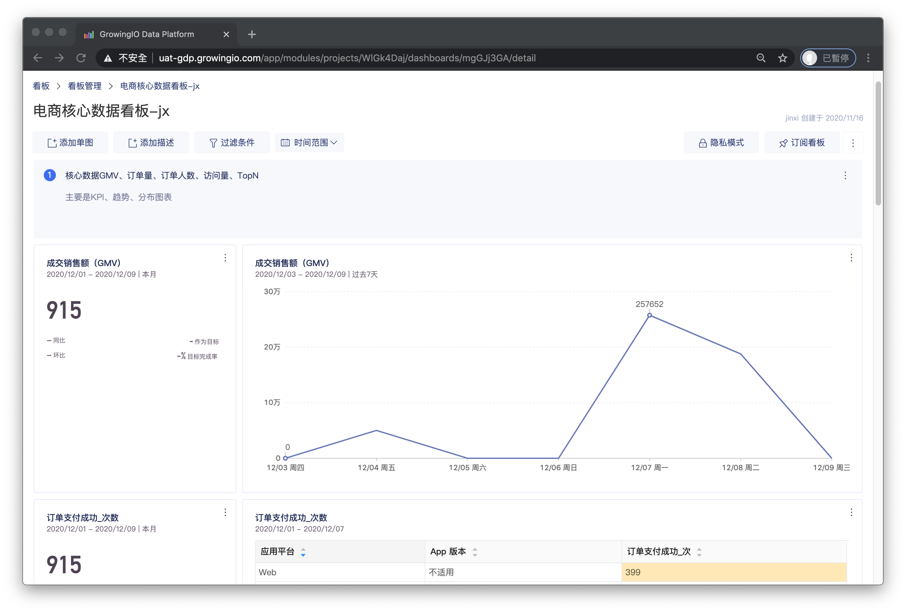
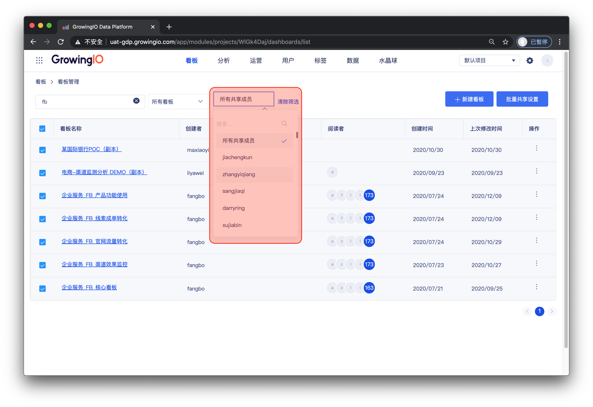
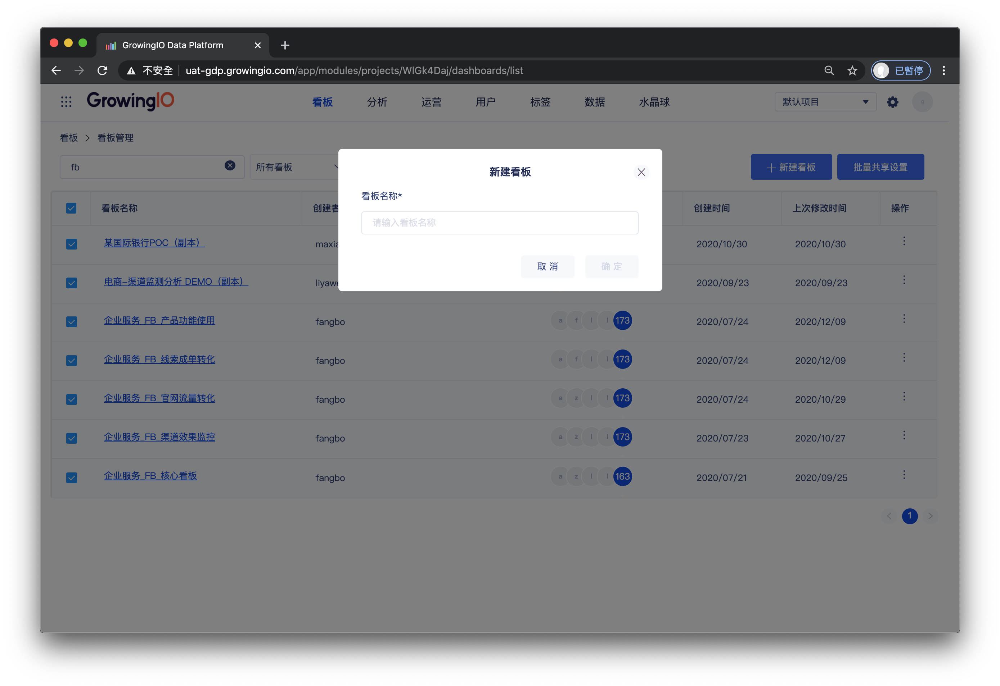
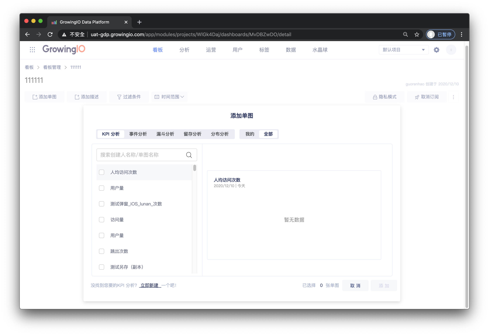
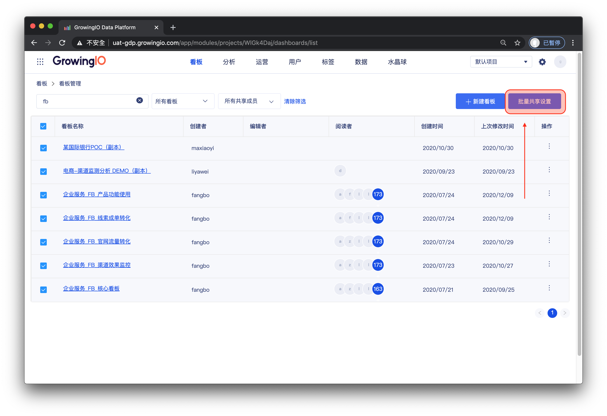
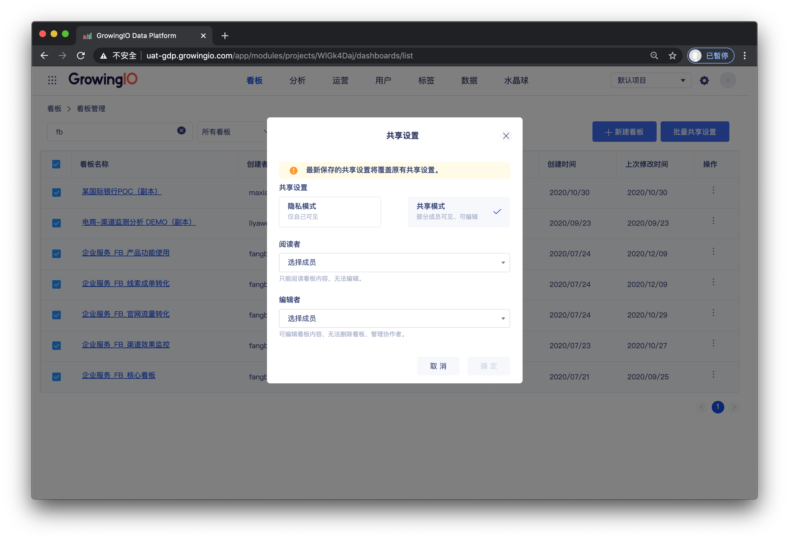
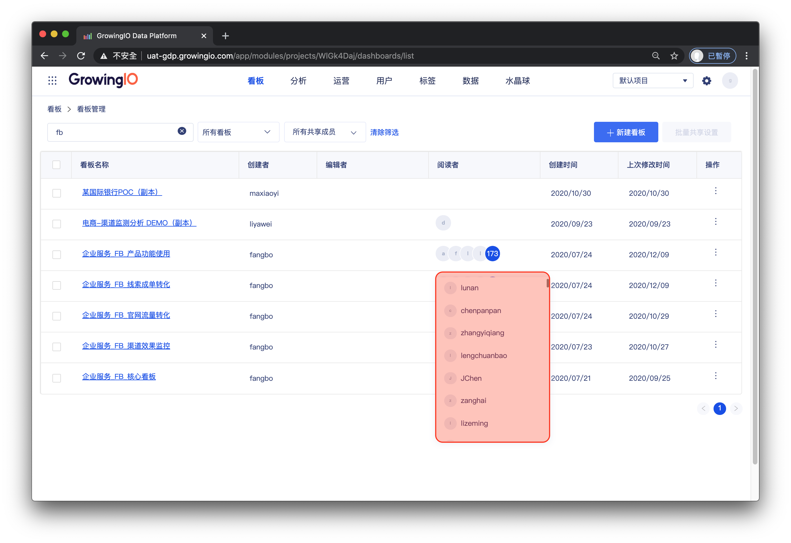

# 看板管理

## 如何进入看板管理？

<<<<<<< HEAD
操作流程： 看板模块- 位于看板侧栏下方，点击全部看板
=======
操作流程：看板模块 - 位于看板侧栏下方，点击全部看板。
>>>>>>> 14.3.0-beta

## 界面介绍

| 操作 | 作用 |
| :--- | :--- |
| 搜索看板 | 可通过搜索创建人或者看板名称来定位看板。 |
| 看板分类筛选 | 看板分类为：所有看板、与我协作、我的看板 |
<<<<<<< HEAD
| 协作者筛选 | 查看某成员 可见的看板范围 |
| 新建看板 | 创建新的看板 |
| 批量刪除 | 快速清除大量看板 |
=======
| 协作者筛选 | 查看某成员可见的看板范围 |
| 新建看板 | 创建新的看板 |
| 批量删除 | 快速清除大量看板 |
>>>>>>> 14.3.0-beta
| 查看协作者 | 查看哪些成员有权限操作此看板 |

### 搜索看板

根据看板名称的关键词，帮助你快速找到看板。

<<<<<<< HEAD
操作流程： 点击搜索框 &gt; 输入看板名称 。
=======
操作流程：点击搜索框 &gt; 输入看板名称。
>>>>>>> 14.3.0-beta

### 进入看板详情

操作流程：在看板列表单击某个看板 &gt;  进入看板详情。


<<<<<<< HEAD
点击左上角面包屑，可返回看板管理列表
=======
点击左上角面包屑，可返回看板管理列表。
>>>>>>> 14.3.0-beta


### 

### 看板筛选

<<<<<<< HEAD
操作流程：  点击下拉匡 &gt; 选中分类。 

1. 看板分类筛选：所有看板、协作看板、我的看板 3 类。

2.筛选协作者 :  透过协作者筛选，可以帮助管理者确定一位成员可见的看板范围。
=======
操作流程：点击下拉框 &gt; 选中分类。 

1. 看板分类筛选：所有看板、协作看板、我的看板 三类。

2.筛选协作者：通过协作者筛选，可以帮助管理者确定一位成员可见的看板范围。
>>>>>>> 14.3.0-beta

### 新建看板

<<<<<<< HEAD
创建一个新的看板，添加分析图表，构建一个新的看数场景

操作流程：点击新建看板&gt; 输入看板名称&gt;  添加图表
=======
创建一个新的看板，添加分析图表，构建一个新的看数场景。

操作流程：点击新建看板 &gt; 输入看板名称 &gt;  添加图表
>>>>>>> 14.3.0-beta


权限控制：需要该成员具有看板权限。


### 

### 批量设置共享

<<<<<<< HEAD
操作流程： 勾选看板 &gt; 点击共享设置 &gt; 设置共享模式与成员&gt; 点击保存 。
=======
操作流程：勾选看板 &gt; 点击共享设置 &gt; 设置共享模式与成员&gt; 点击保存 。
>>>>>>> 14.3.0-beta

### 查看协作者

看板的协作者，代表该数据看板可见的成员是谁，可以通过查看共享的协作成员，确定该看板的**数据安全性。**

操作流程：点击头像 &gt; 展开协作者列表。

