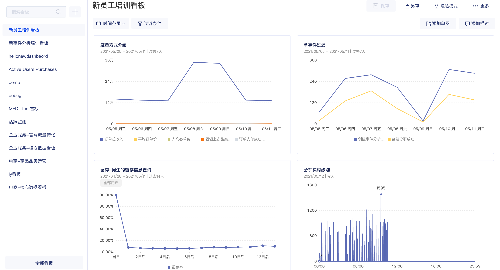

# 看板

## 功能介绍

看板是GrowingIO系统中，最重要的数据消费场景之一，是分析图表的集合。

在看板中多个分析图表可以有效的组合成业务看板进行监控与分析。 

## 界面介绍

看板模块分为两大区域，看板侧栏和看板数据消费区。

### 看板侧栏

看板侧栏包含以下几个部分：

* 订阅看板：展示你所订阅的看板，看板支持订阅， 具体订阅方式请查看 [看板订阅](https://app.gitbook.com/@growingio/s/cdp/~/drafts/-M9RXRh-4-P4hpPAq7ud/product-manual/charts/kan-ban-ding-yue/@drafts)。
* 全部看板：点击全部看板，可进入看板管理模块 ，对看板进行更有效率的管理工作。
* 搜索：搜索全部看板
* 创建看板：快速创建看板

### 看板数据展示区

看板展示区包含以下几个部分：

* 操作部分：添加单图、过滤条件、筛选时间范围、设置协作模式、另存看板、删除看板。

* 数据展示： 不同数据图表。


为了保障企业数据安全性，每位成员能查看的看板，是受到 **共享权限** 控制的。  
  
举例： 系统中 一共有 20 个看板， 与小花协作的看板有2个，小花创建的看板有5个，因此小花能查看的看板一共为 7 个。 

共享设置可见 ： [看板共享设置链接](kanban-sharing-settings.md)


## 看板的操作說明 

对于看板的操作如下：

| 操作 | 作用 |
| :--- | :--- |
| 修改看板名称 | 修改看板名称 |
| 添加单图 | 在看板中添加新的数据图表 |
| 移除单图 | 将分析图表由看板中移除 |
| 添加描述 | 在看板中添加描述图表 |
| 过滤条件 | 对看板设置一个**全局过滤，**该过滤条件会影响所有看板中的分析图表 |
| 筛选时间范围 | 对看板设置一个**时间过滤，**该过滤条件会影响所有看板中的分析图表 |
| 另存看板 | 将当前看板复制一个并且另存 |
| 删除看板 | 删除当前的看板 |
| 单图拖拽 | 调整当前的分析图表的布局 |
| 设置共享模式 | 设置看板协作的成员 |

### 

### 修改看板名称

操作流程：点击看板名称 &gt; 进入编辑模式 &gt; 输入看板名称 &gt; 点击保存


权限控制：需要该成员具有看板功能权限，且同时为该看板的**编辑者**。


### 

### 添加单图

通过添加单图，我们可以在看板中添加新的数据图表，将需要共同分析的图表放在一起构建数据報告，方便大家进行报告、监测、分析 。

操作流程：点击 添加单图 **&gt;** 勾选要添加至此看板的分析图表 &gt; 点击添加。 


 权限控制：添加单图时，需要该成员具有看板功能权限，且同时是该看板的编辑者。

举例：

1.若阿花是Ａ看板的阅读者，则阿花无法对看板进行添加单图操作。

2.若阿花是Ａ看板的编辑者，但管理员并没有给阿花看板功能权限，则阿花无法对看板进行 添加单图操作。


### 

### 移除单图


权限控制：移除单图时，需要该成员具有看板权限，且同时是该看板的编辑者。


## 

### 添加描述

通过添加描述，可对看板添加描述说明。

### 过滤条件

我们可以通过设置过滤条件，决定数据看板中所有分析图表的数据展示范围 。  
如：当我们只想看【**应用平台＝IOS 的訪问量**】时，可通过设置 **维度＝IOS**  ，进行筛选过滤。

设置成功后，看板中的分析图表 将会拥有相同的过滤条件。

操作流程： 点击过滤条件 &gt; 选择过滤范围 &gt; 点击保存 。

从看板双击分析图表 ，將會进入分析图表详情，该分析图表会继承看板的过滤条件， **点击 X** 可以移除过滤条件。


最多支持添加 5 个过滤条件。

过滤维度支持 ：用户属性、用户来源、地域信息、设备信息。



权限控制：保存看板过滤条件时，需要该成员具有看板权限，且同时是该看板的编辑者。


### 

### 筛选时间范围

我们可以通过**时间范围**选择，决定所有分析图表展示的时间区间。  
如：当我们想看 过去半年的访问量时，可将时间范围后则为**过去180 天**。

设置成功后，看板中的分析图表 将会拥有相同的时间范围。

操作流程：点击时间范围 &gt;  选择时间范围区间 &gt; 点击确定。

GIO 提供强大且方便的时间选择控件，可以帮助你快速查看不同时间段的数据。

### 另存看板

操作流程：点击看版右侧  &gt; 选择另存看板 &gt;  输入新看版名称。 


权限控制： 另存看板时，需要该成员具有看板权限


### 

### 删除看板

操作流程：点击看版右侧  &gt;  选择刪除 &gt;  確定刪除。 


权限控制：只有看板的拥有者可以删除看板。


### 

### 设置共享模式

可设置看板共享的成员 ，共享方式分为 **阅读者、编辑者**两种，您可以通过灵活的设置，与同事进行数据的协作，使数据在企业内部进行流动，更好的发挥数据的价值。


共享设置可见 ： [看板共享設置鏈接](https://app.gitbook.com/@growingio/s/cdp/~/drafts/-M7f1KTwEG20PbWnheJR/v/v20200600/product-manual/charts/kan-ban-gong-xiang-she-zhi)


## 常见问题

### 1. **为什么我 hover 到图表上时没有出现角标？**

因为您没有修改当前看板的权限。同样地，修改名称，添加和移除图表都收到编辑权限的控制。

### 2.  **从看板中移除某个图表时该图表会被删除么？**

不会。移除某个图表只会影响当前的看板，您还可以把移除的图表重新添加到该看板中。被移除的图表在各分析模块的单图列表中可以找到。

### 3. 为何我无法操作看板，提示我沒有权限？

添加单图、编辑看板名称、移除单图、删除看板、共享设置、保存过滤条件时，需要该成员具有看板权限，且同时是该看板的编辑者。

