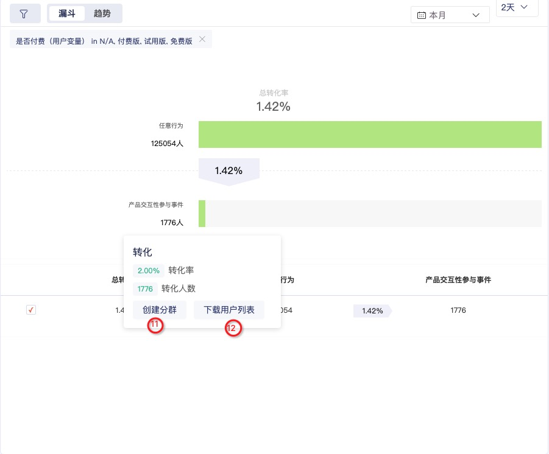

# 漏斗分析

## 简介

漏斗分析是一套流程式的数据分析模型，通过将用户行为起始的各个行为节点作为分析模型节点，来衡量每个节点的转化效果，是转化分析的重要工具。

核心功能包括：

* 漏斗步骤自定义，展示每步人数、转化率，以及总转化率；
* 自定义时间区间，查看特定时间内的相关漏斗转化率趋势；
* 提供属性维度拆分，维度包括但不限于：访问来源、浏览器、浏览器版本、操作系统、城市、地区、国家名称、广告来源、广告名称、广告内容、广告关键字、广告媒介，以及20个自定义的用户属性维度；
* 支持选择不同分群用户，进行漏斗步骤的对比。

## 创建漏斗分析

一、在顶部导航栏选择“**分析 &gt; 产品分析 &gt; 漏斗分析**"，进入漏斗分析看板。

二、单击左侧列表上方"**新建分析 &gt; 漏斗分析"**或单击事件分析看板中“**+”**，进入**创建漏斗分析**页面。

<table>
  <thead>
    <tr>
      <th style="text-align:left">&#x9879;</th>
      <th style="text-align:left">&#x8BF4;&#x660E;</th>
    </tr>
  </thead>
  <tbody>
    <tr>
      <td style="text-align:left">1-&#x4E8B;&#x4EF6;&#x9009;&#x62E9;</td>
      <td style="text-align:left">&#x81F3;&#x5C11;&#x9009;&#x62E9;2&#x4E2A;&#x6B65;&#x9AA4;&#xFF0C;&#x5355;&#x51FB;&#x786E;&#x5B9A;&#x540E;&#x5C55;&#x793A;&#x6F0F;&#x6597;&#x89C6;&#x56FE;&#x3002;</td>
    </tr>
    <tr>
      <td style="text-align:left">2-&#x4E8B;&#x4EF6;&#x8FC7;&#x6EE4;</td>
      <td style="text-align:left">&#x5355;&#x51FB;&#x5DF2;&#x9009;&#x6B65;&#x9AA4;&#x53F3;&#x4FA7;&#x7684;
        &#xFF0C;&#x914D;&#x7F6E;&#x5F53;&#x524D;&#x6B65;&#x9AA4;&#x5355;&#x72EC;&#x7684;&#x8FC7;&#x6EE4;&#x6761;&#x4EF6;&#x3002;</td>
    </tr>
    <tr>
      <td style="text-align:left">3-&#x5168;&#x5C40;&#x8FC7;&#x6EE4;</td>
      <td style="text-align:left">&#x9488;&#x5BF9;&#x6574;&#x4E2A;&#x6F0F;&#x6597;&#x7684;&#x5168;&#x5C40;&#x8FC7;&#x6EE4;&#xFF0C;&#x6BD4;&#x5982;&#x6D4F;&#x89C8;&#x5668;&#xFF1D;Chrome&#x3002;</td>
    </tr>
    <tr>
      <td style="text-align:left">4-&#x76EE;&#x6807;&#x7528;&#x6237;</td>
      <td style="text-align:left">&#x9ED8;&#x8BA4;&#x662F;&#x201C;&#x5168;&#x90E8;&#x7528;&#x6237;&#x201D;&#xFF0C;&#x53EF;&#x4EE5;&#x5207;&#x6362;&#x81F3;&#x201C;&#x65B0;&#x7528;&#x6237;&#x201D;&#x53CA;&#x7528;&#x6237;&#x521B;&#x5EFA;&#x7684;&#x7528;&#x6237;&#x5206;&#x7FA4;&#x3002;</td>
    </tr>
    <tr>
      <td style="text-align:left">5-&#x7EF4;&#x5EA6;&#x5BF9;&#x6BD4;</td>
      <td style="text-align:left">
        
&#x7EF4;&#x5EA6;&#x5BF9;&#x6BD4;&#xFF1A;&#x9488;&#x5BF9;&#x67D0;&#x4E2A;&#x7EF4;&#x5EA6;&#xFF0C;&#x5BF9;&#x6BD4;&#x4E0D;&#x540C;&#x7EF4;&#x5EA6;&#x503C;&#x7684;&#x6F0F;&#x6597;&#x8868;&#x73B0;&#x3002;

        
<b>&#x4F8B;&#x5982;</b>&#xFF1A;&#x6211;&#x4EEC;&#x53EF;&#x4EE5;&#x5BF9;&#x6BD4;&#x300C;&#x6D4F;&#x89C8;&#x5668;&#x300D;&#x7EF4;&#x5EA6;&#xFF0C;Chrome
          &#x548C; Safari &#x7684;&#x6CE8;&#x518C;&#x6D41;&#x8868;&#x73B0;&#x662F;

        
&#x5426;&#x6709;&#x660E;&#x663E;&#x5DEE;&#x5F02;&#x3002;Chrome &#x548C;
          Safari &#x662F;&#x300C;&#x6D4F;&#x89C8;&#x5668;&#x300D;&#x7EF4;&#x5EA6;&#x7684;
          2 &#x4E2A;&#x4E0D;&#x540C;&#x7684;&#x503C;&#x3002;&#x53EF;

        
&#x4EE5;&#x770B;&#x5230;&#x4E24;&#x4E2A;&#x6D4F;&#x89C8;&#x5668;&#x5728;&#x6CE8;&#x518C;&#x6BCF;&#x4E00;&#x6B65;&#x7684;&#x4E0D;&#x540C;&#x8868;&#x73B0;&#x548C;&#x6574;&#x4F53;&#x8F6C;&#x5316;&#x7387;&#x7684;&#x4E0D;&#x540C;&#x8868;&#x73B0;&#xFF0C;&#x5E76;

        
&#x4E14;&#x53EF;&#x4EE5;&#x5728;&#x53F3;&#x4FA7;&#x89C6;&#x56FE;&#x533A;&#x57DF;&#x5207;&#x6362;&#x300C;&#x8D8B;&#x52BF;&#x300D;&#x5BF9;&#x6BD4;&#x5B83;&#x4EEC;&#x7684;&#x8D8B;&#x52BF;&#x60C5;&#x51B5;&#x3002;

      </td>
    </tr>
    <tr>
      <td style="text-align:left">6-&#x7528;&#x6237;&#x5BF9;&#x6BD4;</td>
      <td style="text-align:left">
        
&#x5BF9;&#x6BD4;&#x4E24;&#x4E2A;&#x4E0D;&#x540C;&#x7684;&#x7528;&#x6237;&#x7FA4;&#x4F53;&#x7684;&#x8F6C;&#x5316;&#x60C5;&#x51B5;&#x3002;

        
<b>&#x4F8B;&#x5982;</b>&#xFF1A;&#x67D0;&#x7535;&#x5546;&#x5E73;&#x53F0;&#x5C1D;&#x8BD5;&#x5524;&#x9192;&#x8FD1;&#x671F;&#x4E0D;&#x6D3B;&#x8DC3;&#x7684;&#x7528;&#x6237;&#xFF0C;&#x5E76;&#x5C06;&#x7528;&#x6237;&#x5206;&#x6210;
          2 &#x7EC4;&#xFF0C;&#x5176;&#x4E2D;

        
1 &#x7EC4;&#x53D1;&#x4E86;&#x6EE1;&#x51CF;&#x4F18;&#x60E0;&#x5238;&#xFF0C;&#x53E6;&#x5916;
          1 &#x7EC4;&#x53D1;&#x4E86;&#x7ACB;&#x51CF;&#x4F18;&#x60E0;&#x5238;&#xFF0C;&#x60F3;&#x8981;2&#x7EC4;&#x9886;&#x53D6;&#x4E86;&#x4F18;&#x60E0;&#x5238;&#x4E4B;

        
&#x540E;&#x7684;&#x8F6C;&#x5316;&#x60C5;&#x51B5;&#xFF1B;&#x6B64;&#x65F6;&#x53EF;&#x4EE5;&#x521B;&#x5EFA;
          2 &#x4E2A;&#x7528;&#x6237;&#x5206;&#x7FA4;&#xFF1A;&#x300C;&#x9886;&#x53D6;&#x4E86;&#x6EE1;&#x51CF;&#x5238;&#x7684;&#x7528;&#x6237;&#x300D;(2010&#x4EBA;)&#x548C;
          &#x300C;&#x9886;&#x53D6;&#x4E86;&#x7ACB;&#x51CF;&#x5238;&#x7684;&#x7528;&#x6237;&#x300D;(1080&#x4EBA;)&#xFF0C;&#x5728;&#x6F0F;&#x6597;&#x7528;&#x6237;&#x5BF9;&#x6BD4;&#x65F6;&#x9009;&#x62E9;&#x8FD9;
          2 &#x4E2A;&#x7528;&#x6237;&#x5206;&#x7FA4;&#x5E76;&#x8C03;&#x6574;&#x65F6;&#x95F4;&#x8303;&#x56F4;&#x5230;&#x7528;&#x6237;&#x9886;&#x53D6;&#x4F18;&#x60E0;&#x5238;&#x4E4B;&#x540E;&#x7684;&#x4E00;&#x6BB5;&#x65F6;&#x95F4;&#xFF0C;&#x5C31;&#x53EF;&#x4EE5;&#x5BF9;&#x6BD4;
          2 &#x4E2A;&#x4E0D;&#x540C;

        
&#x7528;&#x6237;&#x5206;&#x7FA4;&#x7684;&#x8F6C;&#x5316;&#x60C5;&#x51B5;&#x4E86;&#x3002;

      </td>
    </tr>
    <tr>
      <td style="text-align:left">7-&#x6F0F;&#x6597;&#x5C55;&#x793A;</td>
      <td style="text-align:left">
        
&#x53EF;&#x9009;&#x62E9;&#x6F0F;&#x6597;&#x56FE;&#x6216;&#x8D8B;&#x52BF;&#x56FE;&#x3002;&#x6F0F;&#x6597;&#x56FE;&#x6309;&#x7B5B;&#x9009;&#x6761;&#x4EF6;&#x5C55;&#x793A;&#x6BCF;&#x4E00;&#x6B65;&#x9AA4;&#x7684;&#x6574;&#x4F53;&#x8F6C;&#x5316;&#x7387;&#xFF1B;

        
&#x8D8B;&#x52BF;&#x56FE;&#x5728;&#x7B5B;&#x9009;&#x6761;&#x4EF6;&#x8303;&#x56F4;&#x5185;&#x5C55;&#x793A;&#x6BCF;&#x4E00;&#x6B65;&#x9AA4;&#x5728;&#x6BCF;&#x5929;&#x7684;&#x8F6C;&#x5316;&#x7387;&#x3002;

      </td>
    </tr>
    <tr>
      <td style="text-align:left">8-&#x65F6;&#x95F4;</td>
      <td style="text-align:left">
        
&#x65F6;&#x95F4;&#x662F;&#x6307;&#x7528;&#x6237;&#x8FDB;&#x5165;&#x6F0F;&#x6597;&#x7684;&#x65F6;&#x95F4;&#x8303;&#x56F4;&#xFF0C;&#x4E5F;&#x5C31;&#x662F;&#x5B8C;&#x6210;&#x6F0F;&#x6597;&#x7B2C;&#x4E00;&#x6B65;&#x7684;&#x65F6;&#x95F4;&#x3002;

        
&#x9ED8;&#x8BA4;&#x662F;&#x201C;&#x8FC7;&#x53BB; 14 &#x5929;&#x201D;&#xFF0C;&#x53EF;&#x4EE5;&#x5728;&#x6B64;&#x5904;&#x5207;&#x6362;&#x6210;&#x201C;&#x4ECA;&#x5929;&#x201D;&#x6216;&#x8005;&#x8FC7;&#x53BB;&#x7684;&#x4E00;&#x6BB5;&#x65F6;&#x95F4;&#x3002;&#x6B64;&#x5904;&#x65F6;

        
&#x95F4;&#x9650;&#x5B9A;&#x7684;&#x662F;&#x6F0F;&#x6597;&#x7B2C;&#x4E00;&#x6B65;&#xFF0C;&#x4E5F;&#x5C31;&#x662F;&#x7528;&#x6237;&#x8FDB;&#x5165;&#x8F6C;&#x5316;&#x6F0F;&#x6597;&#x7684;&#x65F6;&#x95F4;&#x8303;&#x56F4;&#x3002;

      </td>
    </tr>
    <tr>
      <td style="text-align:left">9-&#x8F6C;&#x5316;&#x5468;&#x671F;</td>
      <td style="text-align:left">
        
&#x6307;&#x7528;&#x6237;&#x4ECE;&#x6F0F;&#x6597;&#x7B2C;&#x4E00;&#x6B65;&#x5230;&#x5B8C;&#x6210;&#x4E4B;&#x540E;&#x6BCF;&#x4E00;&#x6B65;&#x9700;&#x8981;&#x5728;&#x8F6C;&#x5316;&#x5468;&#x671F;&#x65F6;&#x957F;&#x5185;&#x5B8C;&#x6210;&#x8BB0;&#x4F5C;&#x8F6C;&#x5316;&#xFF0C;&#x5426;&#x5219;&#x8BB0;&#x4F5C;&#x6D41;&#x5931;&#x3002;

        
&#x9ED8;&#x8BA4;&#x662F;&#x201C; 1 &#x5929;&#x201D;&#xFF0C;&#x6700;&#x957F;&#x652F;&#x6301;
          90 &#x5929;&#x3002; &#x6BD4;&#x5982;&#xFF0C;&#x8F6C;&#x5316;&#x5468;&#x671F;&#x8BBE;&#x7F6E;&#x4E3A;7&#x5929;&#xFF0C;&#x662F;&#x6307;&#x7528;&#x6237;&#x5B8C;&#x6210;&#x6F0F;&#x6597;&#x7B2C;&#x4E00;&#x6B65;&#x4E4B;&#x540E;&#xFF0C;&#x9700;&#x8981;&#x5728;&#x540E;&#x7EED;&#x7684;
          7 &#x5929;&#x5185;&#x5B8C;&#x6210;&#x6F0F;&#x6597;&#x7684;&#x6700;&#x540E;&#x4E00;&#x6B65;&#x624D;&#x8BA1;&#x4E3A;&#x8F6C;&#x5316;&#xFF0C;&#x5426;&#x5219;&#x4F1A;&#x8BB0;&#x4E3A;&#x6D41;&#x5931;&#x3002;

      </td>
    </tr>
    <tr>
      <td style="text-align:left">10-&#x56FE;&#x8868;&#x5BF9;&#x6BD4;</td>
      <td style="text-align:left">&#x53EF;&#x5728;&#x56FE;&#x8868;&#x5904;&#x5C55;&#x793A;&#x4E0D;&#x540C;&#x7EF4;&#x5EA6;&#x5BF9;&#x6BD4;&#x548C;&#x7528;&#x6237;&#x5BF9;&#x6BD4;&#x6570;&#x636E;&#xFF0C;&#x6700;&#x591A;&#x53EF;&#x52FE;&#x9009;2&#x4E2A;&#x3002;</td>
    </tr>
  </tbody>
</table>

三、选择要参数后，右侧即可实时展示分析图表。

四、单击右上角保存，完成一个漏斗分析的创建。

## 解读漏斗分析

<table>
  <thead>
    <tr>
      <th style="text-align:left">&#x9879;</th>
      <th style="text-align:left">&#x8BF4;&#x660E;</th>
    </tr>
  </thead>
  <tbody>
    <tr>
      <td style="text-align:left">
        
&#x5355;&#x4F4D;

        
(&#x7528;&#x6237;&#x91CF;)

      </td>
      <td style="text-align:left">
        
GrowingIO &#x7684;&#x6F0F;&#x6597;&#x57FA;&#x4E8E;&#x7528;&#x6237;&#x884C;&#x4E3A;&#x5206;&#x6790;&#xFF0C;&#x6F0F;&#x6597;&#x6BCF;&#x4E00;&#x6B65;&#x7684;&#x6570;&#x636E;&#x7EDF;&#x8BA1;&#x7684;&#x662F;&#x201C;<b>&#x7528;&#x6237;&#x6570;</b>&#x201D;&#xFF0C;

        
&#x4E5F;&#x5C31;&#x662F;&#x6BCF;&#x4E00;&#x6B65;&#x6709;&#x591A;&#x5C11;&#x7528;&#x6237;&#x5B8C;&#x6210;&#xFF1B;&#x5982;&#x679C;&#x540C;1&#x4E2A;&#x7528;&#x6237;&#x5728;&#x9009;&#x5B9A;&#x7684;&#x65F6;&#x95F4;&#x8303;&#x56F4;&#x5B8C;&#x6210;&#x4E86;&#x67D0;

        
&#x4E2A;&#x6B65;&#x9AA4; 2 &#x6B21;&#xFF0C;&#x7B97;&#x4F5C; 1&#x3002;

      </td>
    </tr>
    <tr>
      <td style="text-align:left">
        
&#x6B65;&#x9AA4;

        
(&#x65F6;&#x5E8F;)

      </td>
      <td style="text-align:left">
        

        
&#x5728;&#x8F6C;&#x5316;&#x5468;&#x671F;&#x5185;&#x6F0F;&#x6597;&#x7B2C;&#x4E00;&#x6B65;&#x548C;&#x7B2C;&#x4E8C;&#x6B65;&#x4E3A;&#x4F8B;&#xFF1A;

        
&#x5E38;&#x89C4;&#x987A;&#x5E8F;&#xFF1A;&#x5982;&#x679C;&#x7528;&#x6237;&#x5148;&#x5B8C;&#x6210;&#x7B2C;&#x4E00;&#x6B65;&#x53C8;&#x5B8C;&#x6210;&#x7B2C;&#x4E8C;&#x6B65;&#xFF0C;&#x5219;&#x7B2C;&#x4E8C;&#x6B65;&#x7528;&#x6237;&#x91CF;
          +1 &#xFF1B;

        
&#x975E;&#x5E38;&#x89C4;&#x987A;&#x5E8F;&#xFF1A;&#x7528;&#x6237;&#x5148;&#x5B8C;&#x6210;&#x7B2C;&#x4E8C;&#x6B65;&#x518D;&#x5B8C;&#x6210;&#x7B2C;&#x4E00;&#x6B65;

        <ul>
          <li>&#x4ECA;&#x65E5;&#x6570;&#x636E;&#xFF1A;&#x5728;&#x540C;&#x4E00;&#x5C0F;&#x65F6;&#x5185;&#x5B8C;&#x6210;&#xFF0C;&#x5219;&#x7B2C;&#x4E8C;&#x6B65;&#x7528;&#x6237;&#x91CF;
            +1&#xFF1B;&#x4E0D;&#x5728;&#x540C;&#x4E00;&#x5C0F;&#x65F6;&#x5B8C;&#x6210;&#xFF0C;&#x7B2C;&#x4E8C;&#x6B65;&#x7528;&#x6237;+0</li>
          <li>&#x4ECA;&#x65E5;&#x524D;&#x6570;&#x636E;&#xFF1A;&#x5728;&#x540C;&#x4E00;&#x5929;&#x5185;&#x5B8C;&#x6210;&#xFF0C;&#x5219;&#x7B2C;&#x4E8C;&#x6B65;&#x7528;&#x6237;&#x91CF;
            +1&#xFF1B;&#x4E0D;&#x5728;&#x540C;&#x4E00;&#x5929;&#x5B8C;&#x6210;&#xFF0C;&#x7B2C;&#x4E8C;&#x6B65;&#x7528;&#x6237;+0</li>
        </ul>
      </td>
    </tr>
    <tr>
      <td style="text-align:left">11-&#x4E0B;&#x94BB;&#x5206;&#x7FA4;</td>
      <td style="text-align:left">&#x6F0F;&#x6597;&#x6B65;&#x9AA4;&#x5206;&#x4E3A;&#x8F6C;&#x5316;&#x533A;&#x57DF;&#x548C;&#x672A;&#x8F6C;&#x5316;&#x533A;&#x57DF;&#xFF0C;&#x70B9;&#x51FB;&#x8F6C;&#x5316;&#x533A;&#x57DF;&#x9009;&#x62E9;&#x300C;&#x521B;&#x5EFA;&#x5206;&#x7FA4;&#x300D;&#x53EF;&#x4EE5;&#x9009;&#x62E9;&#x8F6C;&#x5316;&#x7528;&#x6237;&#x5206;&#x7FA4;&#xFF0C;&#x70B9;&#x51FB;&#x672A;&#x8F6C;&#x5316;&#x533A;&#x57DF;&#x9009;&#x62E9;&#x300C;&#x521B;&#x5EFA;&#x5206;&#x7FA4;&#x300D;</td>
    </tr>
    <tr>
      <td style="text-align:left">12-&#x4E0B;&#x8F7D;&#x7528;&#x6237;ID</td>
      <td style="text-align:left">&#x70B9;&#x51FB;&#x8F6C;&#x5316;&#x533A;&#x57DF;&#xFF0C;&#x53EF;&#x4EE5;&#x9009;&#x62E9;&#x4E0B;&#x8F7D;&#x8F6C;&#x5316;&#x7528;&#x6237;&#x5217;&#x8868;&#xFF0C;&#x70B9;&#x51FB;&#x8F6C;&#x5316;&#x533A;&#x57DF;&#xFF0C;&#x53EF;&#x4EE5;&#x9009;&#x62E9;&#x4E0B;&#x8F7D;&#x672A;&#x8F6C;&#x5316;&#x7528;&#x6237;&#x5217;&#x8868;</td>
    </tr>
  </tbody>
</table>

## 漏斗分析看板

漏斗分析看板与分析看板的管理方式相同，请参考看板管理。

## 常见问题

### 1. 漏斗分析中的数据延迟

数据需要传输时间，从您传输数据到在漏斗中可用会有一定的延迟，成功发送打点事件 1 小时后，可以在漏斗分析中使用该事件创建漏斗；

