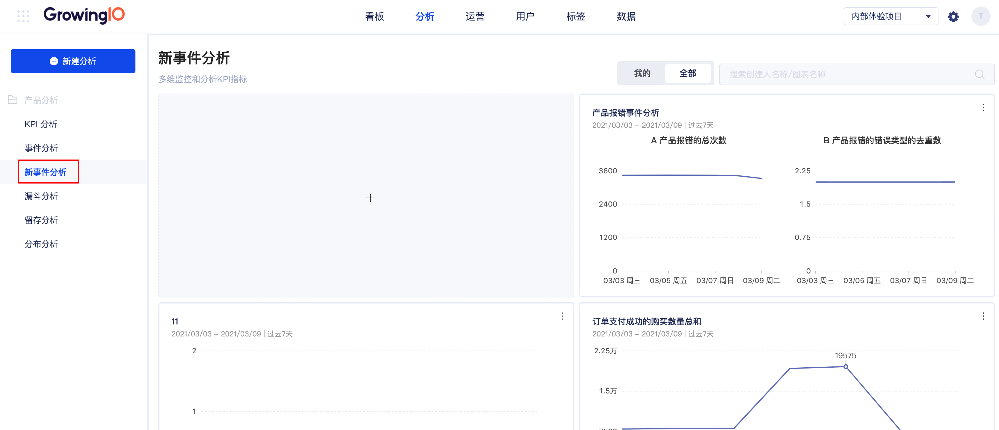
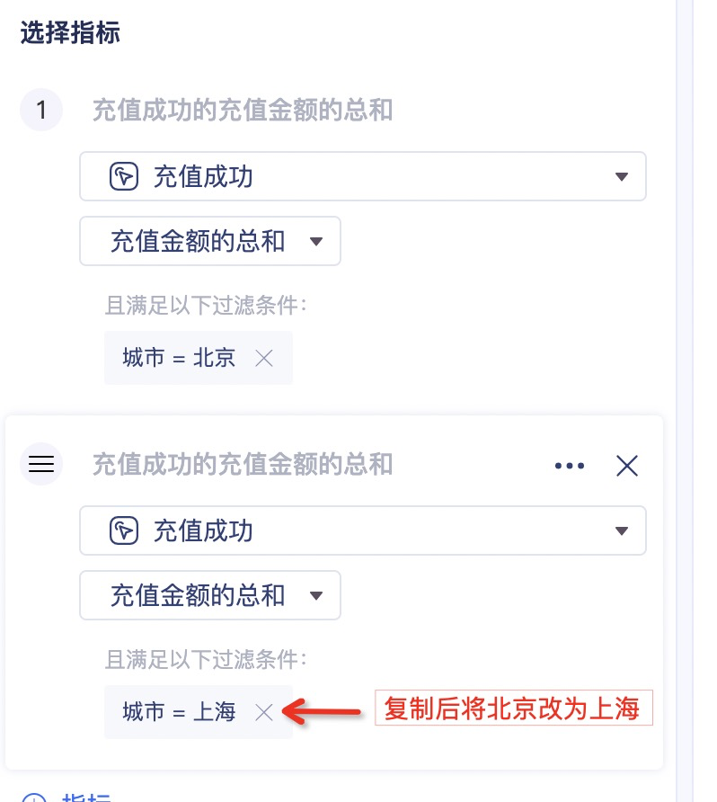
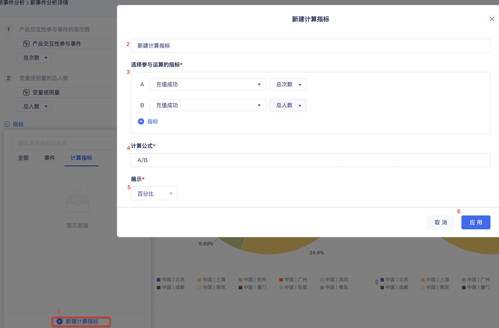
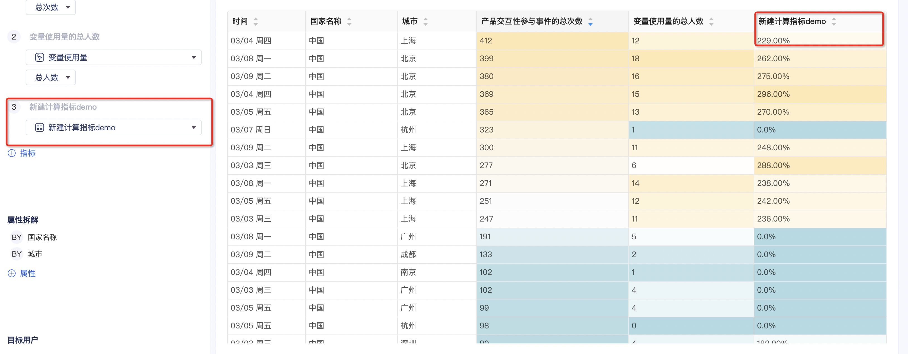

# 新事件分析

## 简介

针对不同场景下的数据可视化需求，我们提供了事件分析这个功能，通过事件分析创建多样的图表来满足您不同分析场景下的数据可视化需求。

核心功能包括：

* 快捷提供事件的计数、去重人数计数、人均的计算能力；
* 可以添加系统内预置属性维度、自定义事件属性、用户属性来进行事件指标的拆分；
* 可以对比不同的目标用户，查看不同用户群的事件指标及维度数值。

> 常用场景：
>
> * 产品和运营同学如何才能对网站每天的 PV、UV、DAU等总体数据有一个直观的把握，包括它们的数值以及趋势？
> * 面对复杂的数据，单从数字来看，不仅效率低下，而且难以直观的发现数据背后所展现的趋势，应该怎么办？
> * 当做了第三方付费渠道推广后，运营同学如何才能有效比较不同渠道带来的流量？

## 创建新事件分析

一、在顶部导航栏选择“**分析 &gt; 产品分析 &gt; 新事件分析**"，进入事件分析列表页。

二、单击左侧列表上方"**新建分析 &gt; 事件分析"**或单击事件分析看板中“**+”**，进入**创建事件分析**页面。

<table>
  <thead>
    <tr>
      <th style="text-align:left">&#x9879;</th>
      <th style="text-align:left">&#x8BF4;&#x660E;</th>
    </tr>
  </thead>
  <tbody>
    <tr>
      <td style="text-align:left">1-&#x6DFB;&#x52A0;&#x4E8B;&#x4EF6;&#x6216;&#x6307;&#x6807;</td>
      <td style="text-align:left">&#x9009;&#x62E9;&#x57CB;&#x70B9;&#x4E8B;&#x4EF6;&#x3001;&#x8BA1;&#x7B97;&#x6307;&#x6807;&#x7B49;&#x4EFB;&#x4E00;&#x4E8B;&#x4EF6;&#x8FDB;&#x884C;&#x5206;&#x6790;&#x3002;</td>
    </tr>
    <tr>
      <td style="text-align:left">2-&#x6DFB;&#x52A0;&#x7EF4;&#x5EA6;</td>
      <td style="text-align:left">
        
&#x9009;&#x62E9;&#x7EF4;&#x5EA6;&#x62C6;&#x5206;&#x4E8B;&#x4EF6;&#x6307;&#x6807;&#xFF0C;&#x8FDB;&#x884C;&#x66F4;&#x52A0;&#x7CBE;&#x7EC6;&#x5316;&#x7684;&#x5206;&#x6790;&#xFF1B;&#x53EF;&#x9009;&#x7684;&#x62C6;&#x5206;&#x7EF4;&#x5EA6;&#x4F1A;&#x968F;&#x7740;&#x4E8B;&#x4EF6;&#x6307;&#x6807;&#x7684;&#x9009;&#x62E9;&#x800C;&#x4EA7;&#x751F;&#x53D8;&#x5316;&#x3002;&#x6700;&#x5927;&#x652F;&#x6301;10&#x4E2A;&#x7EF4;&#x5EA6;&#x503C;&#x7684;&#x62C6;&#x5206;&#x3002;

        
&#x5982;&#x679C;&#x60A8;&#x9009;&#x62E9;&#x7684;&#x4E8B;&#x4EF6;&#x6307;&#x6807;&#x4E0E;&#x7EF4;&#x5EA6;&#x7684;&#x7EC4;&#x5408;&#x65E0;&#x610F;&#x4E49;&#xFF0C;&#x7CFB;&#x7EDF;&#x4E5F;&#x4F1A;&#x8FDB;&#x884C;&#x63D0;&#x793A;&#x3002;

      </td>
    </tr>
    <tr>
      <td style="text-align:left">3-&#x76EE;&#x6807;&#x7528;&#x6237;</td>
      <td style="text-align:left">
        
&#x9009;&#x62E9;&#x800C;&#x5206;&#x6790;&#x7684;&#x5BF9;&#x8C61;&#x4EBA;&#x7FA4;&#xFF0C;&#x652F;&#x6301;&#x6700;&#x591A;&#x9009;&#x62E9;5&#x4E2A;&#x4E0D;&#x540C;&#x7C7B;&#x578B;&#x7684;&#x5206;&#x7FA4;&#x8FDB;&#x884C;&#x5BF9;&#x6BD4;&#x5206;&#x6790;&#x3002;

        
&#x6211;&#x4EEC;&#x9ED8;&#x8BA4;&#x63D0;&#x4F9B;2&#x79CD;&#x5206;&#x7FA4;&#x7528;&#x6237;&#xFF1A;&#x5168;&#x90E8;&#x7528;&#x6237;&#x3001;&#x65B0;&#x7528;&#x6237;&#x3002;

        
&#x4E5F;&#x53EF;&#x4EE5;&#x901A;&#x8FC7;&#x7528;&#x6237;&#x5206;&#x7FA4;&#x529F;&#x80FD;&#x521B;&#x5EFA;&#x7279;&#x5B9A;&#x7684;&#x5206;&#x7FA4;&#x7528;&#x6237;&#xFF0C;&#x5BF9;&#x7279;&#x5B9A;&#x7684;&#x5206;&#x7FA4;&#x7528;&#x6237;&#x8FDB;&#x884C;&#x5206;&#x6790;&#x3002;

      </td>
    </tr>
    <tr>
      <td style="text-align:left">4-&#x5168;&#x5C40;&#x8FC7;&#x6EE4;</td>
      <td style="text-align:left">&#x8FC7;&#x6EE4;&#x6761;&#x4EF6;&#x53EF;&#x9009;&#x62E9;&#x4E0D;&#x540C;&#x7EF4;&#x5EA6;&#x7684;&#x7279;&#x5B9A;&#x6570;&#x503C;&#x6216;&#x6587;&#x672C;&#xFF0C;&#x4ECE;&#x800C;&#x5B9E;&#x73B0;&#x6A21;&#x7CCA;&#x6216;&#x7CBE;&#x786E;&#x5339;&#x914D;&#xFF0C;&#x6700;&#x591A;&#x53EF;&#x53E0;&#x52A0;5&#x79CD;&#x4E0D;&#x540C;&#x8FC7;&#x6EE4;&#x6761;&#x4EF6;&#x3002;</td>
    </tr>
    <tr>
      <td style="text-align:left">5-&#x65F6;&#x95F4;&#x8303;&#x56F4;&#x4E0E;&#x7C92;&#x5EA6;</td>
      <td style="text-align:left">&#x5305;&#x62EC;&#x4ECA;&#x65E5;&#x3001;&#x6628;&#x5929;&#x3001;&#x8FC7;&#x53BB;7&#x5929;&#x3001;14&#x5929;&#x3001;30&#x5929;&#x3001;180&#x5929;&#x4EE5;&#x53CA;365&#x5929;&#x7B49;&#x5E38;&#x7528;&#x7528;&#x6237;&#x6D3B;&#x52A8;&#x5468;&#x671F;&#x3002;&#x9897;&#x7C92;&#x5EA6;&#x9009;&#x62E9;&#x53EF;&#x9009;&#x5206;&#x949F;
        &#x5C0F;&#x65F6;&#x3001;&#x5929;&#x3001;&#x5468;&#x4EE5;&#x53CA;&#x6708;&#xFF0C;&#x786E;&#x4FDD;&#x5206;&#x6790;&#x7CBE;&#x7EC6;&#x7A0B;&#x5EA6;&#x3002;</td>
    </tr>
    <tr>
      <td style="text-align:left">6-&#x56FE;&#x8868;&#x7C7B;&#x578B;</td>
      <td style="text-align:left">&#x4E8B;&#x4EF6;&#x5206;&#x6790;&#x63D0;&#x4F9B;&#x4E86;6&#x79CD;&#x4E0D;&#x540C;&#x7684;&#x56FE;&#x8868;&#x6837;&#x5F0F;&#xFF0C;&#x4F9D;&#x6B21;&#x662F;&#xFF1A;1.&#x7EBF;&#x56FE;
        2. &#x7EB5;&#x5411;&#x67F1;&#x56FE; 3.&#x8868;&#x683C; 4.&#x6A2A;&#x5411;&#x67F1;&#x56FE;
        5.&#x73AF;&#x5F62;&#x56FE; 6.&#x6C14;&#x6CE1;&#x56FE;&#x3002;&#x8BE6;&#x7EC6;&#x8BF7;&#x53C2;&#x8003;
        <a
        href>&#x89C6;&#x56FE;&#x4ECB;&#x7ECD;</a>&#x3002;</td>
    </tr>
    <tr>
      <td style="text-align:left">7-&#x7EF4;&#x5EA6;&#x5C55;&#x793A;&#x6761;&#x6570;</td>
      <td style="text-align:left">&#x8BBE;&#x7F6E;&#x56FE;&#x8868;&#x4E2D;&#x5C55;&#x793A;&#x7684;&#x7EF4;&#x5EA6;&#x6761;&#x6570;&#x3002;</td>
    </tr>
  </tbody>
</table>

三、选择要参数后，右侧即可实时展示分析图表。

四、单击右上角保存，完成一个事件分析的创建。

#### 添加事件或指标-事件的度量方式

GrowingIO在这个版本提供了更加丰富的度量方式，由次数，人数人均，数值型属性的求平均和求和进行了扩展。以「购买事件」为例，介绍新增的度量方式，示例含义和常见场景。

| 度量方式 | 示例 | 含义 | 场景 |
| :--- | :--- | :--- | :--- |
| 次数 | 购买次数 | 对购买事件的次数进行计数 | 用户购买了多少次？ |
| 人数 | 购买人数 | 做过购买事件的去重用户数 | 有多少用户进行了购买？ |
| 人均 | 人均购买次数 | 购买事件总次数除以总人数 | 人均购买了多少次？ |
| 每人总计-最大值 | 购买每人总计最大值 | 购买事件每人总计的「最大值」：目标人群中，所选时间内每人做过购买次数的最大值 | 购买人群中，购买最多的人购买了多少次？ |
| 每人总计-最小值 | 购买每人总计最小值 | 购买事件每人总计的「最大值」：目标人群中，所选时间内每人做过购买次数的最小值 | 购买人群中，购买最少的人购买了多少次？ |
| 每人总计-中位数 | 购买每人总计中位数 | 购买事件每人总计的「中位数」：目标人群中，所选时间内每人做过「该事件」次数中位数值 | 购买人群中，每人购买次数的中位数是多少？ |
| 每人总计-分位数 | 购买每人总计分位数 | 购买事件每人总计的「分位数」：目标人群中，所选时间内每人做过「该事件」次数X分位数值（25分位，75分位，90分位等） | 购买人群中，每人购买次数的25位数是多少？ |
| 数值型属性-总计 | 购买金额-总计 | 当事件发生时，目标事件对应的数值型变量值的和。 | 购买事件的购买金额值的和。 |
| 数值型属性-均值 | 购买-购买金额-均值 | 事件发生时，目标事件对应的数值型变量值的和除以事件发生的次数 | 购买客单价均值是多少？ |
| 数值型属性-最大值 | 购买-购买金额-最大值 | 当事件发生时，目标事件对应的数值型变量值的最大值。 | 购买事件中对应的最大金额是多少？ |
| 数值型属性-最小值 | 购买-购买金额-最大值 | 当事件发生时，目标事件对应的数值型变量值的最小值。 | 购买事件中对应的最小金额是多少？ |
| 事件-每人数值型属性总计-均值 | 购买-每人购买金额总计-均值 | 目标用户中，每个用户购买金额之和的均值。 | 人均客单价是多少？ |
| 事件-每人数值型属性总计-中位数 | 购买-每人购买金额总计-中值 | 目标用户中，每个用户购买金额之和的中位数 | 客单价的中位数是多少？ |
| 事件-每人数值型属性总计-分位数 | 购买-每人购买金额总计-分位数 | 目标用户中，每个用户购买金额之和的分位数 | 客单价的25分位数是多少？ |
| 事件-每人数值型属性总计-最大值 | 购买-每人购买金额总计-最大值 | 目标用户中，每个用户购买金额之和的最大值 | 客单价的最大值是多少 |
| 事件-每人数值型属性总计-最小值 | 购买-每人购买金额总计-最小值 | 目标用户中，每个用户购买金额之和的最小值 | 客单价的最小值是多少 |
| 事件-属性-去重数 | 购买-品类-去重复 | 目标用户中，用户购买的品类数量是多少？ | 用户购买的品类数量是多少？ |

操作：当你选择事件之后，可以选择事件的度量方式，默认为事件的次数。

增加了每人总计次数的度量方式，您可以在每人总计次数下选择：中位数，25分位数，75分位数，90分位数，最大值，最小值等。

数值型属性增加了最大最小值和每人总计后求均值，中位数，最大值最小值等度量方式

#### 你可以对指标进行别名，别名会展示到对应的图上。

#### 你可以对选中的指标进行过滤：

#### 如果您想分析的多个指标比较相像，只有过滤条件的值不同，您可以通过复制指标的功能，生成一个新指标，进而对新指标进行修改：

#### 

#### 

#### 添加事件或指标-事件分析支持直接创建并应用计算指标

1. 在事件，指标选择器里，点击计算指标后可以点击创建计算指标。
2. 您可以依次填写指标名称
3. 选择参与运算的指标
4. 选择完毕后会用指标前的符号（A B C D）代表参与四则运算，
5. 展示百分比，两位小数，或者整数。默认展示百分比

选择完毕后的展示：

注意：在事件分析创建的计算指标暂时不支持保存，每次需要重新创建。

#### 

#### 添加维度-分钟颗粒度

在线图中，**当时间范围选择为一天时**，如今天，昨天，或者过去任意一天，支持分钟级颗粒度的数据展示：

#### 图表类型-环形图

当纬度值的个数比较少的时候，您可以选择环形图进行占比分析。（纬度值较多时，比较难看出来各个纬度值的大小关系）。我们默认为您标识出 Top5 纬度值的占比，以便您查看重要纬度值。

注意：总计之当前纬度条数（前20）下的 维度值的算数之和。暂不支持展示多个目标用户。

