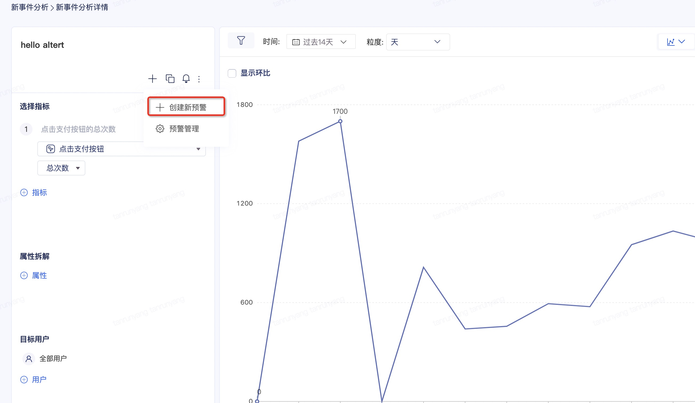
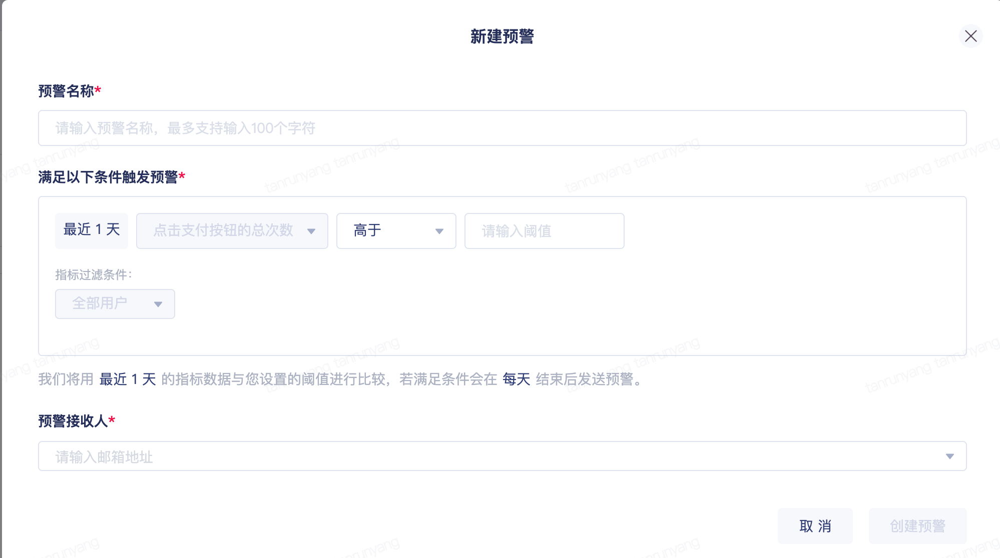
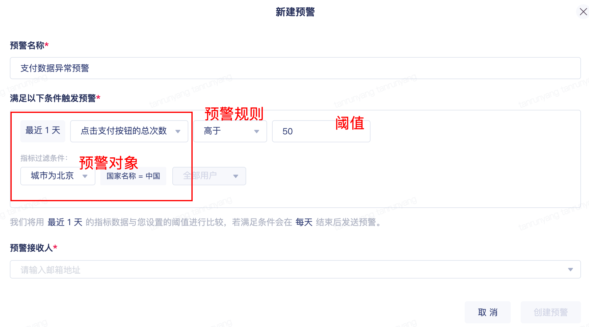
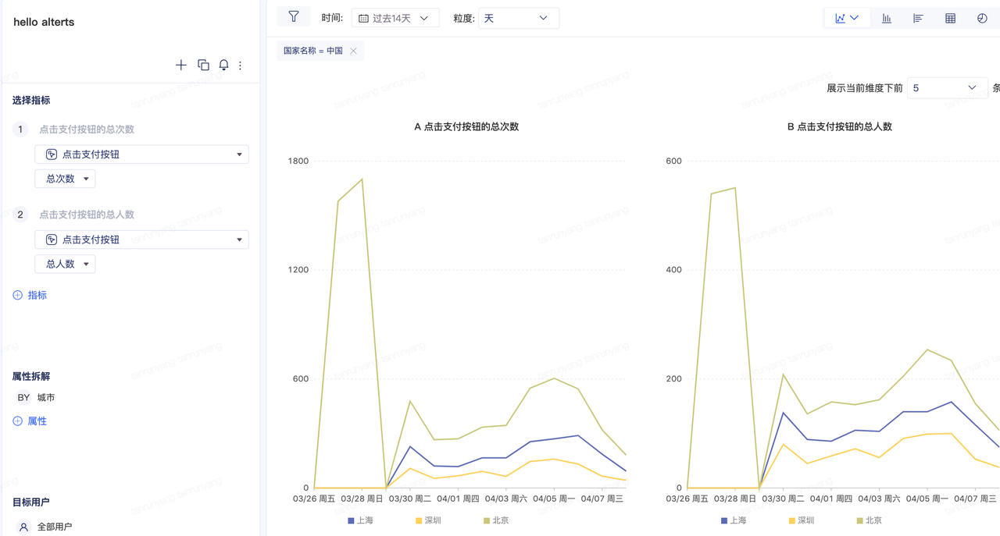
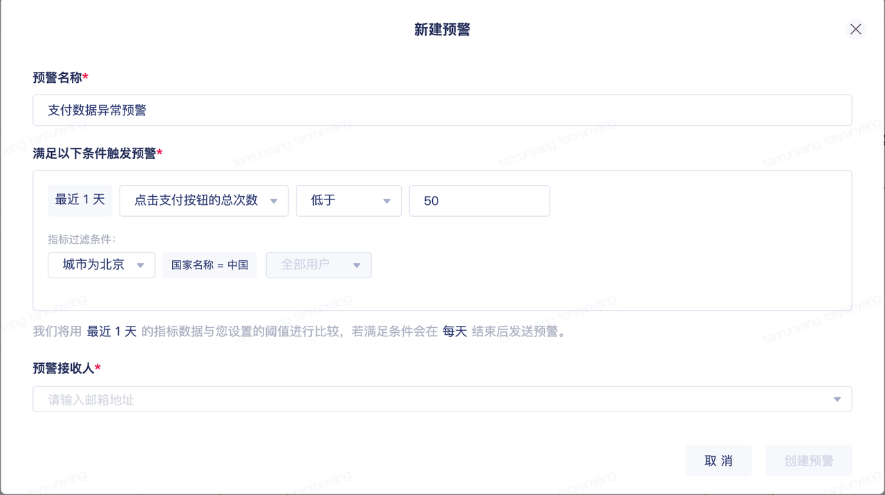
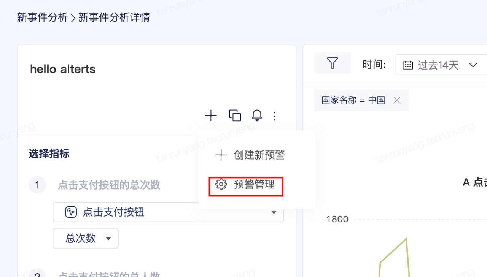
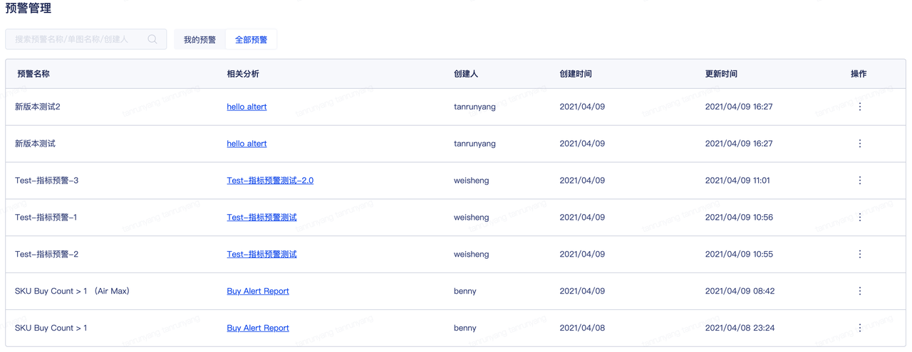
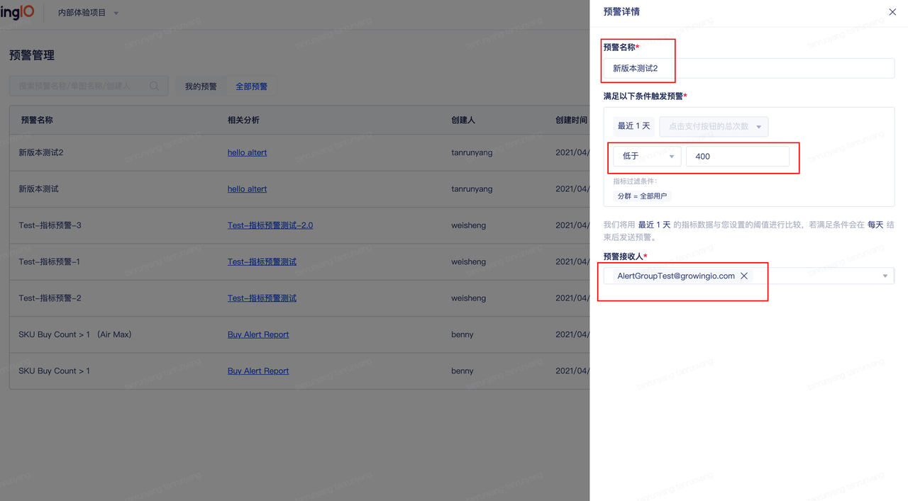

# 预警 \(beta\)

预警可以帮助您及时发现指标异常。您可以在事件分析图表创建预警，当数据高于或者低于阈值时，您可以收到邮件通知。

### 创建预警

您可以在**已经保存**的单图创建新预警

点击创建新预警后，您会看到新建预警的弹窗：

您需要填写**预警名称、触发预警的条件** 和 **预警邮件的接收人**。 

**预警名称：** 填写您认为具有意义的预警名称，因为预警名称会成为预警邮件标题的组成部分。 邮件接收者可以根据邮件标题判断是否与他相关。

**预警条件：** 预警条件由 预警对象 + 预警规则 + 阈值构成。如下图

**预警对象**包括指标和指标对应的过滤条件，如过去7天北京购买人数，即时间范围是过去7天，城市为北京，购买事件的总人数；昨天VIP用户消费金额，即时间是昨天，用户等级为VIP， 缴费金额求和。

注：我们会自动将事件分析的规则填充到预警对象中，事件分析的第一个指标会成为预警的指标，您也可以选择其他指标作为需要预警的指标。 

维度会默认选取第一个属性的纬度值，您也可以选择其他维度作为需要预警的纬度值，全局过滤会直接继承，无法修改。 

分群的第一个分群会成为参与指标过滤的分群，您也可以选择其他分群作为参与过滤的分群。 

时间维度： 

如果单图有时间维度（比如线图），那么我们提供对应时间粒度下的最近一个值，以确保当数据出现问题时，直接发送给您。 如果时间粒度是天，那么我们提供最近1天的指标对应数据值。如果时间粒度是周，我们提供最近一周的指标作为监测值。（本期暂不支持小时）

如果单图没有时间维度，那么我们提供对应指标的时间范围的数据作为监测值。

**预警规则：**本期支持大于小于两种预警规则**。**

**阈值**您可以输入任意数值，包括负数。

\*\*\*\*

**预警的邮件接收人**：你可以选择或者填写邮箱。

**预警管理：**

您可以发送邮件给任意邮件地址。检查数据的逻辑：每晚会比较预警对象的数据和阈值数据，不符合预期则发送邮件到指定邮箱**预警管理**入口：

**预警管理页面操作：**

点击预警名称，您可以对预警进行修改，包括预警名称、预警规则、阈值和邮件接收人信息。

您可以点击分析单图名称进入对应的分析页面。

您可以删除预警，删除后将不会对预警接收人发信息。

