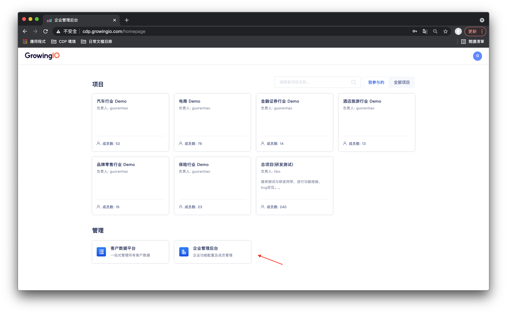
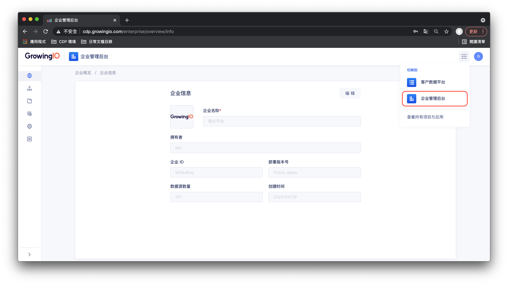
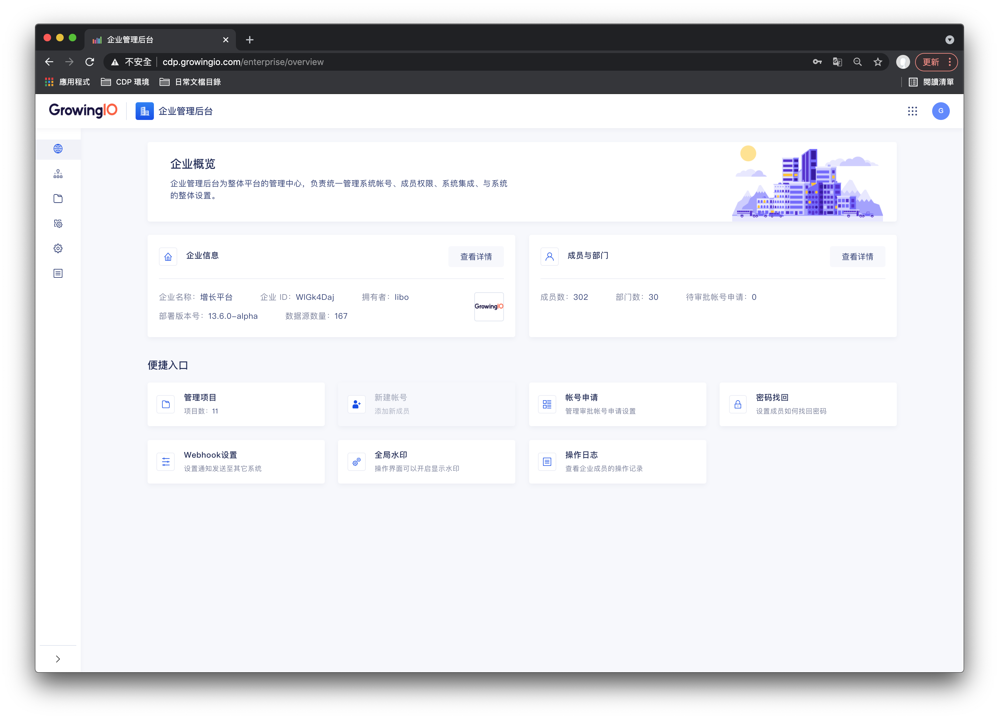
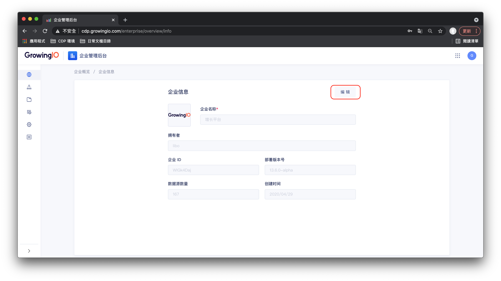

# 企业概览

## 功能介绍

企业概览包括企业与GrowingIO 系统的基本信息。 

## 如何进入企业概览？

在系统首页点击企业管理后台。

在頂部導航上，点击企业管理后台。


企业管理后台的访问权限受到 _**企业角色**_ 所控制。  
  
企业角色为外部成员的使用者，无法访问。 


## 界面介绍

| 字段 | 說明 |
| :--- | :--- |
| 企业名称 | 企业名称 |
| 企业ID  | 系統的ID |
| 版本号 | 系统当前的版本编号 |
| 创建时间 | 系统首次部署的时间 |
| 成员数量 | 系统中使用者数量 |
| 项目数 | 系统内项目（独立的协作空间）数量 |
| 数据源数量  | 系统内接入的数据源数量 |

## 企业概览操作说明

| 操作 | 作用说明 |
| :--- | :--- |
| 编辑企业名称 | 可以调整企业名称 |
| 上传企业 logo | 可以修改 logo  |
| 更换企业拥有者 | 僅拥有者可将企业移交给其他成员 |

### **编辑企业信息**

点击企业信息- 查看详情，点击编輯，进入企业信息修改模式。你可按需修改企业名称、上传企业 logo，点击确认即可保存。


仅 _**企业拥有者、企业超级管理员**_ 可以操作编辑企业名称


\*\*\*\*

