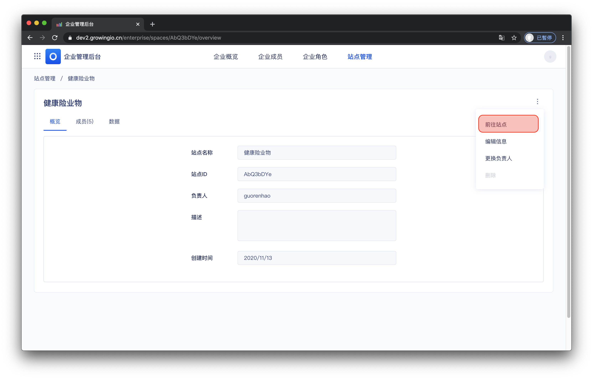
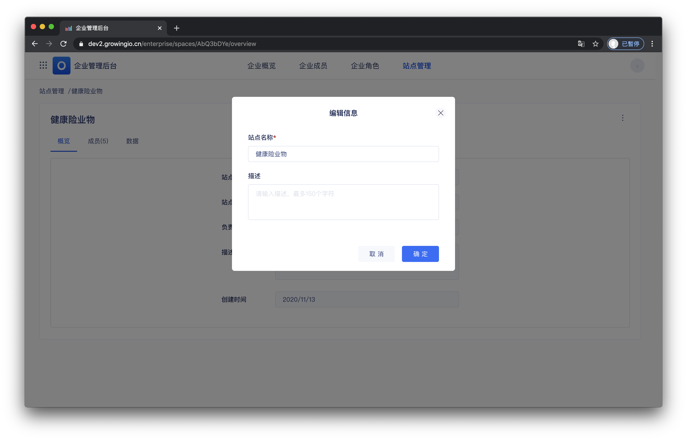

# 項目概览 done

## 界面介绍

## 項目概览的操作说明

| 操作 | 作用 |
| :--- | :--- |
| 前往項目 |  |
| 编辑項目信息 |  |
| 更换负责人 |  |
| 删除項目 |  |

### 

### 前往項目

过点击前往項目，可进入項目内部 。 


权限控制： 仅已被加入項目中的成员 ，才可访问項目 。


### 编辑項目信息

操作流程 ：点击操作 &gt;  编辑項目信息 &gt;  点击保存 。


权限控制： 仅拥有者、超级管理员可更换項目负责人


### 

### 更换负责人

操作流程 ： 点击操作 &gt;  点击更换负责人 &gt; 选择新负责人 &gt; 点击确定 。


权限控制： 仅拥有者、超级管理员可更换項目负责人


### 删除項目


由於刪除項目為高度敏感且危險操作 ，當前平台中 不支持 自行刪除站點 。  
  
若有刪除项目的訴求，請聯繫 GrowingIO 技術顧問提供協助。


