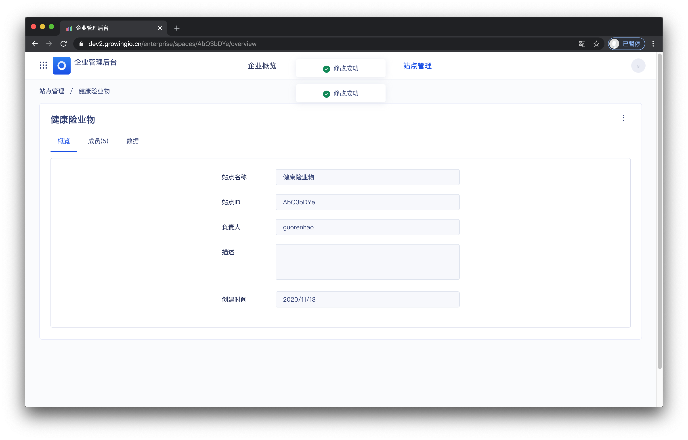
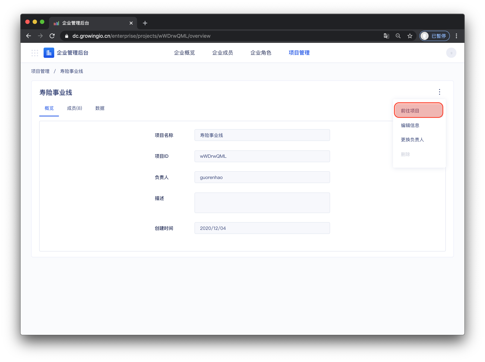
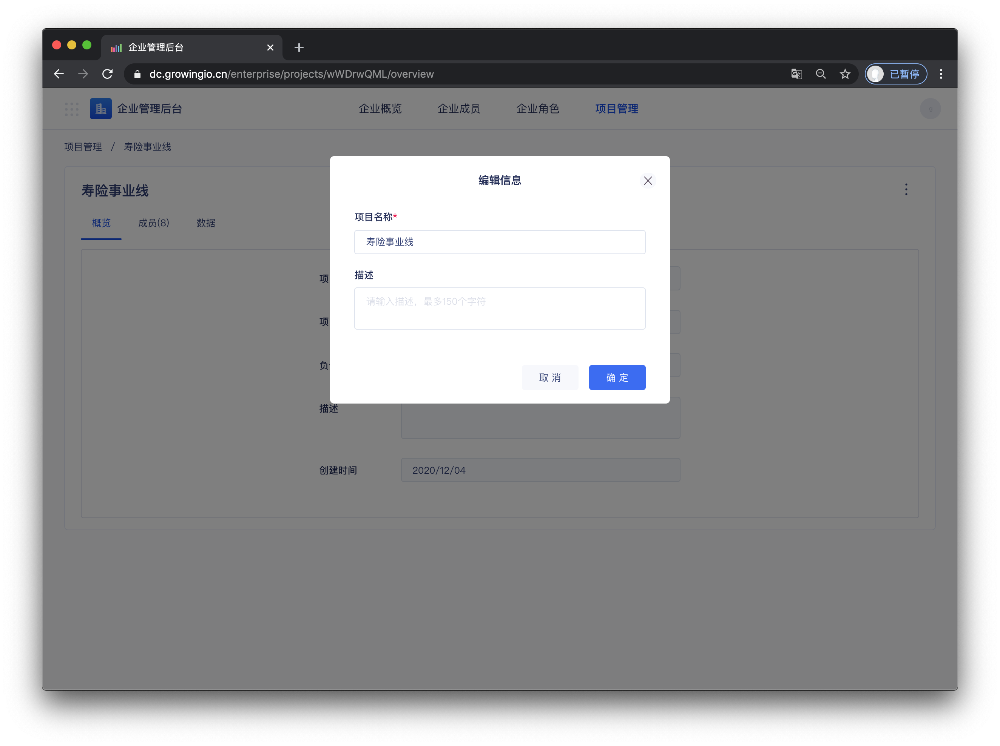
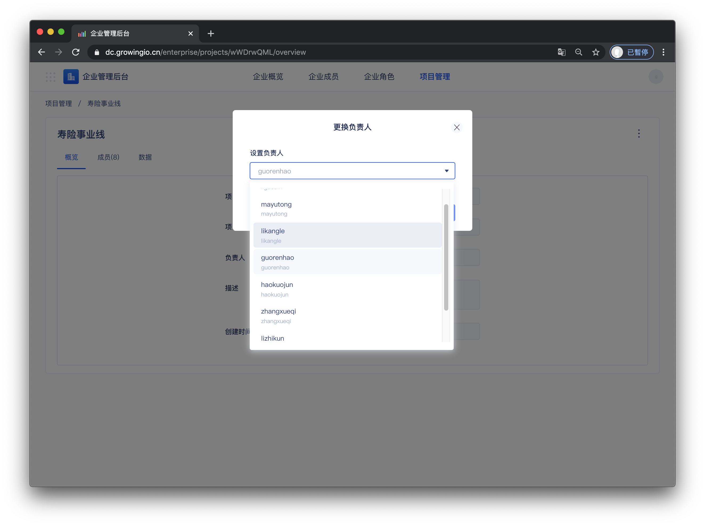
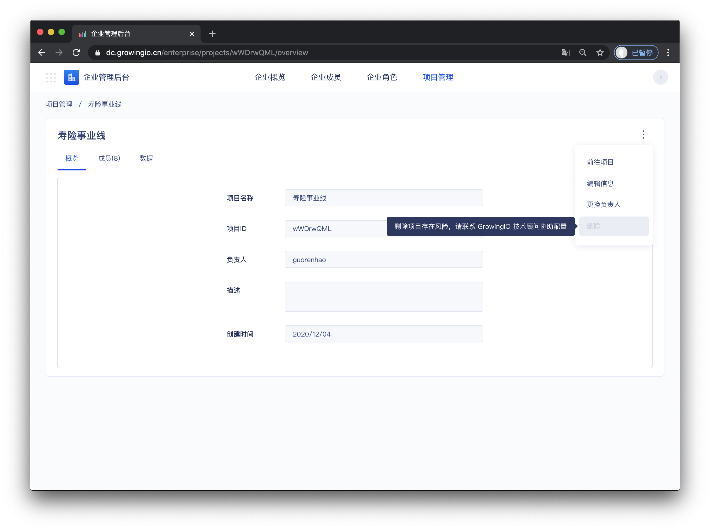

# 項目概览 .

## 界面介绍

## 項目概览的操作说明

| 操作 | 作用 |
| :--- | :--- |
| 前往項目 | 点击可进入项目内部 |
| 编辑項目信息 | 修改项目名称、项目描述 |
| 更换负责人 | 负责人可将项目移交给其他项目成员 |
| 删除項目 | 删除不需要的项目 |

### 前往項目

点击前往項目，可进入項目内部 。 


权限控制： 仅已被加入項目中的成员 ，才可访问項目 。


### 编辑項目信息

操作流程 ：点击操作 &gt;  编辑項目信息 &gt;  点击保存 。


权限控制： 仅拥有者、超级管理员可更换項目负责人


### 更换负责人

操作流程 ： 点击操作 &gt;  点击更换负责人 &gt; 选择新负责人 &gt; 点击确定 。


权限控制： 仅拥有者、超级管理员可更换項目负责人


### 删除项目


由于删除项目为高度敏感且危险操作 ，当前平台中 不支持 自行删除项目 。  
  
若有删除项目的诉求，请联系 GrowingIO 技术顾问提供协助。


