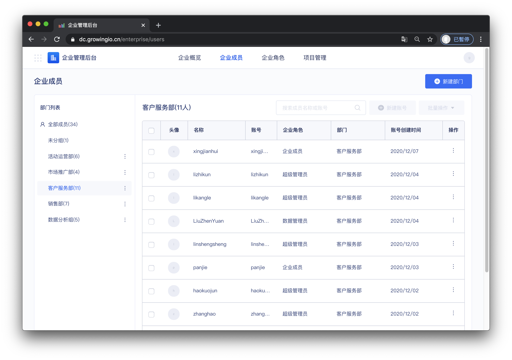
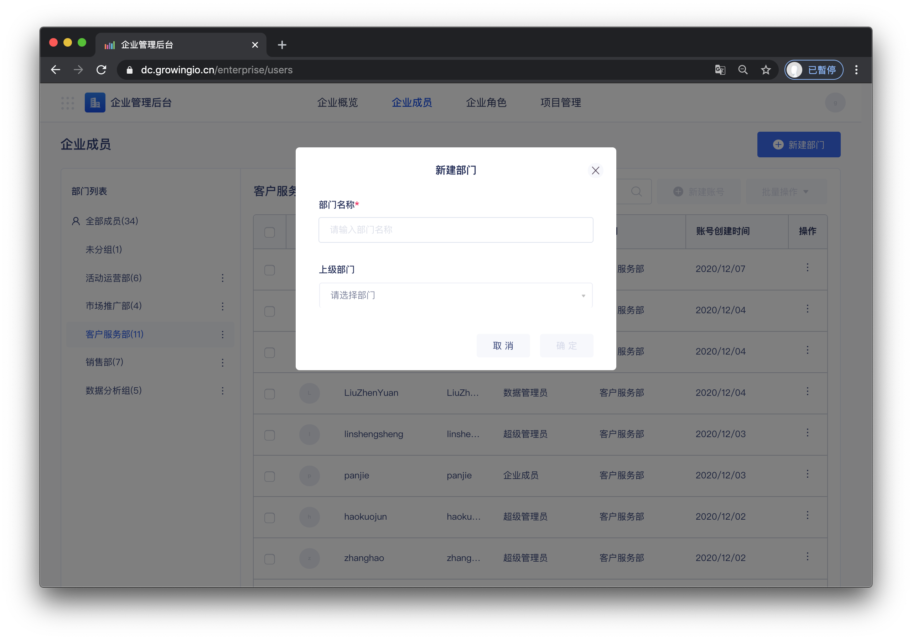
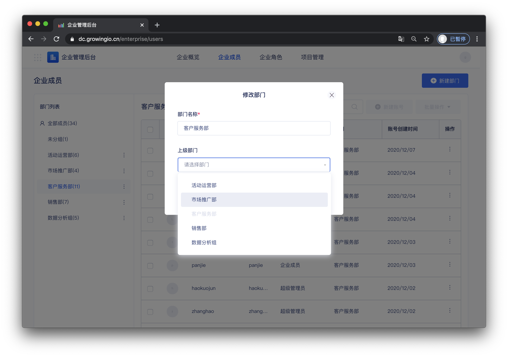
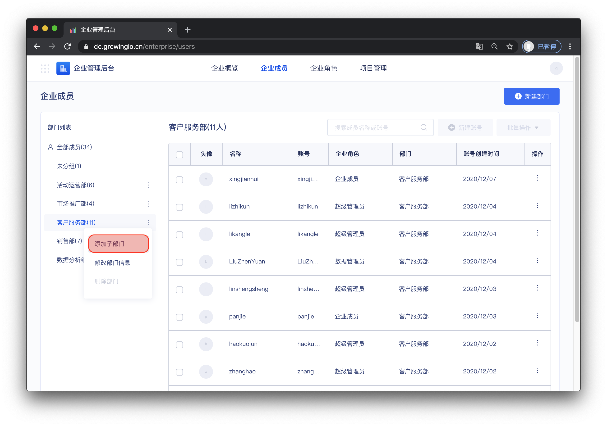
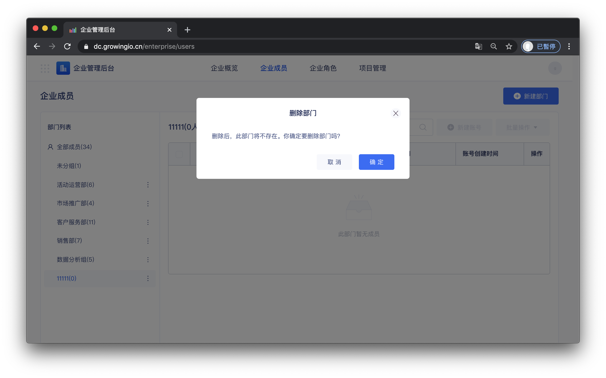

# 部门管理 .

## 功能介绍

为了使企业管理更有层次和秩序，超級管理员可依据组织架构创建部门，并将成员依据组织架构进行管理 。 


每个站点成员 只能在一个部门中 。

部门为树状结构 ，可以无限的向下加子部门。


## 界面介绍

* 查看全部成员  ： 可查看系统中的所有成员 。
* 未分组成员 ：若成员为关联部门 ，可在"未分组"的分类下查看 。‌
* 查看部门下的成员 ： 当点击一个部门时，会展示部门 与 以下子部门的成员 。

## 部门的操作说明

| 操作 | 作用 |
| :--- | :--- |
| 新建部门 | 添加新的部门，以满足组织结构。 |
| 编辑部门信息 | 调整部门的名称、描述 |
| 添加子部门 | 在大部门下添加子部门 ，来满足多组织层级的情况。 |
| 刪除部门 | 删除不需要的部门。 |


权限控制：仅拥有者、超级管理员 拥有部门管理的权限


### 

### 新建部门

操作流程： 点击右上角 “新建部门按钮”  &gt;  进入新建部门弹窗  &gt;  填写部门信息  &gt;  点击确认 。

选择上级部门后 ， 新建的部门会成员该部门的子部门。 


权限控制：仅拥有者、超级管理员 拥有部门管理的权限


### 编辑部门信息

操作流程： 点击 更多按钮 &gt;  点击修改部门信息 &gt; 进入弹窗编辑 &gt; 点击确认 。


权限控制：仅拥有者、超级管理员 拥有部門管理的权限


### 

### 添加子部门

支持在大部门下添加子部门 ，来满足多组织层级的情况。

操作流程： 点击 更多按钮 &gt;  点击添加子部门 &gt; 进入弹窗 &gt; 点击确认 。


权限控制： 仅拥有者、超级管理员 拥有部门管理的权限 。


### 

### 刪除部门

操作流程： 点击 更多按钮 &gt;  点击刪除子部门 &gt; 进入弹窗 &gt; 点击确认 。


权限控制：仅拥有者、超级管理员 拥有部门管理的权限。



刪除部门时， 不能有下级部门 。请先刪除 下级部门。

删除部门时 ， 部门中不能有成员 。 请先将成员 转移至其他部门。


