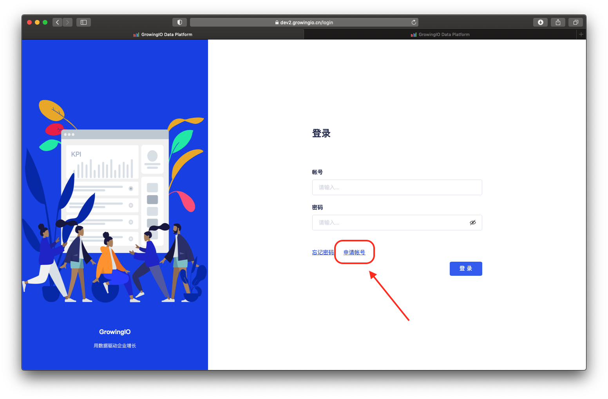
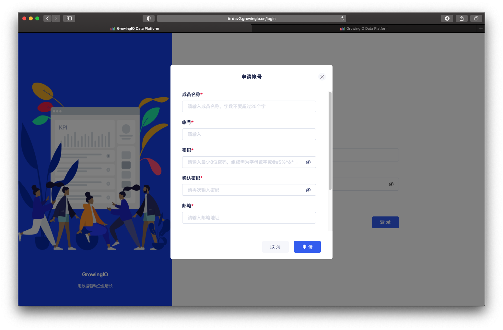
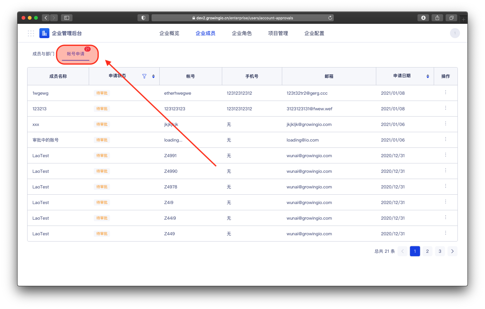
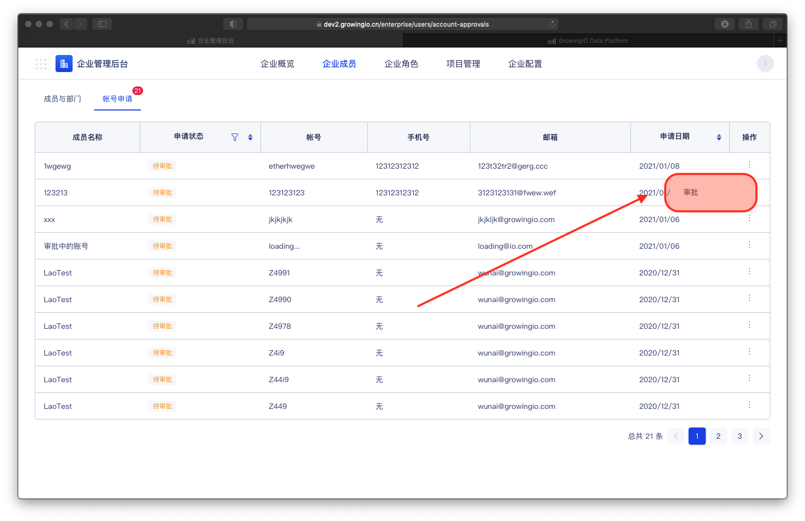
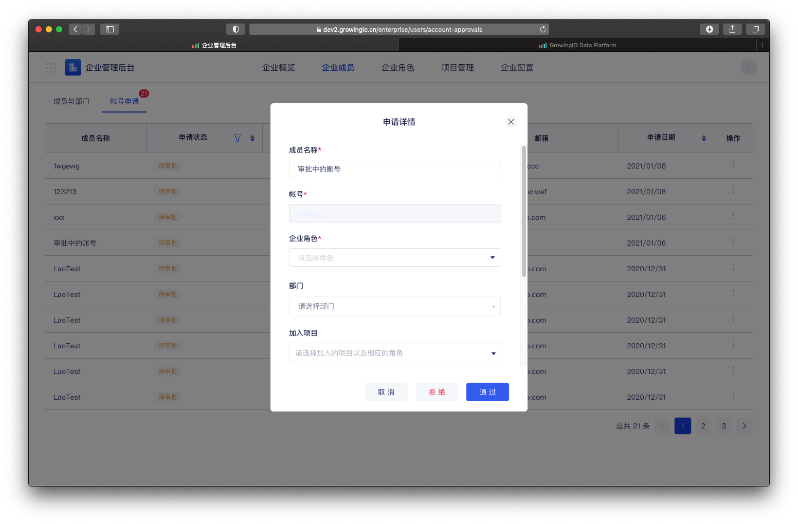
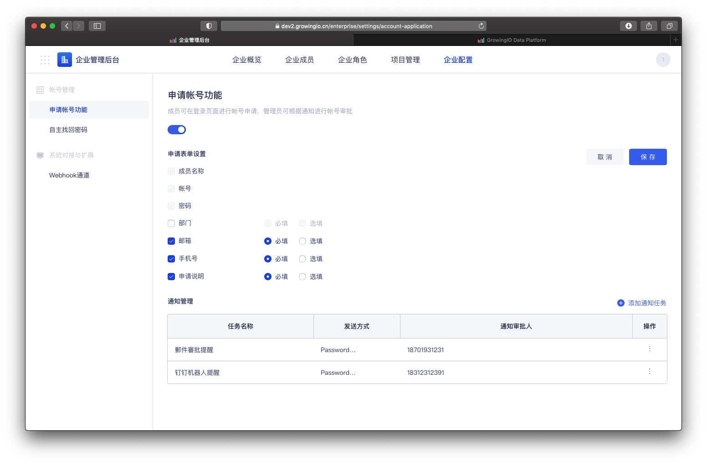
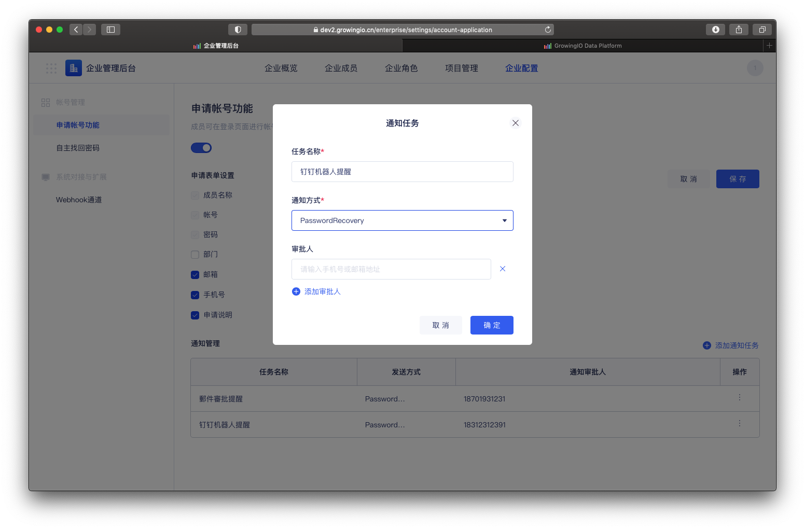

# 申请帐号功能

## 功能介绍

成员可在登录页面进行帐号申请，管理员可根据申請通知进行帐号审批。


系统开启单点登入时 ，无法使用帐号申请功能。


## 帐号申请

step1 : 在登入页面，可点击 【帐号申请】。

step2 : 在表单中填写申请内容。 

step3 : 提交申请，审批人员接收申请通知 。


系统开启单点登入时 ，无法使用帐号申请功能。


## 帐号审批


权限控制：只有企业拥有者、企业超级管理员，可以进行帐号审批。


step1 : 点击帐号申请审批，进入审批页面 。

step2  :  点击 申请通知进行审批操作 

step3 :  填写成员信息 ，进行 通过 / 拒绝 。 

信息可设置：修改成员的企业角色、邮箱、手机号等信息 ，但不可调整 申请的密码/帐号 。

step4 :  审批通过后 ，申请者即可使用帐号密码进行登入操作 。 

## 帐号申请设置


权限控制：只有企业拥有者、企业超级管理员，可以进行設置。


可配置，启用/禁用帐号申请功能、申请填写表单与申请时的通知任务。

### 配置申请表单内容 ：

勾选，表单中的填写项并选择必填或选填 。

### 配置通知任务：

step1 :  任务名称。

step2 :  选择通知的渠道 （当前支持 webhook 通道对接）

step3 : 设置通知的对象 。 （支持可以添加多个审批对象）


1.触发时机 ：当有申请时系统会触发任务发送通知，通知审批人。

2.审批对象：可输入 手机号、邮箱、工号 等 ，可确定通知对象的字段 , 依据对接场景灵活设置 。


 

