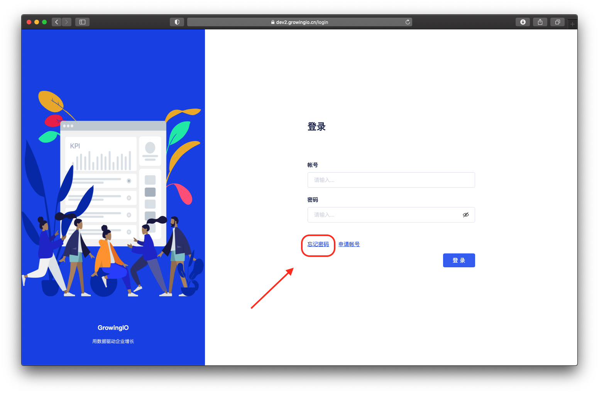
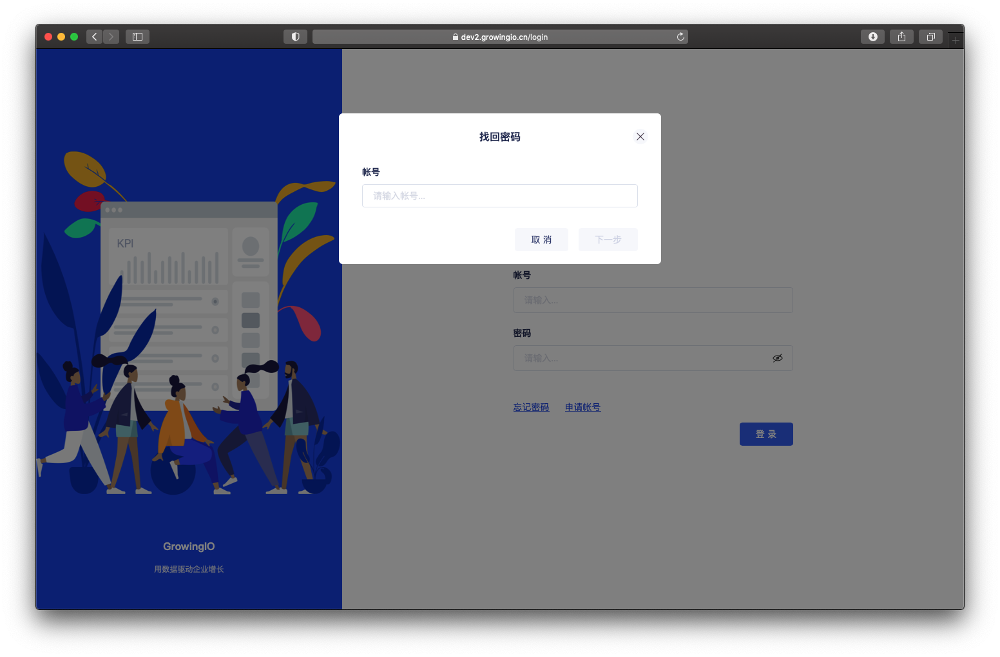
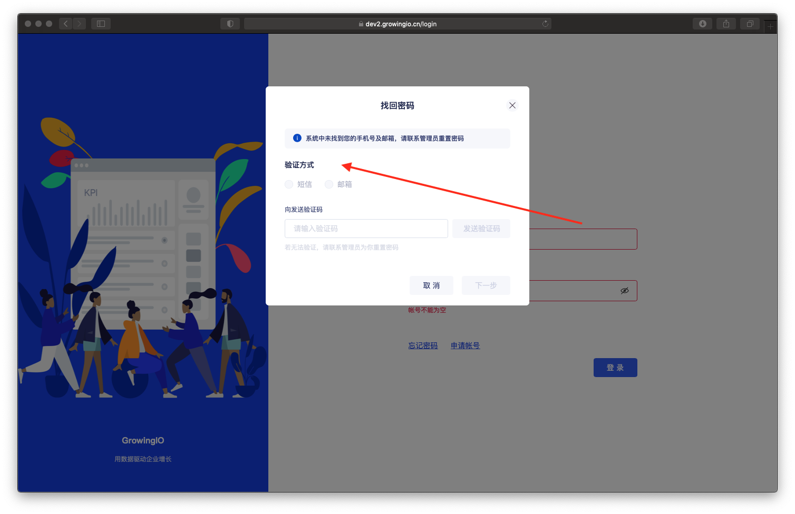
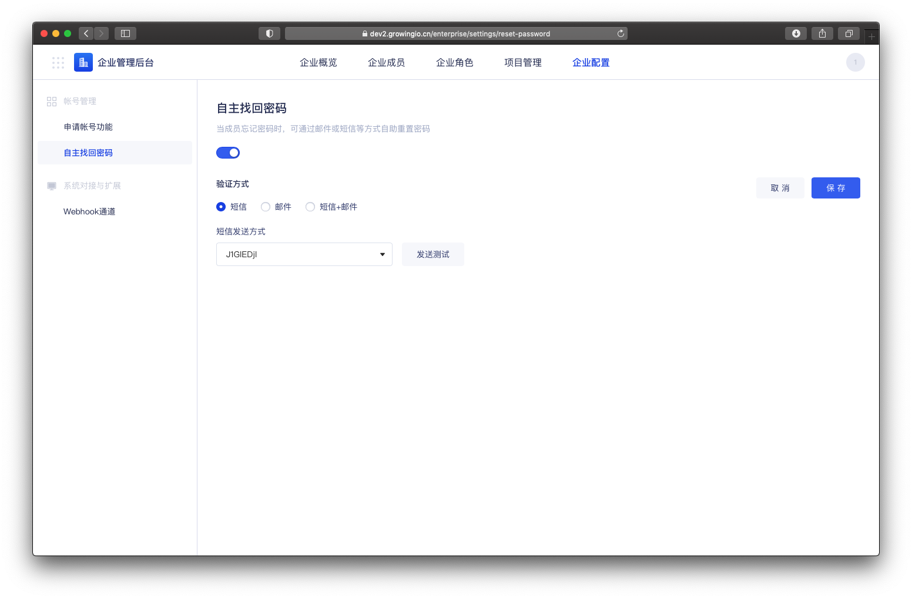

# 自主找回密码

## 功能介绍

当成员忘记密码时，可通过邮件或短信等方式自助重置密码。

节省管理人员，未使用成员重新配置密码工作 。


系统开启单点登入时 ，无法使用自主找回密码功能。


## 使用者重置密码流程 

step1 :  使用者可在登入頁面，点击忘记密码 。

step1 :  输入要找回密码的帐号 ，点击下一步。

step 2 : 选择验证方式 ，发送验证码 ，并填写验证码 。


1.可在企业配置 - 自助找回密码设置中，配置验证方式，目前支持邮箱或手机号 。 

2.若该帐号 未绑定短信、邮箱 ，则无法使用该方式验证 。 可连系管理员手动重置密码。

3.验证码 【15分钟】 有效 


step 3 : 填写新密码 ，提交并登入系统。

## 自助找回密碼功能功能設置

点击，企业配置- 自助找回密码 。 

验证方式 ： 

可选择 短信、手机号 方式进行发送验证码 。  
‌  
并对两种验证方式 配置通知通道 （目前支持webhook 对接）


权限控制：只有企业拥有者、企业超级管理员，可以进行設置。


