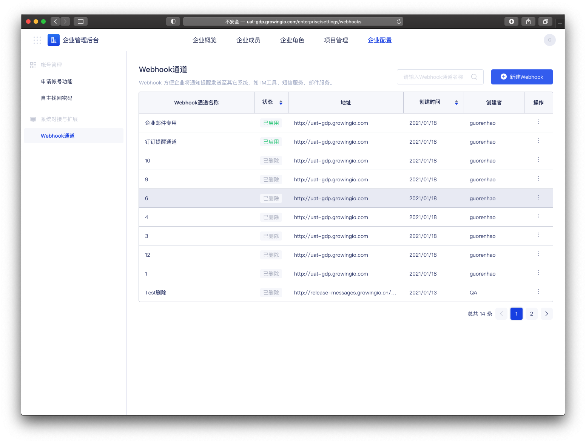
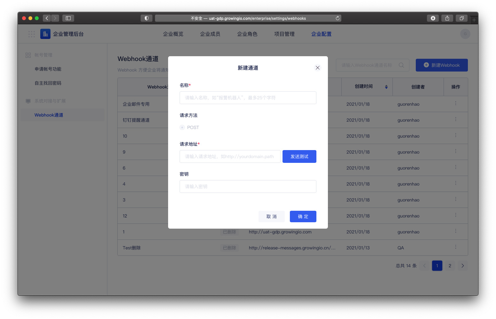
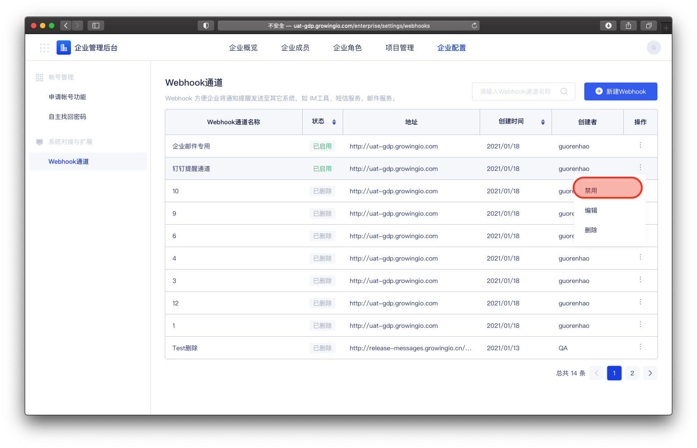
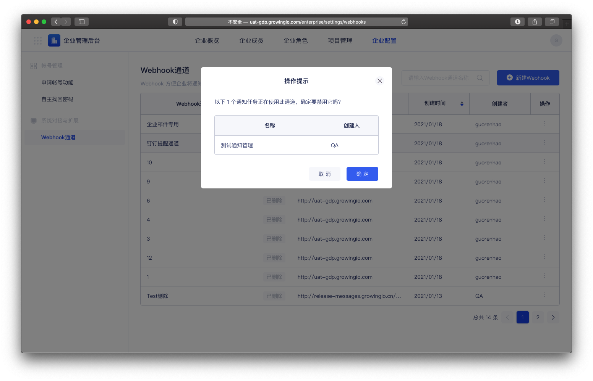

# Webhook通道

## 功能介绍

Webhook 方便企业将通知提醒发送至其它系统，如 IM工具、短信服务，邮件服务。 

对于已经有建设或采购自己的 邮件、短信、IM等系统的客户， 只需要使用 GIO 的配置webhook通道，用 Webhook 是较灵活、简易“跨系统对接”解决方案，用户只需要选择配置好的 Webhook 配置，信息发送的动作由其他系统来完成。

當前企业配置中的webhook 通道 ，可用于 帐号审批通知、忘记密码等 ， GIO  系统对其他系统进行消息场景。


权限控制：只有企业拥有者、企业超级管理员，可以进行設置。


 

## Webhook 操作说明

### 查看webhook

点击，进入 企业配置-  webhook通道 。

### 新建 Ｗebhook 

step1 : 点击，新建 webhook  

step2 :  填写，通道名称  、 请求地址 、密钥 


1.确定webhook通道名称（客户内部统一即可）

2.确定请求地址（即客户开放给gio的调用接口）

3.确定鉴权 密钥 \(若没有可不填


### 禁用/啟用 Webhook  

点击，操作    
点击，启用/禁用

禁用时，当此webhook 被使用在 相关连的通知任务时，会给予提示 。   
若确定禁用webhook ，关联的通知任务将失效 。

### Request Payload 

