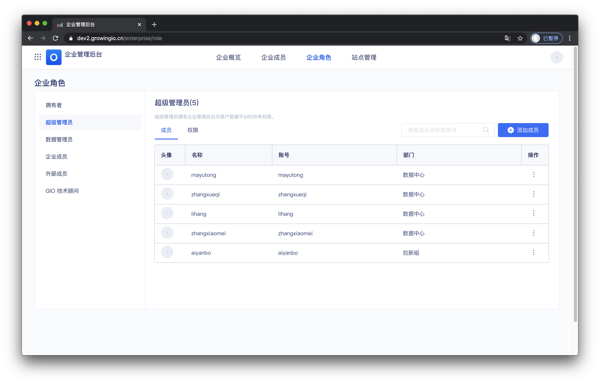
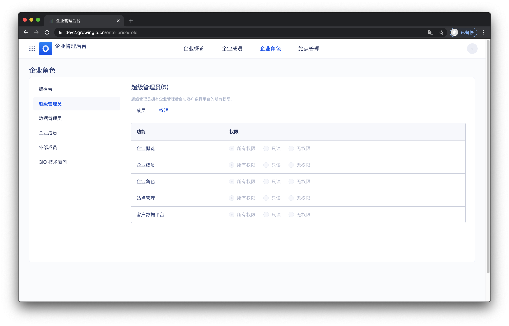
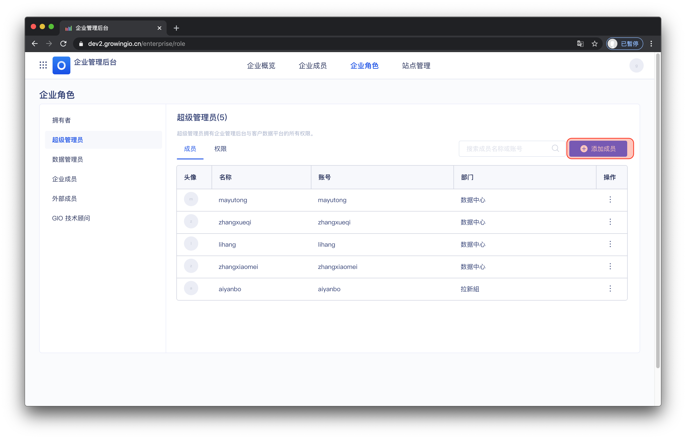
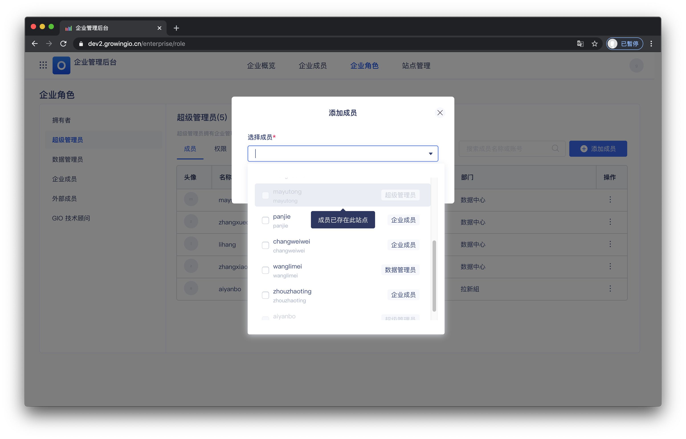
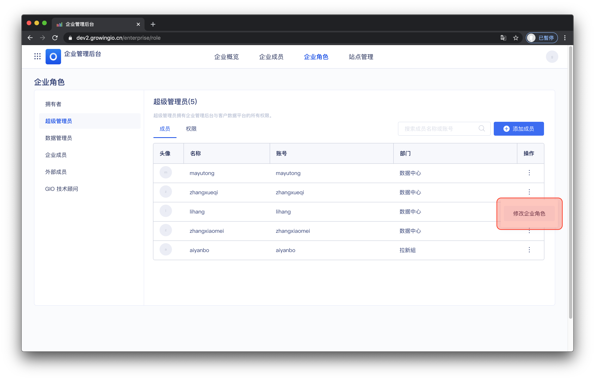
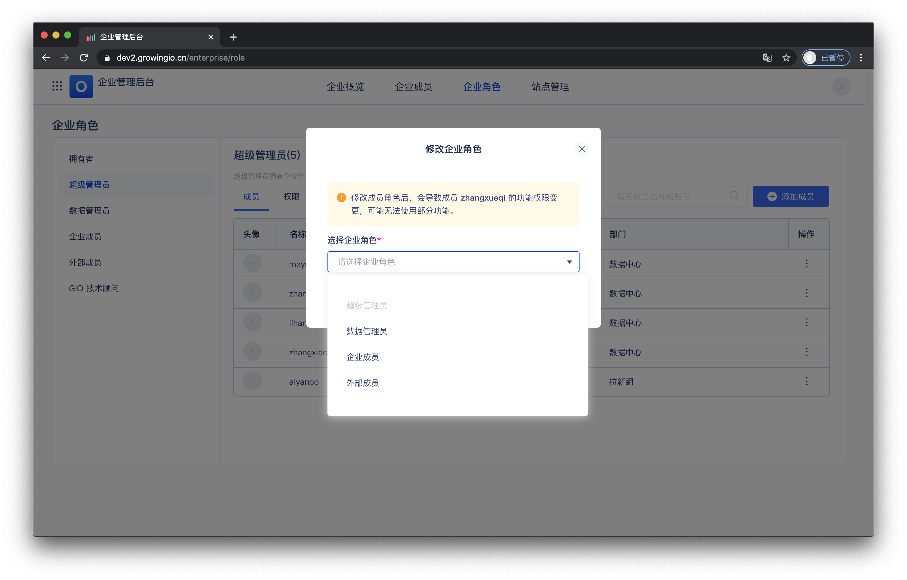

# 企业角色 done

## 功能介绍

企业角色是区分系统使用者对，“企业管理功能＆客户数据平台”的权力和责任。

一个角色，就相当于一个功能权限包。角色将决定成员在该中的功能权限，即该成员可否使用某项功能。


企业角色和成员是“1对1”的关系，每个成员都具有一个企业角色，即为，该用户对“企业管理功能＆客户数据平台“的权限。


## 界面介绍

**企业角色关联的成员**

可查看企业角色下相关的企业成员。

**企业对应的权限**

可查看企业角色对应的权限。

\*\*\*\*

\*\*\*\*

## **系统预置角色介绍**

GrowingIO 在项目中，帮助用户预置了 5 个系统角色：_**拥有者、超级管理员、数据管理员、企业成员、外部成员**_ 。系統預置角色不支持编辑角色信息、修改角色权限、删除角色等操作。

**拥有者**

* 拥有者是系統唯一的。 
* 拥有者有最高权限的角色。一般来说是管理人員，管理成员们在项目中可以做什么，不能做什么。

**超級管理员**

* 管理员可以辅助拥有者做管理工作的角色。
* 超级管理员拥有企业管理后台与客户数据平台的所有权限。

**数据超級管理员**

* 数据管理员主要负责 客户数据平台的管理与维护 ，负责定议员数据 、接入数据源。 
* 推荐团队内部DBA、数据工程师担任此角色。

**企业成员**

* 可查看企业管理相关权限 **，**但无法进行企业管理操作。 
* 无法访问客户数据平台，推荐给各业务人员设置此角色。
* 推荐给各业务人员，或无需做数据管理的同事设置此角色。

**外部成員**

* 无访问企业管理后台与客户数据平台。推荐给各企业外部人员设置此角色。

|  | 超級管理员 | 数据管理员 | 企业成员  | 外部成员 |
| :--- | :--- | :--- | :--- | :--- |
| 企业概览 | 所有权限 | 只读 | 只读 | 无权限 |
| 部门与成员 | 所有权限 | 只读 | 只读 | 无权限 |
| 企业角色 | 所有权限 | 只读 | 只读 | 无权限 |
| 站点管理  | 所有权限 | 只读 | 只读 | 无权限 |
| 客户数据平台 | 所有权限 | 所有权限 | 无权限 | 无权限 |

## 企业角色的操作说明

| 操作 | 作用 |
| :--- | :--- |
| 添加成员至角色 | 将成员添加至当前角色 |
| 修改企业角色 | 将当前角色下的成员，修改为其他角色 |

### \*\*\*\*

### **添加成员至角色**

操作流程： 点击添加成员 &gt;  弹窗选择成员 &gt; 点击确定。

### 修改企业角色

操作流程： 点击修改企业角色 &gt;  弹窗选择企业角色&gt; 点击确定。

