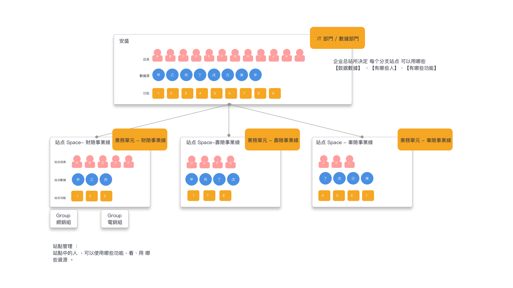

# 項目管理 \(需要改圖\)

## 什么是項目?

定义：何为项目 space ？

項目可被理解为一个 “ **独立的协作业务单位** ” 。 数据需要一起被分析，人需要一起协作 ，需要在同一个項目中。

“項目” 在业务意义上，可被理解为业务主要运转的空间。 **一群人为了共同完成一个业务目标**，就可以通过创建一个項目，将需要的人与数据组合在一起。

可以对应到一个业务线、部门上， 或一个大区中 ，只要是一个独立的协作单位，便可建立一个Space ， 当然我们期望可以对应到组织架构上 。

* 可将成员分配至不同項目中 ， 使不同业务线的成员 相互独立的进行工作 。
* 可将事件分配至不同項目中 ，使不同业务线的成员，彼此不可查看其他数据 。
* 可将用户属性、标签 分配至不同項目中 ，使不同业务线的成员，彼此不可查看其他业务线相关的用户数据。

#### 

