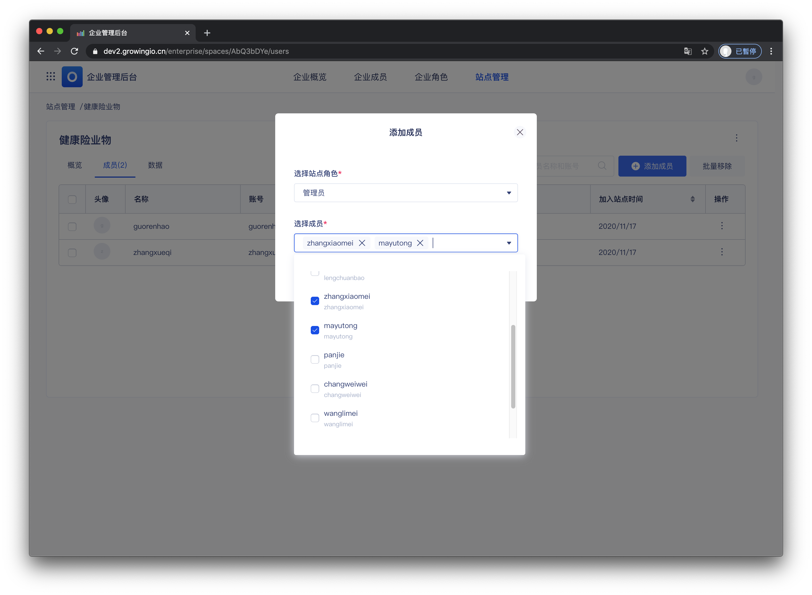
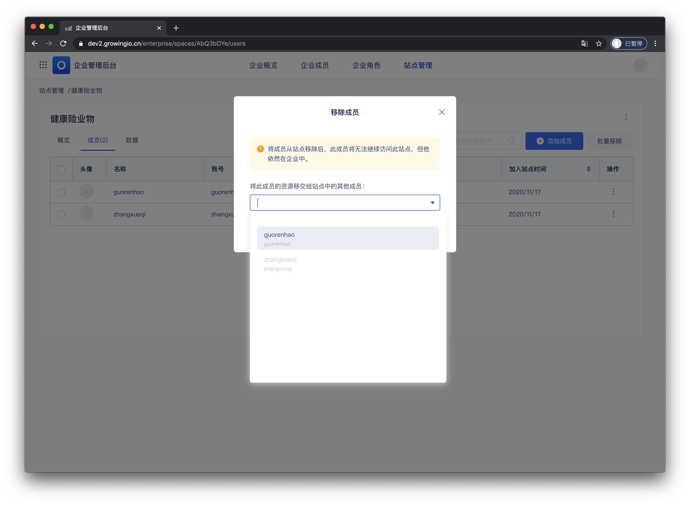

# 成员配置 done

## 功能介绍

可将成员分配至不同项目中 ， 使不同业务线的成员相互独立的进行工作 。

只有被分配到项目中的成员\(帐号\) ， 可以进入项目内，进行项目内操作 。

## 界面介绍

在项目成员的列表中，可查看项目中都有哪些成员，并可进行添加/移除 。

## 项目概览的操作说明

| 操作 | 作用 |
| :--- | :--- |
| 添加成員 | 将成员添加至项目之中，使成员可访问项目。 |
| 移除成員 | 将成员移出项目，成员无法访问此项目。 |

### 添加成員

将成员添加至项目之中，使成员可访问项目。

操作流程  ： 点击添加成员 &gt;  选择项目角色 &gt;  选择成员 &gt; 点击确认 。


项目角色为此用户在项目内的功能权限 。 可查看 项目[角色](https://app.gitbook.com/@growingio/s/op/~/drafts/-MMVAIcGiHwnMjXMi1gb/v/v20201200/product-manual/zhan-dian-guan-li/zhan-dian-jiao-se)。



权限控制： 仅拥有者、超级管理员可更换项目负责人


### 

### 移除成員

将成员从项目移除后，此成员将无法继续访问此项目，但他依然在企业中 ，若成员需要访问项目，可以再次加入 。

操作流程 ： 点击移出成员 &gt;  选择移交资源对象 &gt;  点击确认 。


权限控制： 仅拥有者、超级管理员可更换项目负责人


