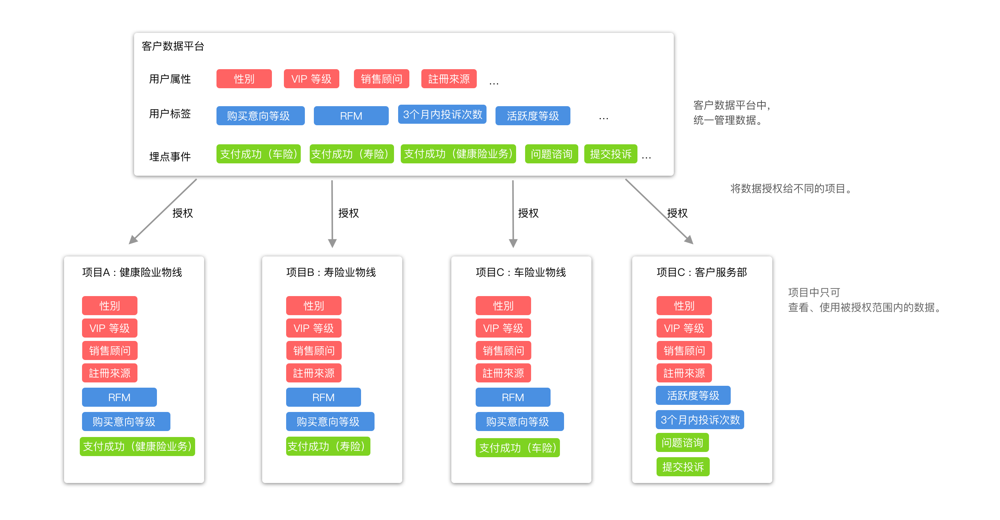

# 数据授权 （需補截圖）

## 功能介绍

对不同的授权不同的数据（事件、用户标签、用户属性） ，使不同项目可以使用的数据范围是被限制的，达到数据隔离的目的 。  实际案例 [点此查看](https://app.gitbook.com/@growingio/s/op/~/drafts/-MMtCPPs5u00-QtXECst/v/v20201200/product-manual/qi-ye-guan-li-hou-tai/zhan-dian-guan-li/ying-yong-chang-jing-jie-shao/~/settings/customization) 。

举例示意图：

此情景下 ，我們分了4 個項目 ，分別為 健康險業務線、壽險業務線、車險業務線、客戶服務部 。 

用户属性：

* 需求上各个业务项目都需要使用用户属性的数据 ，于是授权了给4 个项目全部的用户属性 。

用户标签 ：

* 标签为整个系统整合数据后统一分配 ，但由于业务场景不同 与 数据安全的考量 ， 给业务线 RFM 、购卖意象等级等 具备业务意义的标签 。
* 但由于 客服部门 需要处理投诉与业务流失的干预 ，但不负责销售行为 ，于是只授权了 客户服务相关的标签 。

埋點事件：

* 由于交易KPI 的信息为企业内部高度敏感信息 ，功能内部不可跨业务线查看 交易相关数据 ，因此将不同的 业务的交易 拆分为 多个交易事件，分别授权不同的项目 。


12.0 版本 ，不支持用户范围的授权与限制。  
默认所有项目 可查看的用户范围 =  全部用户。


## 界面介绍

## 数据授权操作说明

| 操作 | 作用 |
| :--- | :--- |
| 查看项目数据范围 | 可查看项目中可用的数据 |
| 编辑用户属性、用戶標籤、埋點事件 授权范围 | 配置项目可用的数据 |

### 

### 查看项目数据范围

在弹窗列表中可查看项目中可用的数据 \(用户属性、用户标签、埋点事件\) ，只有列表中被授权的数据可在项目中被使用与查看。

操作流程 ： 点击查看 &gt; 打开弹窗 &gt; 查看可用的 用户属性、用户标签、埋点事件。

### 编辑 用户属性、用户标签、埋点事件 授权范围

透过授权配置，可配置不同的项目可用的不同的数据。

操作流程 ：  点击编辑 &gt;  进入 埋点数据授权 &gt;  选择授权方式  &gt;   保存。


授权模式：

全部可用 ：可以使用全部 ，当有新的 属性、标签、埋点事件时 ，自动授权项目使用。  
  
全部禁用：不可以使用任何 用户属性、标签、埋点事件。  
  
自定义：可以自由定义使用 用户属性、标签、埋点事件。



12.0 用户属性 \(不控制用户信息\)



权限控制： 仅拥有者、超级管理员可更换项目负责人


### 

