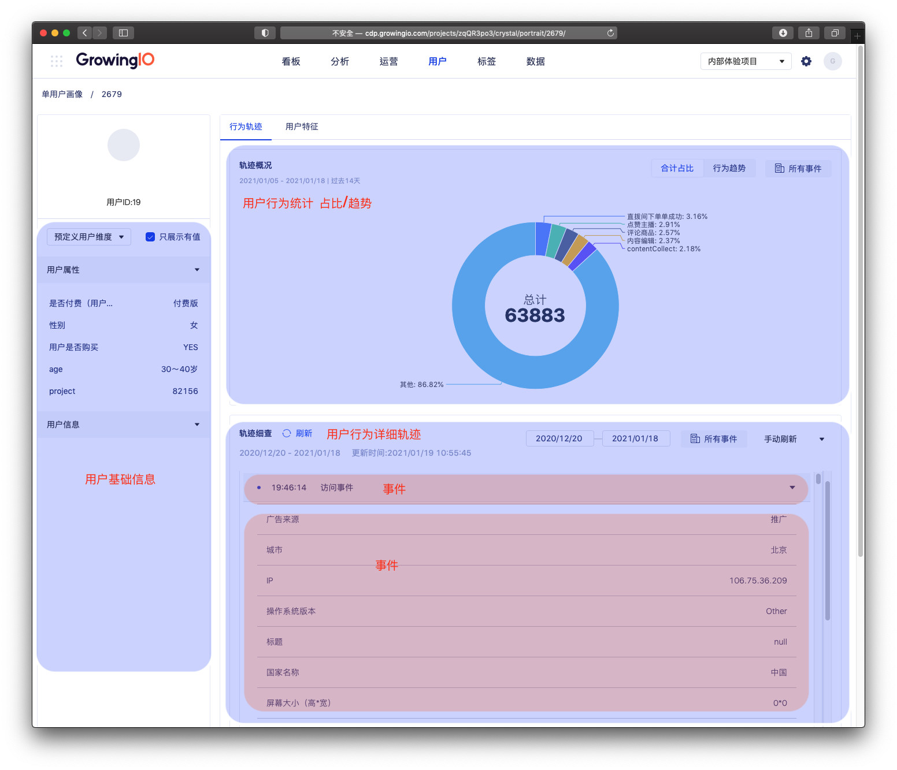
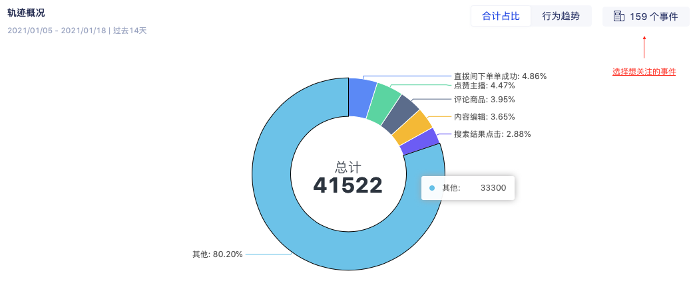
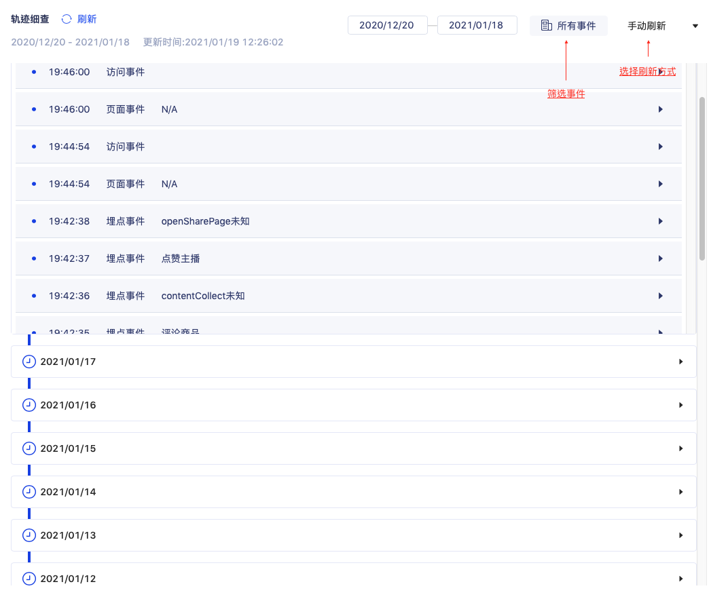
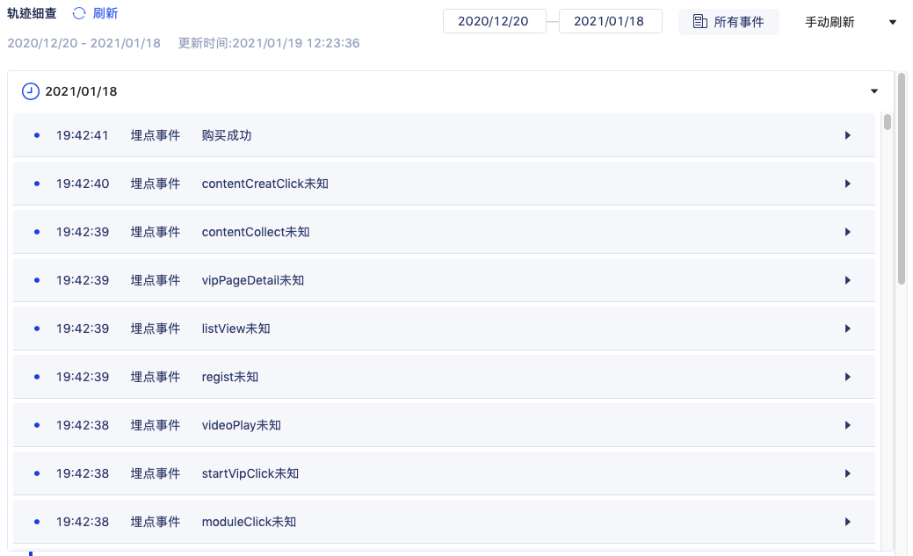

# 360°单用户画像 new

## 功能介绍

在360°单用户画像中您可以通过用户ID、姓名、手机号、邮箱、OpenID或UnionID查找用户并查看用户画像详情；也可以通过预置分群来查找用户，如过去30天来访用户活跃度Top10，今日活跃用户、三周连续活跃用户、上两周流失用户。

找到用户后，您可以在用户细查页面查看用户行为明细和用户特征。

## 用户搜索页

用户搜索 ： 目前支持 用户ID、姓名、手机号、邮箱、unionID、OPenID ，使用用户唯一标示查询用户。

高活跃用户： 一段时间内，访问次数最多的用户 top 10 。

预置分群：

* 今日活跃用户 ： 今天发生过“任意事件"的用户。
* 三周连续活跃用户 :  以周为单位计算 ，连续3周 都发生过任意行为。
* 上两周的流失用户 ： 周为单位计算 ，两周前有多任意行为，但已经连续两周未发生任意行为。

##  单用户画像的解读 

### 用户基础信息 ：  

帮助你了解此用户的基础用戶信息 

* 展示该项目中被授权查看的用户属性、用户信息 。
* 用戶屬性  为在系统中定义上报。[点击查看](../../customer-data-platform/data-center/property/user-property/)
* 用戶信息 为系统中上报。[点击查看](../../customer-data-platform/data-center/property/user-info.md)
* 可勾選只展示有值的信息 。

### 轨迹概览： 

展示此用户 在最近14 天的行为统计 ，帮助你了解此用户的行为情况概括。可以通过此占比分布，发现用户最常使用的行为 ，发现用户热衷的喜好与行为习惯 。

* 可切换展示行为 近14天行为合计占比 /  近14天 行为趋势。
* 可筛选特定事件统计 。
* 占比中默认展示前5 ，其余用合并为其他展示 。
* 支持事件筛选，选择想关注的事件 。

### 轨迹细查：

在这里展示了此用户所有被采集的行为，包含访问事件，页面事件，埋点事件&事件变量，同時也支持事件筛选，选择想关注的事件 。

默认会按照日期从近到远的顺序来显示行为轨迹，即最先显示今天的行为轨迹，然后显示昨天的，前天的，更早的行为……

刷新方式：支持手动刷新、5分钟刷新、实时刷新。

### 常見問題 ：

### **Q :** 怎样使用轨迹细查进行埋点数据校验？

埋点校验是根据GIO埋点数据方案，对于方案中的埋点数据进行校验，需要验证埋点是否正常上传，对应可在细查中实时看到上传的埋点事件，如下几点：

1）在app应用中进行访问后，在细查中是否可以看到对应触发的埋点事件

 2）埋点事件是否正确绑定事件属性

### Q:为什么轨迹细查中事件、事件属性会出现  “未知”的事件 ？ 

“未知” 是由于GIO系统收到事件、事件属性的数据，但系统中并未对次进行申明定义 。

GIO是会对上传的埋点事件进行判断，是否在系统已经定义该事件，如已定义，对应的事件和属性是会显示对应定义的事件名称；

对于未在系统平台进行申明定义的，则会显示上传的标识符以及未知，同时会影响后续在产品分析中查看数据 可在 客户数据平台-  埋点事件、事件属性中定义。[点击查看](../../customer-data-platform/data-center/event-management/manual.md#chuang-jian-shi-jian)

  
  

