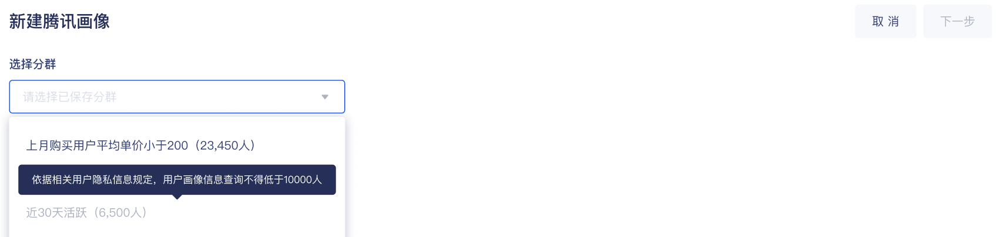
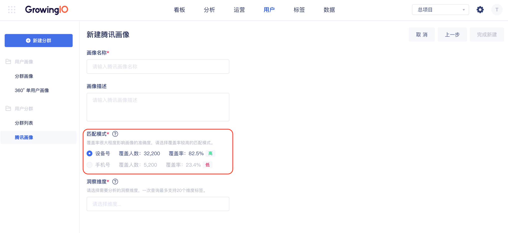
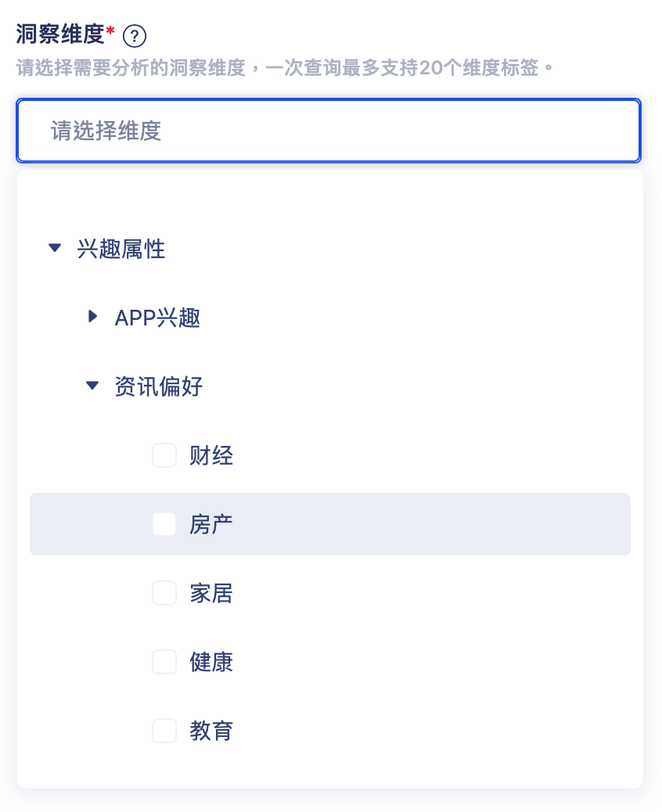
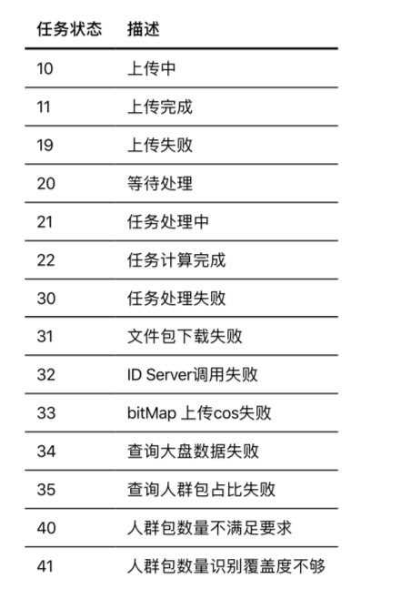

# 腾讯画像

## 功能介绍

数据源的丰富性缺乏是绝大多传统客户线上转型過程中的難点 ，騰訊生態體系中，提供豐富的用戶畫像可補充部分數據缺失，提供便捷、豐富的用戶群體畫像洞察 ，輔助業務人員決策更精彩 。

## 名词解释

* 何為TGI 指數 ?

为了便于理解，我们可以将TGI简易的理解为  “此人群的偏好程度” 。   
既有程度一说，那便有参照，在腾讯画像中，TGI指数表达的意思为 ：  
‌在某个偏好中，“此人群” 对比于 “腾讯整体用户” ，是高或低 。    ‌  
TGI指数等于100表示平均水平。  
TGI &gt; 120，代表此人群的人比较喜欢这个“标签” ; ‌  
TGI &lt; 80，代表此人群的人比较不喜欢这个“标签”。


TGI指数计算公式 ：

\(目标群体中具有某一特征的群体所占比例/总体中具有相同特征的群体所占比例\)\*标准数100。



举例： 

想知道某一个特定群里中，关于 【資訊 - 健身】的偏好程度 。  
此人群覆盖率 ：83%    腾讯覆盖率 : 56 %   
TGI = 83% / 56% \* 100 = 148.2  。    
由此可知  ， 此群体在腾讯身态中的偏好程度表现是十分明显的 。


| 名詞 | 註釋 |
| :--- | :--- |
| 分群用户数 | GIO 发起查询时的分群用户数 |
| 查询人数 | 上傳的ID減去重複的數量 |
| 腾讯识别人数 | 上传用户中，可被腾讯人群数据库识别的用户数量。例如用户上传人群含1w个ID，其中8000个可被识别，则该人群打通数为8000 |
| GIO識別率 | 腾讯识别人数 / 分群用户数 |
| 腾讯识别率 | 腾讯识别人数 / 查询用户数。例如用户上传人群含1w个ID，其中8000个可被识别，则该人群打通率等于80% |

## 操作说明

Step 1 :   新建腾讯画像   
点击，新建腾讯画像按钮 

Step 2 : 选择分群 

选择系统中以创建好的分群，用于请求腾讯画像信息 。 

由于  用户隐私安群规定画像信息查询不得低于 10000 人，因此分群中只可选择分群人数为10000 人以上的分群 。

Step 3  : 填写画像信息 

Step 4  : 选择匹配模式   

选择一种用户标示将分群用户与腾讯生态数据信行匹配，覆盖率高低大程度影响画像精准度。  
  
‌覆盖率规则:分群中有设备\(手机号\)人数 / 分群总人数。


依据相关用户隐私信息规定，用户画像信息查询不得低于 10000 人


  

Step 5  : 选择洞察维度

选择需要分析的洞察维度 ，一次查询最多支持20个。

異常情況 ：   

## 数据安全与隐私

Growing IO  坚守重视用户信息安全及隐私的原则，本功能均在符合国家法规基础上进行开展 ，具体的隐私保护措施包括且不限于以下几个方面 ： 

* 本功能所有用户信息，缺进行了匿名化、去标识化的处理。
* 不提供任何 个体数据，最小限度数据结果需 &gt;  10000 人 。
* 输出结果均为基于间接画像数据，结合公开数据建模后的推测值 。
* 不提供实时统计功能 。


基于必要的用户信息保护措施，数据统计结果可能出现 等式不成立的可能性，均属正常现象


