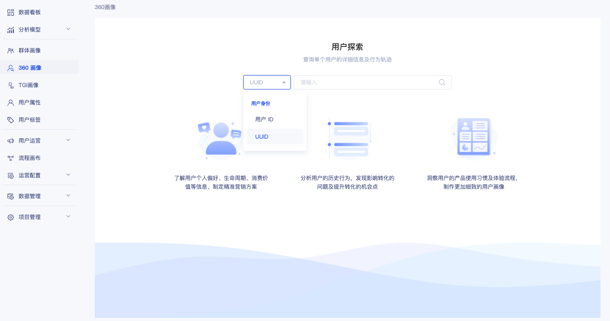
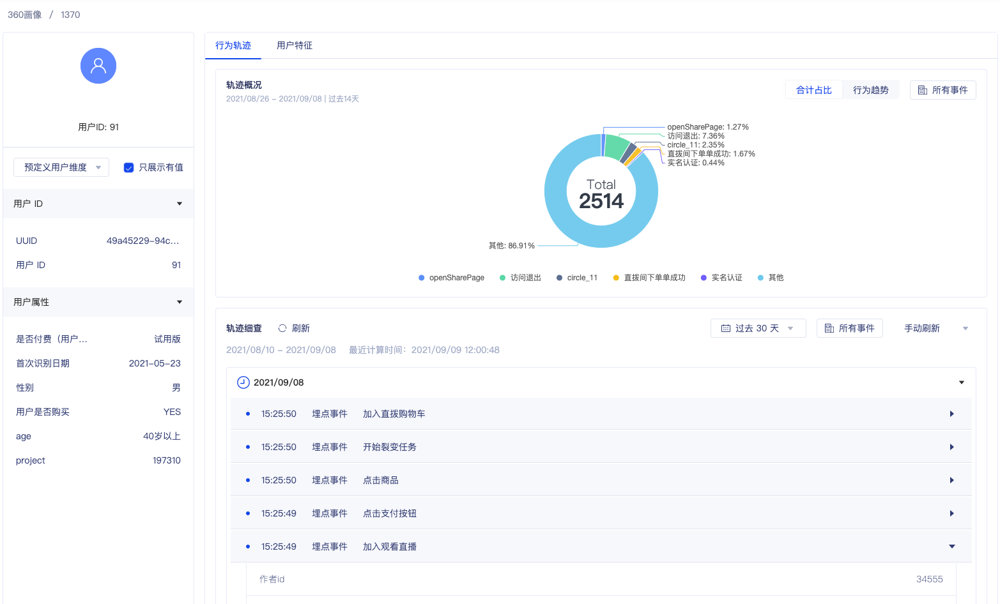
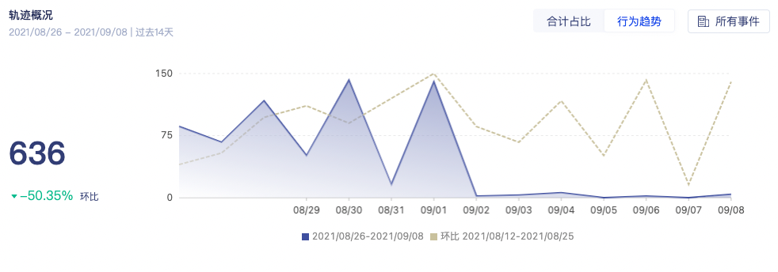
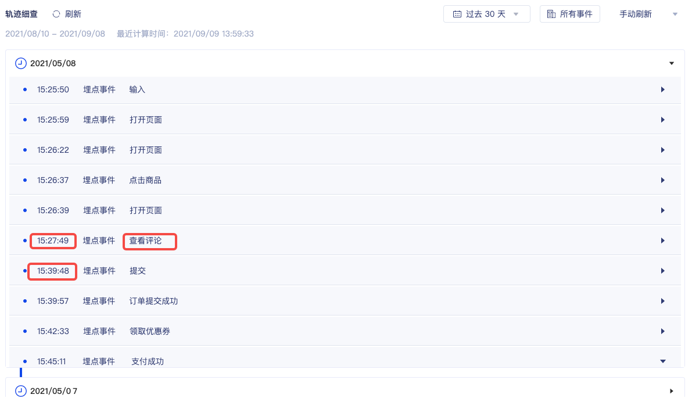

# 360单用户画像

## 功能介绍

在360单用户画像中您可以通过用户ID、UUID、姓名、手机号、邮箱、OpenID或UnionID查找用户并查看用户画像详情；也可以通过 [群体画像](segment-profiles.md) 中的用户列表细查进入指定用户的360单用户画像页面 。

找到用户后，您可以在用户细查页面查看用户详细属性、用户行为明细和用户特征。

## 用户搜索页

**用户搜索** ： 目前默认支持 用户ID、UUID等用户唯一标识查询用户；通过在客户数据平台 [用户ID](../customer-data-platform/data-center/users/user-identifications.md) 菜单配置后，可支持通过姓名、手机号、邮箱、微信UnionID、微信OpenID进行查询。

##  单用户画像的解读 

### 用户基础信息

帮助你了解此用户的基础用户信息 

* 展示该项目中被授权查看的用户属性、用户信息 。
* 用户属性 为在系统中定义上报。[点击查看](../customer-data-platform/data-center/users/user-properties/)
* 用户信息 为系统中上报。[点击查看](../customer-data-platform/data-center/users/user-identifications.md)
* 可勾选只展示有值的用户属性信息 。

### 轨迹概览

展示此用户 在最近14 天的行为统计 ，帮助你了解此用户的行为情况概括。可以通过此占比分布，发现用户最常使用的行为 ，发现用户热衷的喜好与行为习惯 。通过行为趋势分布，了解用户在近14天内活跃趋势。

* 右上角可切换tab分别展示 近14天行为合计占比 /  近14天行为趋势。
* 合计占比中默认展示总数前5的事件，其余事件合并为其他展示。
* 默认统计全部项目内授权的事件，支持通过事件筛选，选择想关注的事件。

* 切换至行为趋势tab后，可展示最近14天内的事件总数及其环比数据

### 轨迹细查

在该模块展示了此用户所有被采集的行为，包含访问事件、页面事件、埋点事件，以及事件所包含的事件属性。同時也支持事件筛选，选择想关注的事件 。

事件按照每天进行聚合展示，默认会按照日期从近到远的顺序来显示行为轨迹，即最先显示今天的行为轨迹，然后显示昨天的，前天的，更早的行为……

刷新方式：支持手动刷新、5分钟刷新、实时刷新。

### 用户特征

在用户特征页面，可以查看该用户所拥有的全部用户标签及其标签值。

## 常见问题

### **Q :** 怎样使用轨迹细查进行埋点数据校验？

埋点校验是根据GIO埋点数据方案，对于方案中的埋点数据进行校验，需要验证埋点是否正常上传，对应可在细查中实时看到上传的埋点事件，如下几点：

1）在app应用中进行访问后，在轨迹细查中是否可以看到对应触发的埋点事件

 2）埋点事件是否正确绑定事件属性

### Q:为什么轨迹细查中事件、事件属性会出现  “未知”的事件 ？ 

“未知” 是由于GIO系统收到事件、事件属性的数据，但系统中并未对此进行申明定义 。 [点击查看：创建埋点事件](../customer-data-platform/data-center/event-management/manual.md)

GIO是会对上传的埋点事件进行判断，是否在系统已经定义该事件，如已定义，对应的事件和属性是会显示对应定义的事件名称；

对于未在系统平台进行申明定义的，则会显示上传的标识符以及未知，同时会影响后续在产品分析中查看数据 可在 客户数据平台-  埋点事件、事件属性中定义。[点击查看](../customer-data-platform/data-center/event-management/manual.md#chuang-jian-shi-jian)

##  应用场景

### 案例一

某在线旅游平台想了解哪些旅游产品的购买率更高，然后推出更多类似的产品，带来利润增长。该客户通过使用购买行为转化率等分析方法找到了一些购买率较高的产品，但这些产品的各种特征如价格、地域、类别等没有很明显的规律。此时我们先通过用户分群，找出“购买了产品A”的所有用户，并在这些用户中任意选择一位来查看用户细查，观察用户是如何与该平台进行交互的：

通过查看一些典型用户的访问轨迹，我们发现这些用户大部分都有“查看全部评论”这一行为，并会在这一页面上停留较长时间。在进一步查看这些评论以后，我们发现这些产品的评分都在4.5/5以上，并且有大量图文并茂的详细评论。而购买率较低的产品则不具备这些用户行为，即使有些产品是客户主推的、预期较高的。

因此我们提出了一个大胆假设：由于旅游产品多数价格较高，用户在产生购买行为时比较谨慎，所以正面的评论能很大程度上加强用户购买的意向。建议在后续的产品优化中，设计一种能刺激用户提交评论的激励机制，并筛选优质评论展示在产品页面，以提高产品提高购买率。

### 案例二

提升购买率的第一步在于刺激用户购买的欲望，而第二步则是确保用户能够成功完成订单，为企业产生盈利。还是这家在线旅游平台，通过对于购买流程的数据分析发现，用户从产生购买行为到确认订单的平均转化率仅为60%左右。基于这个事实，我们可以提问：用户为什么在这一步中流失？如何流失的？

此时我们先通过用户分群，筛选出在购买流程中流失的所有用户，再通过“用户细查”来观察用户在购买流程中的交互行为。

通过查看一些用户的访问轨迹，我们发现了一个常见的行为模式。下图为一个典型用户的行为轨迹，该用户先访问了某一个目的地的旅游产品页面，在该页面上进行了一些“点击”“选择”的行为，然后进入了订单填写的页面。但是该用户在订单填写页没有进行任何行为，而是返回到了产品的页面，继续进行“点击”“选择”。如此反复三次，并且每次在产品页面产生的事件内容都有差异。而最终该用户没有完成支付就结束访问了。

结合这个在线旅游平台的产品形态，我们可以进一步分析该用户的行为。产品页面上需要用户选择出行时间、出行人数以及出行方式等，而订单页面上不能修改这些信息。该用户在产品页面和订单页面反复访问，并且在产品页面修改了填写的信息，由此我们可以猜测：用户在进入订单填写的页面后，想要修改某些信息，但订单页面并没有提供可修改的地方，导致用户不得不回退到产品页面进行修改，再把其他所有的信息重填一遍。在这个过程中用户失去了耐心，最终没有完成支付就离开了。

由此，建议在后续产品的优化中，在订单页面增加让用户可以修改订单信息的选项，满足用户调整选项的需求，优化产品体验，从而提高最终的购买转化率。

  

