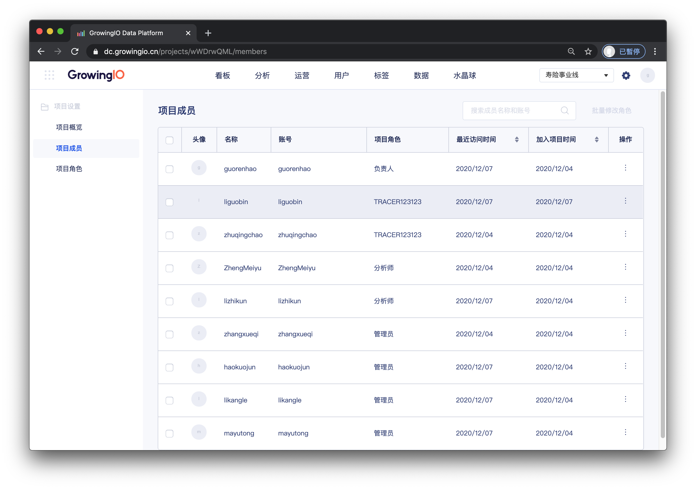
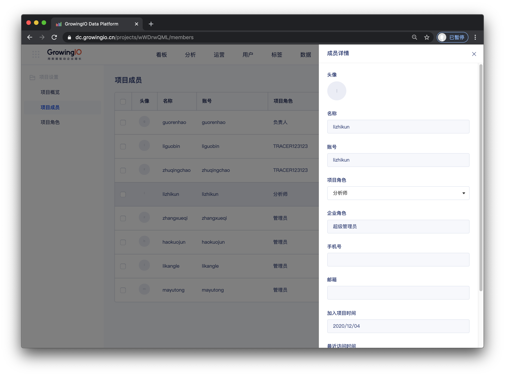
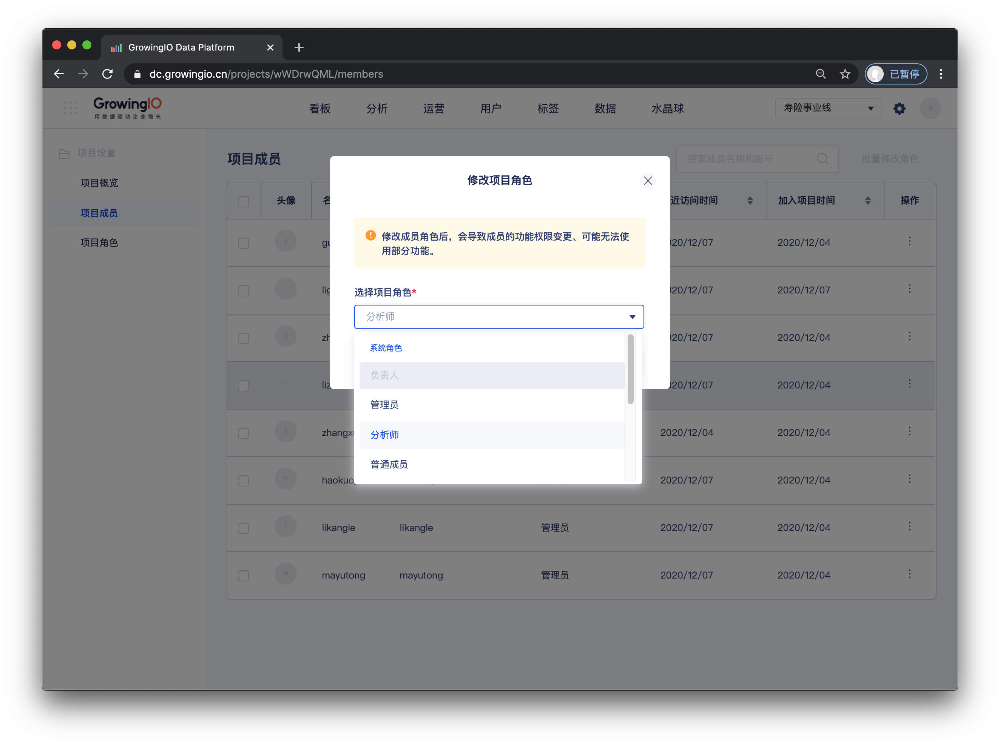
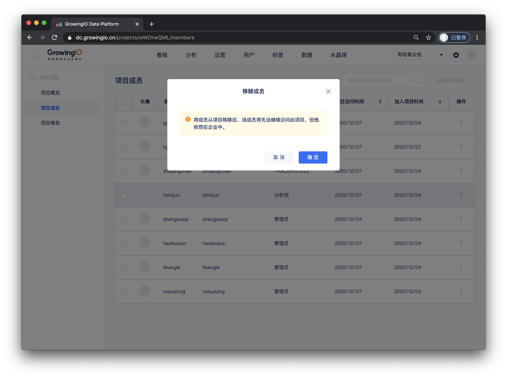

# 项目成员.

## 功能介绍

项目负责人、项目管理员可在项目成员管理模块，完成对于项目内成员的管理工作，包含 修改项目角色 、移交资源、移除成员。


只有在项目中的成员，才可进入此项目。

可以在 企业管理后台 - 项目管理中，将成员将入各个项目。 [点此查看](https://app.gitbook.com/@growingio/s/op/~/drafts/-MMuEk7ax0sRi_esMUzn/v/v20201200/product-manual/qi-ye-guan-li-hou-tai/zhan-dian-guan-li/cheng-yuan-pei-zhi)


## 介面介绍

##  ‌项目成员操作说明

| 操作 | 作用 |
| :--- | :--- |
| 查看成员詳情 | 查看成员的详细信息 |
| 修改項目角色 | 赋予成员在项目中的权限 |
| 移除成员 | 将成员移除项目，使其无法访问此项目 |

### 

### 查看成员詳情


权限控制： 仅“项目负责人”和“项目管理员” 拥有項目成員管理的权限


### 修改項目角色


权限控制： 仅“项目负责人”和“项目管理员” 拥有項目成員管理的权限


### 移除成员 


权限控制： 仅“项目负责人”和“项目管理员” 拥有項目成員管理的权限


