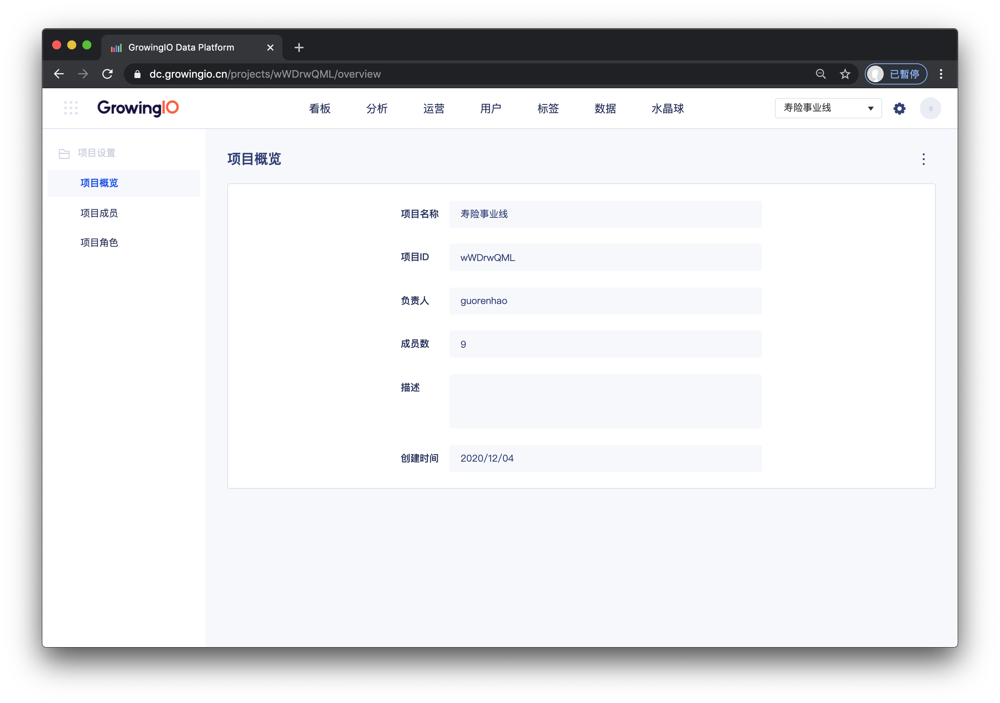
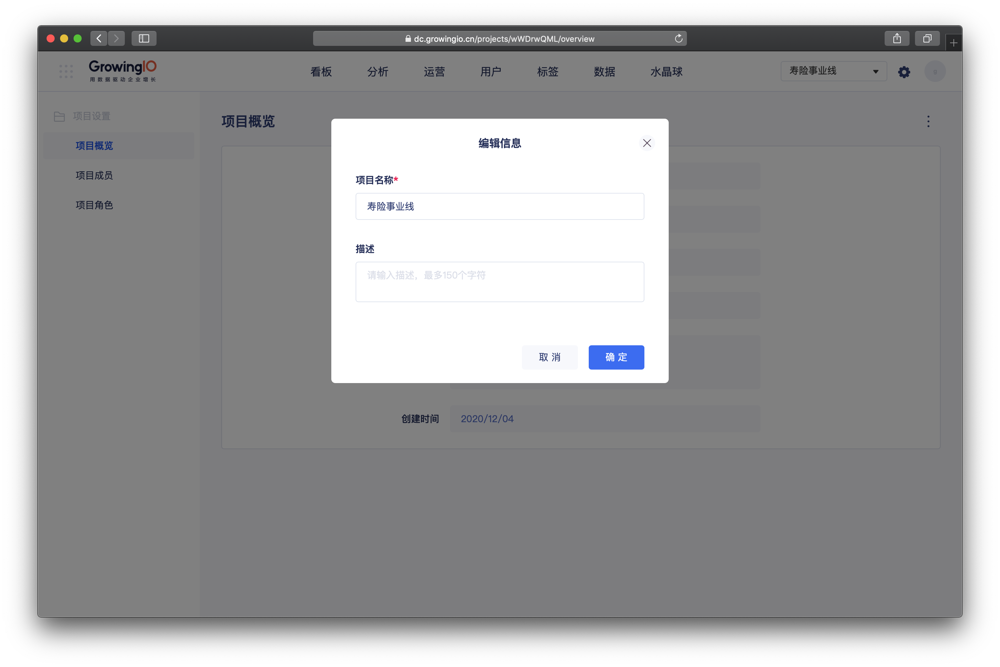
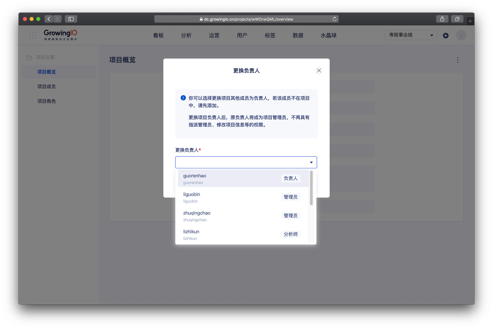

# 项目概览.

## 介面介绍

| 字段 | 說明 |
| :--- | :--- |
| 项目名称 | 项目的名称 |
| 项目ID  | 项目的ID |
| 負責人负责人 | 项目最高权限的成员 |
| 描述 | 说明项目的作用与目的 |
| 成员数量 | 项目中 使用者数量 |
| 创建时间 | 系统首次部署的时间 |

##  项目概览操作说明

| 操作 | 作用 |
| :--- | :--- |
| 编辑信息 | 修改项目的信息 名称、描述 |
| 更换负责人 | 目负责人可将项目移交给其他成员 |

### 编辑信息

操作流程：点击编辑信息 &gt;  修改内容 &gt;  点击确定。


权限控制： 仅“项目负责人”和“项目管理员” 拥有項目成員管理的权限


### 

### 更换负责人

操作流程：点击更换负责人&gt;  选择移交的目标成员 &gt;  点击确定。


权限控制： 仅“项目负责人” 拥有項目成員管理的权限


