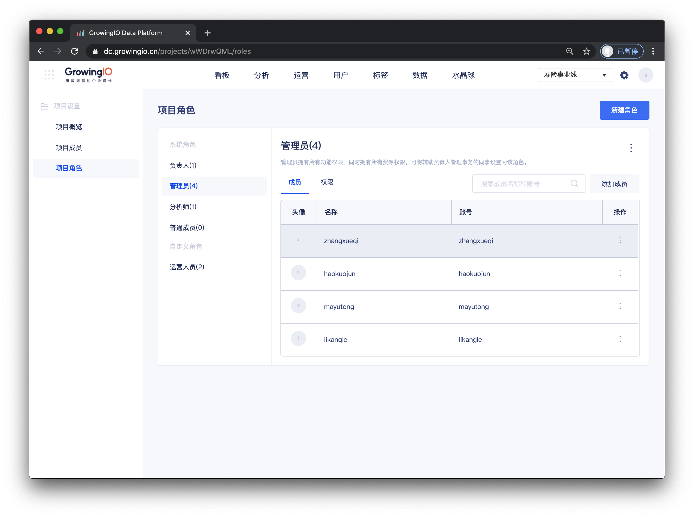
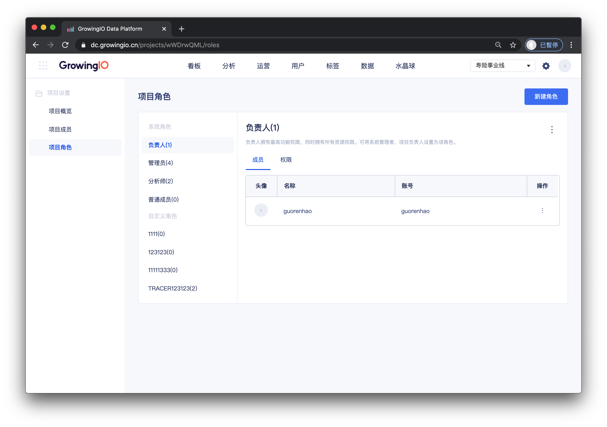
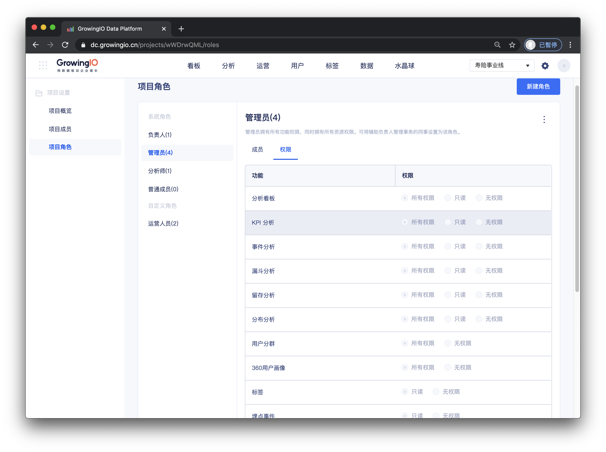
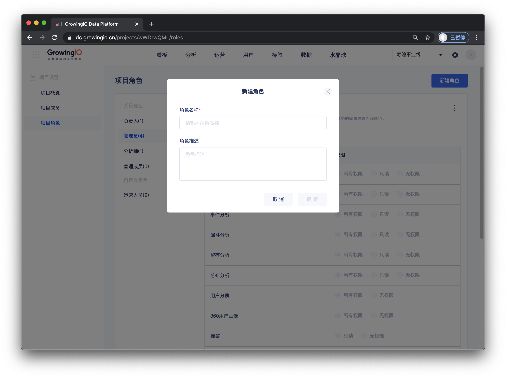
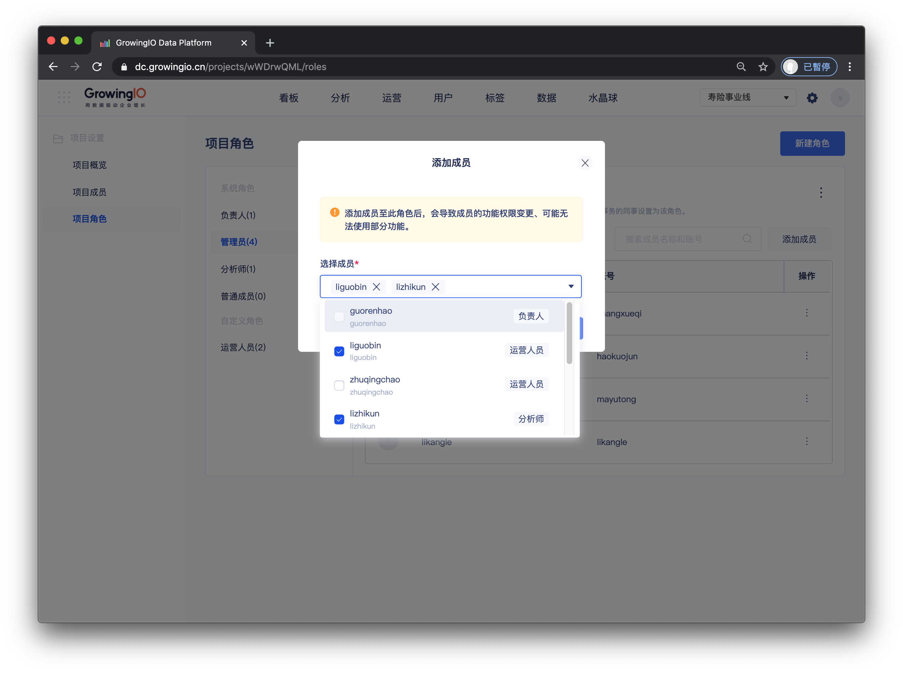
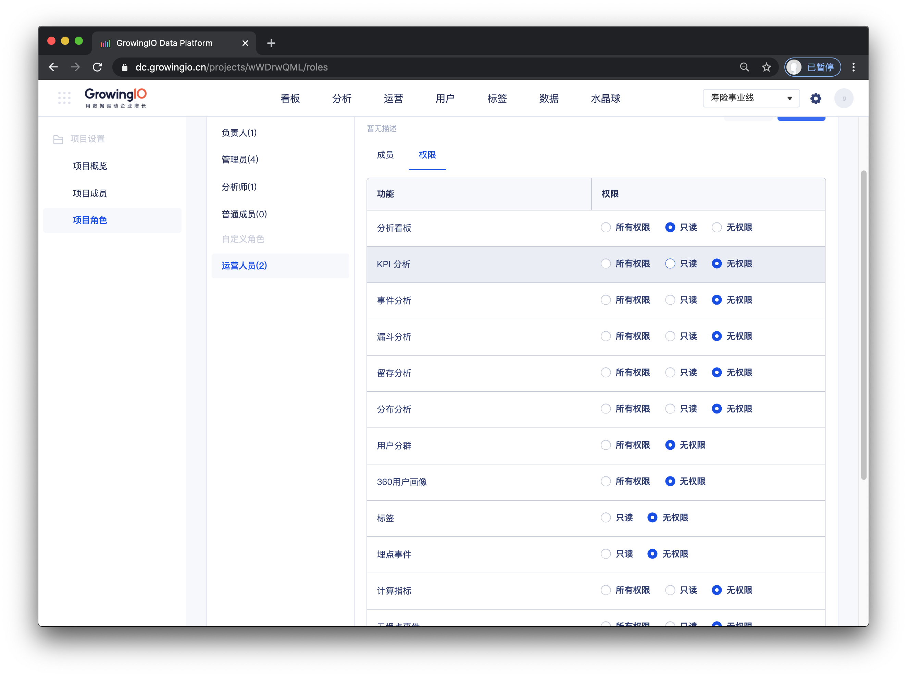
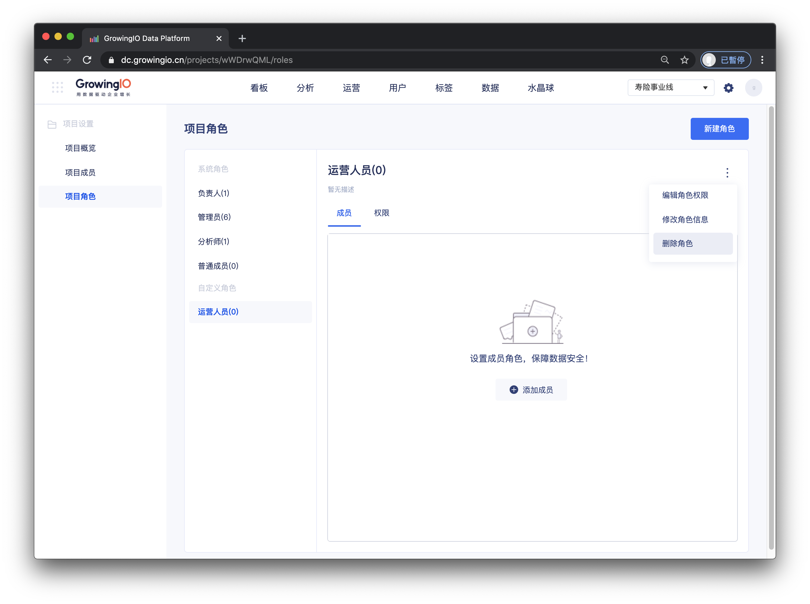

# 项目角色.

## 功能介绍

项目中的角色将决定成员在该项目中的功能权限，即该成员可否使用某项功能。GrowingIO 在项目中有预置的 **系统角色**，也支持 **項目自定义角色。** 使用场景案例 [点击查看](https://app.gitbook.com/@growingio/s/op/~/drafts/-MNwUyrXvvQ78EP2ul56/v/v20201200/product-manual/zhan-dian-guan-li/zhan-dian-jiao-se/classic-scenario)  

## 介面介绍

##   **系统预置企业角色介绍**

GrowingIO 在项目中，帮助用户预置了 4 个系统角色：項目 _**负责人、管理员、分析师、普通成员**_。系統預置角色不支持编辑角色信息、修改角色权限、删除角色等操作。

**负责人**

* 负责人是每个项目中唯一的。 
* 负责人拥有项目中最高权限的角色。一般来说是管理人員，管理成员们在项目中可以做什么，不能做什么。

**管理员**

* 可将辅助负责人管理事务的同事设置为该角色。
* 管理员拥有所有功能权限，同时拥有所有资源权限。

**分析師**

* 分析师为主要数据生产者，拥有分析功能的所有权限。
* 可将团队内主要负责生产数据看板、数据分析的同事设置为该角色

**普通成员**

* 普通成员为数据的主要消费者。 可将不需要进行数据分析的同事设置为该角色。

| 功能項 | 負責人 | 管理員 | 分析師 | 普通成員 |
| :--- | :--- | :--- | :--- | :--- |
| 看板 | 所有权限 | 所有权限 | 所有权限 | 只读 |
| KPI分析 | 所有权限 | 所有权限 | 所有权限 | 无权限 |
| 事件分析 | 所有权限 | 所有权限 | 所有权限 | 无权限 |
| 漏斗分析 | 所有权限 | 所有权限 | 所有权限 | 无权限 |
| 留存分析 | 所有权限 | 所有权限 | 所有权限 | 无权限 |
| 分布分析 | 所有权限 | 所有权限 | 所有权限 | 无权限 |
| 用戶分群 | 所有权限 | 所有权限 | 所有权限 | 无权限 |
| 360 度单用户画像 | 所有权限 | 所有权限 | 所有权限 | 无权限 |
| 标签 | 所有权限 | 所有权限 | 所有权限 | 无权限 |
| 事件管理 | 所有权限 | 所有权限 | 所有权限 | 无权限 |
| 计算指标 | 所有权限 | 所有权限 | 所有权限 | 无权限 |
| 项目概覽 | 所有权限 | 所有权限 | 只读 | 无权限 |
| 项目成员 | 所有权限 | 所有权限 | 只读 | 无权限 |
| 项目角色 | 所有权限 | 所有权限 | 只读 | 无权限 |

## 自定义项目角色操作说明

| 操作 | 作用 |
| :--- | :--- |
| 查看角色成员与权限 | 可查看角色有哪些功能权限，以及有哪些成员属于这个角色 |
| 新建自定义角色 | 根据不同的需求场景，可以自定义角色，来满足不同功能权限的配置。 |
| 添加成員 | 将项目中的成员绑定此角色。 |
| 编辑角色权限 | 配置角色拥有不同的功能。 |
| 编辑角色信息 | 修改角色名称、描述。 |
| 删除角色 | 删除不需要的角色。 |


权限控制： 仅“项目负责人”和“项目管理员” 拥有角色管理的权限


### 查看角色成员与权限

可查看角色有哪些功能权限，以及有哪些成员属于这个角色

### 新建自定义角色

根据不同的需求场景，可以自定义角色，来满足不同功能权限的配置。

操作流程：点击右上角新建角色 &gt;  填写角色信息 &gt; 点击确定 。 


新建完成后，会附于新角色初始化的权限配置 ， 可点击 编辑角色权限进行调整。



权限控制： 仅“项目负责人”和“项目管理员” 拥有新建角色权限。


### 添加成員

将项目中的成员绑定此角色。

操作流程： 点击 添加成员  &gt;  选择项目中的成员  &gt;   确定 。


权限控制： 仅“项目负责人”和“项目管理员” 拥有添加成員权限。


### 编辑角色权限

配置角色拥有不同的功能。

操作流程： 点击 编辑角色权限 &gt; ****进入权限编辑状态 &gt; 点击保存。 


功能权限的设置 ： 可对一个功能项，选择 所有权限/ 只读 / 无权限 。

* 所有权限： 可查看、新建、编辑、删除。

* 只读： 仅可查看。

* 无权限



权限控制： 仅“项目负责人”和“项目管理员” 拥有编辑角色权限


### 删除角色

操作流程： 点击 删除角色按钮 &gt; 点击确定。


权限控制： 仅“项目负责人”和“项目管理员” 拥有删除角色权限。



删除角色时，需先将角色关连的成员，修改为其他角色。


